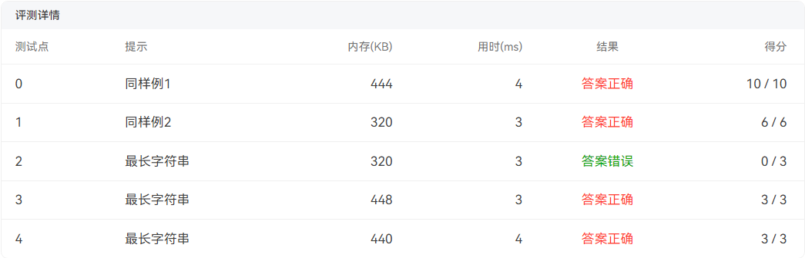

自己写的两个有序链表的合并 

期中大规模数据输入问题出现段错误

```cpp
#include<bits/stdc++.h>
#define maxsize 1000000
using namespace std;
struct Node{
    int data;
    Node* next;
};
//结点初始化
Node* node_init(int number){
    Node* new_node = new Node();
    new_node->data = number;
    new_node->next = NULL;
    return new_node;
}

int main(){
    Node* s1 = node_init(0);
    Node* s2 = node_init(0);
    Node* temp1 = s1;
    Node* temp2 = s2;
    //输入
    int number = 0;
    while(1){
        cin>>number;
        if(number == -1) break;
        else{
            Node* node = node_init(number);
            temp1->next = node;
            temp1 = temp1->next;
        }
    }
    while(1){
        cin>>number;
        if(number == -1) break;
        else{
            Node* node = node_init(number);
            temp2->next = node;
            temp2 = temp2->next;
        }
    }
    //并集
    temp1 = s1->next;
    temp2 = s2->next;
    int result[maxsize];
    int i = 0;
    //容易将代码中的逻辑运算和离散数学中的逻辑运算搞混
    while(temp1 != NULL || temp2 != NULL){
        if(temp1 != NULL && temp2 == NULL){
            while(temp1){
                result[i] = temp1->data;
                temp1 = temp1->next;
                i++;
            }
        }
        else if(temp2 != NULL && temp1 == NULL){
            while(temp2){
                result[i] = temp2->data;
                temp2 = temp2->next;
                i++;
            }
        }
        else{
            if(temp1->data == temp2->data){
                result[i] = temp1->data;
                i=i+1;
                result[i] = temp2->data;
                i=i+1;
            }
            else if(temp1->data < temp2->data){
                result[i] = temp1->data;
                i=i+1;
                result[i] = temp2->data;
                i=i+1;
            }
            else{
                result[i] = temp2->data;
                i=i+1;
                result[i] = temp1->data;
                i=i+1;
            }
            temp1 = temp1->next;
            temp2 = temp2->next;
        }
    }
    //输出
    int n = i;
    if(n==0){
        cout<<"NULL";
        return 0;
    }
    else{
        for(int i = 0;i < n - 1;i++) cout<<result[i]<<" ";
        cout<<result[n-1];
        return 0;
    }
}
```


```cpp
#include<bits/stdc++.h>
#include<stack>
using namespace std;


int main(){
    // stack<char> n;
    // //用户输入全部输入进去 不过存储用户输入直接使用栈应该操作受限了 不能从头到尾扫描
    // char input;
    // while(1){
    //     cin>>input;
    //     if(cin.fail()) break;
    //     s.push(input);
    // }
    //用户输入
    string input;
    cin>>input;
    int n = input.length();
    //括号匹配
    stack<char> operation;
    for(int i = 0; i < n;i++){
        if(input[i] == '(' || input[i] == '[' || input[i] == '{'){
            operation.push(input[i]);
        }
        //右括号不匹配或者只有右括号情况
        if(input[i] == ')' || input[i] == ']' || input[i] == '}'){
            if(!operation.empty()){
                char top = operation.top();
                // cout<<"top:"<<top<<endl;
                // cout<<"input[i]:"<<input[i]<<endl;
                // if(top != input[i]) cout<<"no";//靠我是憨批
                if(input[i] == ')' && top == '(') operation.pop();
                else if(input[i] == ']' && top == '[') operation.pop();
                else if(input[i] == '}' && top == '{') operation.pop();
                // else{
                //     cout<<"no";
                //     break;
                // }
            }
            else{
                cout<<"no";
                break;
            }
        }
    }
    //如果完全匹配则操作栈中没有内容反之则不匹配 
    if(!operation.empty()) cout<<"no";
    else cout<<"yes";
    return 0;
}
```

