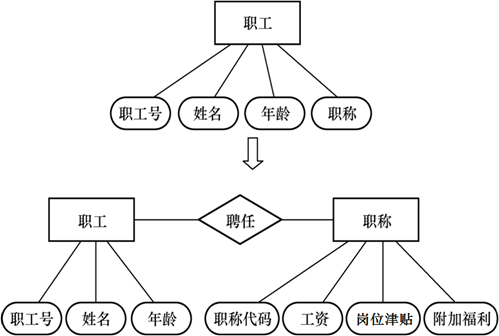
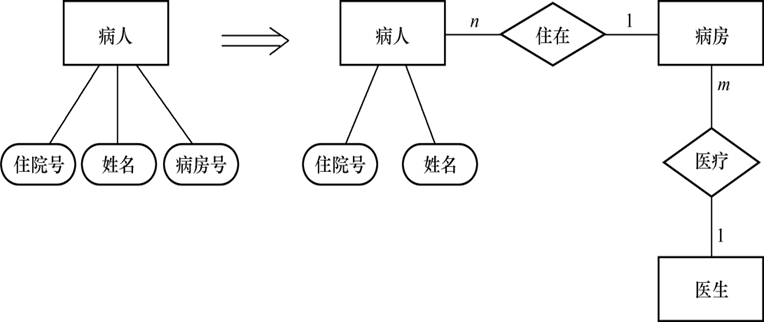
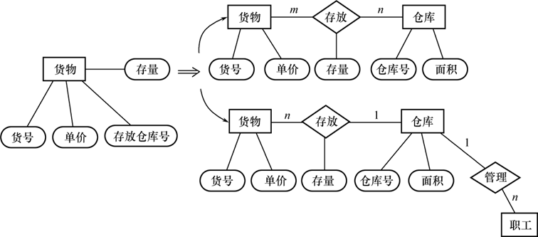
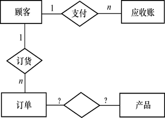
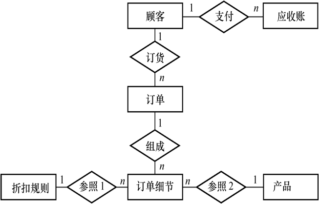
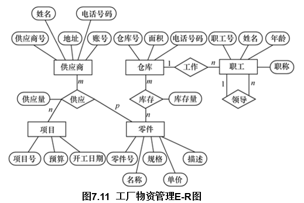
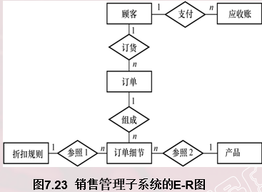
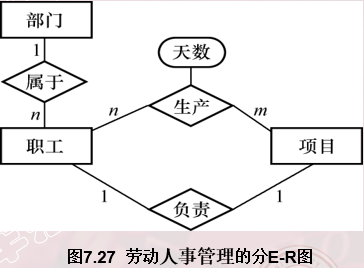
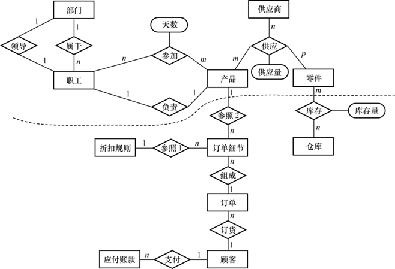

数据库设计模型实例总结

某个工厂物资管理的概念模型。物资管理涉及的实体有：

- 仓库：属性有仓库号、面积、电话号码
- 零件：属性有零件号、名称、规格、单价、描述
- 供应商：属性有供应商号、姓名、地址、电话号码、账号
- 项目：属性有项目号、预算、开工日期
- 职工：属性有职工号、姓名、年龄、职称

这些实体之间的联系如下： 

- 一个仓库可以存放多种零件，一种零件可以存放在多个仓库中，因此仓库和零件具有多对多的联系。用库存量来表示某种零件在某个仓库中的数量
- 一个仓库有多个职工当仓库保管员，一个职工只能在一个仓库工作，因此仓库和职工之间是一对多的联系
- 职工之间具有领导与被领导关系。即仓库主任领导若保管员，因此职工实体型中具有一对多的联系。
- 供应商、项目和零件三者之间具有多对多的联系。即一供应商可以供给若干项目多种零件，每个项目可以使不同供应商供应的零件，每种零件可由不同供应商供 

- [ ] 训练自己快速阅读理解ER图的能力
- [ ] 阅读分析的时候需要注意关注的图像信息是哪些

[例1] 职工是一个实体，职工号、姓名、年龄是职工的属性。

- 职称如果没有与工资、福利挂钩，根据准则（1）可以作为职工实体的属性
- 如果不同的职称有不同的工资、住房标准和不同的附加福利，则职称作为一个实体更恰当

[例2] 在医院中，一个病人只能住在一个病房，病房号可以作为病人实体的一个属性；

- 如果病房还要与医生实体发生联系，即一个医生负责几个病房的病人的医疗工作，则根据准则（2） 病房应作为一个实体。

[例3] 如果一种货物只存放在一个仓库，那么就可以把存放货物的仓库的仓库号作为描述货物存放地点的属性。

- 如果一种货物可以存放在多个仓库中，或者仓库本身又用面积作为属性，或者仓库与职工发生管理上的联系，那么就应把仓库作为一个实体。

[例4]  销售管理子系统E-R图的设计。

- 该子系统的主要功能是：
  - 处理顾客和销售员送来的订单
  - 工厂是根据订货安排生产的
  - 交出货物同时开出发票
  - 收到顾客付款后，根据发票存根和信贷情况进行应收款处理

参照需求分析和数据字典中的详尽描述，遵循前面给出的两个准则，进行了如下调整：

- （1）每张订单由订单号、若干头信息和订单细节组成。订单细节又有订货的零件号、数量等来描述。按照准则（2），订单细节就不能作订单的属性处理而应该上升为实体。一张订单可以订若干产品，所以订单与订单细节两个实体之间是1∶n的联系。

  

- （2）原订单和产品的联系实际上是订单细节和产品的联系。每条订货细节对应一个产品描述，订单处理时从中获得当前单价、产品重量等信息。
- （3）工厂对大宗订货给予优惠。每种产品都规定了不同订货数量的折扣，应增加一个“折扣规则”实体存放这些信息，而不应把它们放在产品实体中。

最后得到销售管理子系统E-R图如图7.23所示。

对每个实体定义的属性如下：

- 顾客：{顾客号，顾客名，地址，电话，信贷状况，账目余额}
- 订单：{订单号，顾客号，订货项数，订货日期，交货日期，工种号，生产地点}
- 订单细则：{订单号，细则号，零件号，订货数，金额}
- 应收账款：{顾客号，订单号，发票号，应收金额，支付日期，支付金额，当前余额，货款限额}
- 产品：{产品号，产品名，单价，重量}
- 折扣规则：{产品号，订货量，折扣}

[例5]  某工厂管理信息系统的视图集成。

