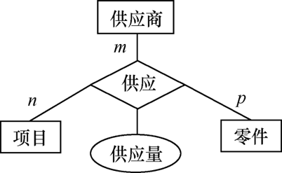
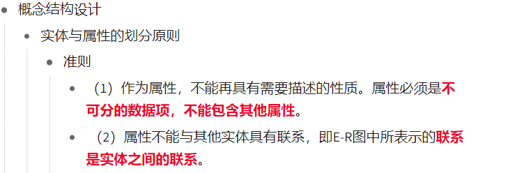

数据库设计笔记整理

> 有没有自动化这个设计过程的工具
> 是不是github action的操作就是用来搞这个的

How to What are the five phases of database design and how to automate them in the development process

The five phases of database design are:

1. Requirements Analysis: In this phase, you identify the requirements of the database, such as the data that needs to be stored, the relationships between different data elements, and the queries that will be used to extract data from the database.
2. Conceptual Design: In this phase, you create a high-level conceptual model of the database that identifies the entities, attributes, and relationships between them.
3. Logical Design: In this phase, you create a logical model of the database that specifies the structure of the database, including tables, fields, primary keys, foreign keys, and indexes.
4. Physical Design: In this phase, you create a physical model of the database that specifies the storage requirements, such as the file formats, disk space, and memory requirements.
5. Implementation: In this phase, you implement the database design by creating the tables, indexes, and other database objects, and then populate the database with data.

To automate these phases in the development process, you can use a database management system (DBMS) that provides tools for each phase. Here are some examples of how to automate each phase:

1. Requirements Analysis: You can use a requirements gathering tool or a data modeling tool to collect and document the requirements of the database.
2. Conceptual Design: You can use a data modeling tool that allows you to create an Entity-Relationship (ER) diagram or other high-level conceptual models.
3. Logical Design: You can use a database design tool that generates a logical data model from the ER diagram or other high-level models.
4. Physical Design: You can use a database design tool that generates a physical data model from the logical data model, and then generates the necessary SQL code to create the database objects.
5. Implementation: You can use a database management system that allows you to execute the SQL code generated in the previous phase to create the database objects and populate the database with data.

By automating these phases, you can save time and reduce errors in the database design and implementation process.

Software tools used in the requirements analysis phase of database design

During the requirements analysis phase of database design, various software tools can be used to assist in gathering, documenting, and analyzing requirements. Some of the commonly used tools are:

1. Spreadsheets: Spreadsheets such as Microsoft Excel or Google Sheets can be used to create lists and tables to capture and organize requirements. This can help in identifying commonalities and discrepancies among requirements.
2. Diagramming tools: Diagramming tools such as Microsoft Visio or draw.io can be used to create diagrams to represent business processes, data flows, and entities. This can help in visualizing the relationships between various requirements.
3. Prototyping tools: Prototyping tools such as Axure or Balsamiq can be used to create interactive prototypes of the database system. This can help in identifying usability and functionality issues before actual implementation.
4. Requirements management tools: Requirements management tools such as JIRA or Trello can be used to manage and track requirements, changes, and their status. This can help in ensuring that all requirements are captured and managed efficiently.
5. Use case modeling tools: Use case modeling tools such as Enterprise Architect or Visual Paradigm can be used to create use case diagrams to depict the interactions between users and the system. This can help in identifying requirements related to user behavior and interactions.

Overall, the use of software tools during the requirements analysis phase can help in making the process more efficient, organized, and collaborative.

https://github.com/whileskies/curriculum_design

Decision table or decision tree description tool for the specific processing logic of the process

Both decision tables and decision trees are useful tools for describing the processing logic of a process.

A decision table is a grid that outlines various conditions or inputs and their corresponding actions or outputs. It allows you to easily see all the possible combinations of conditions and actions and helps ensure that all scenarios are considered. Decision tables can be particularly useful when there are multiple conditions and actions to consider.

On the other hand, a decision tree is a branching diagram that visually represents the various paths that a decision-making process can take. It starts with a single question or condition and then branches out into multiple options, each leading to further questions or conditions until a final decision or action is reached. Decision trees can be particularly useful when the decision-making process involves a series of yes/no questions or conditions.

Both decision tables and decision trees have their strengths and weaknesses and the choice of which to use will depend on the specific characteristics of the processing logic being described. For example, if there are many conditions to consider, a decision table may be more appropriate, while if the decision-making process is a series of binary choices, a decision tree may be more appropriate.

Automated software to describe the decision table or decision tree for the specific processing logic of the process

There are several automated software tools available that can help in describing decision tables or decision trees for specific processing logic of a process. Some popular tools include:

1. IBM Operational Decision Manager: This software tool allows you to create and manage decision tables and decision trees to represent complex decision-making processes.
2. Bizagi: Bizagi is a business process management (BPM) software that includes a decision table editor and a decision tree editor, which can be used to automate decision-making processes.
3. Lucidchart: Lucidchart is a diagramming tool that offers a decision tree and decision table template to help users map out decision-making processes.
4. Visual Paradigm: This software tool provides a decision table editor and a decision tree editor that allows users to create, visualize and analyze decision-making processes.
5. SmartDraw: SmartDraw is a diagramming tool that includes a decision tree template and a decision table template to help users automate decision-making processes.

Overall, these software tools can help streamline decision-making processes and reduce the likelihood of errors by providing a visual representation of the logic involved.

Automated software to describe the decision table or decision tree for the specific processing logic of the process Note that the software should not be a drawing board tool I think the drawing board tool is very wasteful of design time

There are several software tools available that can help you describe the decision table or decision tree for a specific processing logic of a process without being a drawing board tool. Here are a few examples:

1. Decision Explorer: This is a tool that helps you build decision trees and decision tables using a simple and intuitive interface. It has features such as automatic grouping, sorting, and filtering of rules based on their attributes, and supports exporting the decision tree in various formats like HTML, PDF, and XML.
2. IBM Operational Decision Manager: This software helps you create decision tables and decision trees for operational decisions in a business process. It supports creating decision tables with multiple input and output variables, and also provides a graphical representation of the decision tree.
3. FICO Blaze Advisor: This is a rules management system that helps you create decision tables and decision trees for complex decision-making processes. It provides a visual representation of the decision tree and also allows you to test the rules before deployment.
4. Drools: This is a business rules management system that allows you to define and execute decision tables and decision trees using a domain-specific language. It has a visual editor that helps you create and modify the decision tables and decision trees.

These tools can help you describe the decision table or decision tree for a specific processing logic of a process without the need for a drawing board. They offer intuitive interfaces and features to help you create, modify, and test the rules efficiently.

What are the software tools that assist in the requirements analysis phase of database design

There are several software tools that can assist in the requirements analysis phase of database design. Some of the commonly used tools include:

1. Microsoft Visio: Microsoft Visio is a diagramming and vector graphics application that can be used to create various types of diagrams, including entity-relationship (ER) diagrams. ER diagrams can be used to model the data requirements of a database system, making them a useful tool for requirements analysis.
2. IBM Rational Rose: IBM Rational Rose is a modeling and design tool that can be used to create UML (Unified Modeling Language) diagrams. UML diagrams can be used to model the data requirements of a database system, making them a useful tool for requirements analysis.
3. ERwin: ERwin is a data modeling tool that can be used to create ER diagrams. ER diagrams can be used to model the data requirements of a database system, making them a useful tool for requirements analysis.
4. PowerDesigner: PowerDesigner is a data modeling tool that can be used to create various types of diagrams, including ER diagrams. ER diagrams can be used to model the data requirements of a database system, making them a useful tool for requirements analysis.
5. Lucidchart: Lucidchart is a cloud-based diagramming and collaboration tool that can be used to create various types of diagrams, including ER diagrams. ER diagrams can be used to model the data requirements of a database system, making them a useful tool for requirements analysis.

These tools can help in the requirements analysis phase of database design by allowing designers to create visual representations of the data requirements of a system, helping to ensure that all relevant data is captured and that the system meets the needs of its stakeholders.

如何理解联系可以具有属性

实体与属性的划分准则对应的具体实例的描述 是说在例子上使用自然语言描述的话会出现逻辑矛盾吗？

