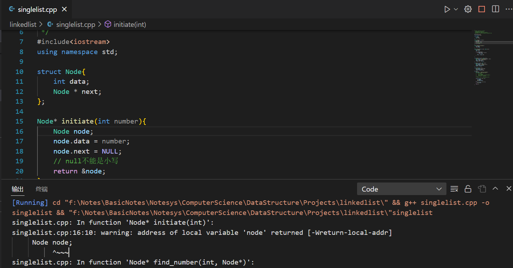
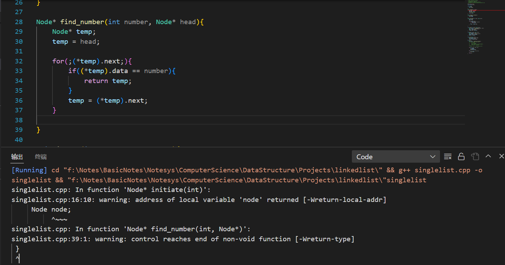

`LIFO.cpp(6, 10): 尝试访问运行时存储`


`"int" 类型的值不能用于初始化 "int [1000]" 类型的实体C/C++(144)`


`LIFO.cpp(7, 6): 尝试访问运行时存储`

```cpp
/*
 * @Date: 2023-02-27 08:46:49
 * @LastEditors: Bigorrila
 * @LastEditTime: 2023-02-27 09:03:37
 * @FilePath: \Projects\LIFO.cpp
 */
#include<iostream>
using namespace std;
#define N 1000

int st[N];
// 这里使用 st[0] (即 *st) 代表栈中元素数量，同时也是栈顶下标

// 压栈 ：
st[++*st] = 10;

// 取栈顶 ：
int u = st[*st];
cout<<u<<endl;

// 弹栈 ：注意越界问题, *st == 0 时不能继续弹出
if (*st) --*st;

// 清空栈
*st = 0;

```


```shell
error: 'st' does not name a type
 st[++*st] = 10;
 ^~
error: 'cout' does not name a type
 cout<<u<<endl;
 ^~~~
error: expected unqualified-id before 'if'
 if (*st) --*st;
 ^~
error: expected constructor, destructor, or type conversion before '=' token
 *st = 0;
```

太多奇怪的错误了


```cpp
/*
 * @Date: 2023-02-27 09:21:35
 * @LastEditors: Bigorrila
 * @LastEditTime: 2023-02-27 09:26:11
 * @FilePath: \Projects\LIFO_stl.cpp
 */
#include<iostream>
#include<stack>
using namespace std;

// 定义存储空间
stack<int> lifo;

// 压栈
lifo.push(10);

// 读栈
int element = lifo.pop();
cout<<element<<endl;
```


```shell
LIFO_stl.cpp:14:1: error: 'lifo' does not name a type
 lifo.push(10);
 ^~~~
LIFO_stl.cpp:17:24: error: void value not ignored as it ought to be
 int element = lifo.pop();
                        ^
LIFO_stl.cpp:18:1: error: 'cout' does not name a type
 cout<<element<<endl;
```

cout需要写在int main里面，而不能在函数外直接写


```shell
LIFO_stl.cpp:19:28: error: void value not ignored as it ought to be
     int element = lifo.pop();
```

```cpp
元素访问
st.top() 返回栈顶
修改
st.push() 插入传入的参数到栈顶
st.pop() 弹出栈顶
容量
st.empty() 返回是否为空
st.size() 返回元素数量
```

直接使用`python3 <文件名>` 不会在输出中显示结果 但是直接运行是可以的


```cpp
/*
 * @Date: 2023-02-27 10:01:33
 * @LastEditors: Bigorrila
 * @LastEditTime: 2023-02-27 10:09:52
 * @FilePath: \Projects\queue\FIFO.cpp
 */
#include<iostream>
using namespace std;
#define size 1000
int main(){
    int q[size], ql = 1, qr;

    // 压队列
    q[++qr] = 10;


    // 出队列
    cout << q[qr] << endl;
    return 0;
}
```


```cpp
#include<iostream>
#include<queue>
using namespace std;

int main(){
    queue<int, deque<int>> fifo;

    fifo.push_back(10);
    fifo.push_back(11);

}
```

push()
这里如何定义deque

queue<int, deque<int>> fifo;
这两个函数还是不可用

如何阅读头文件


```cpp
Node* initiate(int number){
    Node node = new node;
    node.data = number;
    node.next = NULL; 
    // null不能是小写
    return &node;
}
```



```cpp
Node* find_number(int number, Node* head){
    Node* temp;
    temp = head;
    
    for(;(*temp).next;){
        if((*temp).data == number){
            return temp;
        }
        temp = (*temp).next;
    }
    
}
```





c++ 函数参数类型

- [ ] 阅读cpp函数参数部分内容


