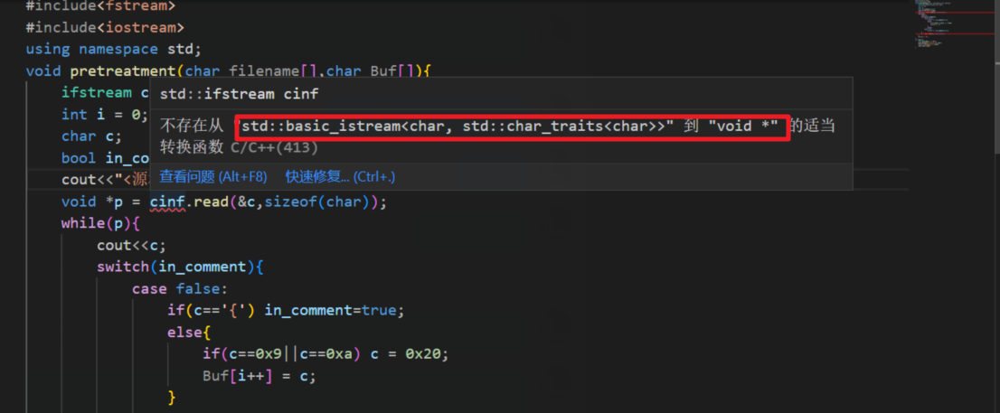

2-1用高级语言编写一个词法分析预处理程序。从文件读入源程序,去除源程序中注释(注释用{…}标记),用空格取代Tab和换行符,在源程序尾部添加字符“#”,并在屏幕上显示处理结果。源程序中无续行符,字母无须处理。

任务

1. 从文件读入源程序
2. 去除源程序中注释(注释用{…}标记)
3. 用空格取代Tab和换行符
4. 在源程序尾部添加字符“#”
5. 在屏幕上显示处理结果

```c++
#include<fstream.h>
void pretreatment(char filename[],char Buf[]){
    ifstream cinf(filename,ios::in);
    int i = 0;
    char c;
    bool in_comment=false;
    cout<<"<源程序>"<<end;
    void *p = cinf.read(&c,sizeof(char));
    while(p){
        cout<<c;
        switch(in_comment){
            case false:
                if(c=='{') in_comment=true;
                else{
                    if(c==0x9||c==0xa) c = 0x20;
                    Buf[i++] = c;
                }
                break;
            case true:
                if(c=='}') in_comment=false;
        }
        p = cinf.read(&c,sizeof(char));
    }
    Buf[i] = '#';
}
void main(){
    char Buf[4048] = {'\0'};
    pretreatment("source.txt",Buf);
    cout<<"<预处理结果>"<<endl;
    cout<<Buf<<endl;
}
```

- [ ] 使用python写出上述代码


```cpp
/*
 * @Date: 2023-02-26 22:01:20
 * @LastEditors: Bigorrila
 * @LastEditTime: 2023-02-26 22:01:28
 * @FilePath: \Projects\test.cpp
 */
#include <fstream>
#include <iostream>

using namespace std;

void pretreatment(char filename[], char Buf[]);

int main()
{
    char Buf[4048] = {'\0'};
    pretreatment("source.txt", Buf);
    cout << "<预处理结果>" << endl;
    cout << Buf << endl;
    return 0;
}

void pretreatment(char filename[], char Buf[])
{
    // 从文件读入程序
    ifstream cinf(filename, ios::in);
    if (!cinf)
    {
        cerr << "Failed to open file" << endl;
        exit(1);
    }

    int i = 0;
    char c;
    bool in_comment = false;
    cout << "<源程序>" << endl;

    char *p = (char *)cinf.read(&c, sizeof(char));

    while (p)
    {
        cout << c;
        switch (in_comment)
        {
        case false:
            if (c == '{')
                in_comment = true;
            else
            {
                if (c == 0x9 || c == 0xa)
                    c = 0x20;
                Buf[i++] = c;
            }
            break;
        case true:
            if (c == '}')
                in_comment = false;
        }
        p = (char *)cinf.read(&c, sizeof(char));
    }
    Buf[i] = '#';
}

```


```shell
2-1.cpp: In function 'void pretreatment(char*, char*)':
2-1.cpp:18:47: error: invalid cast from type 'std::basic_istream<char>::__istream_type' {aka 'std::basic_istream<char>'} to type 'char*'
     char *p = (char*)cinf.read(&c,sizeof(char));
                                               ^
2-1.cpp:34:46: error: invalid cast from type 'std::basic_istream<char>::__istream_type' {aka 'std::basic_istream<char>'} to type 'char*'
         p = (char *)cinf.read(&c,sizeof(char));
                                              ^
2-1.cpp: In function 'int main()':
2-1.cpp:40:34: warning: ISO C++ forbids converting a string constant to 'char*' [-Wwrite-strings]
     pretreatment("source.txt",Buf);
```


python面向对象实现词法分析处理程序

```python
'''
Date: 2023-02-26 22:07:13
LastEditors: Bigorrila
LastEditTime: 2023-02-26 22:11:14
FilePath: \Projects\2-1.py
'''
# 1. 从文件读入源程序
# 2. 去除源程序中注释(注释用{…}标记)
# 3. 用空格取代Tab和换行符
# 4. 在源程序尾部添加字符“#”
# 5. 在屏幕上显示处理结果

# 使用面向对象方式来实现上述代码

class Lexer:
    def __init__(self, filename):
        self.filename = filename
    
    def read_file(self):
        with open(self.filename, 'r') as f:
            return f.read()
    
    def remove_comments(self, source_code):
        in_comment = False
        result = ""
        for i, char in enumerate(source_code):
            if not in_comment:
                if char == '{':
                    in_comment = True
                else:
                    result += char
            else:
                if char == '}':
                    in_comment = False
        return result
    
    def replace_tab_and_newline(self, source_code):
        return source_code.replace('\t', ' ').replace('\n', ' ')
    
    def add_hashtag(self, source_code):
        return source_code + '#'
    
    def preprocess(self):
        source_code = self.read_file()
        source_code = self.remove_comments(source_code)
        source_code = self.replace_tab_and_newline(source_code)
        source_code = self.add_hashtag(source_code)
        print(source_code)

```

```shell
PS F:\Notes\BasicNotes\Notesys\ComputerScience\CompilationTheory\Projects> python test.py
Traceback (most recent call last):
  File "F:\Notes\BasicNotes\Notesys\ComputerScience\CompilationTheory\Projects\test.py", line 4, in <module>
    lexer.preprocess()
  File "F:\Notes\BasicNotes\Notesys\ComputerScience\CompilationTheory\Projects\lexer.py", line 44, in preprocess        
    source_code = self.read_file()
  File "F:\Notes\BasicNotes\Notesys\ComputerScience\CompilationTheory\Projects\lexer.py", line 21, in read_file
    return f.read()
UnicodeDecodeError: 'gbk' codec can't decode byte 0xaf in position 266: illegal multibyte sequence
```

`'gbk' codec can't decode byte 0xaf in position 266: illegal multibyte sequence` 如何快速定位到这里说的位置`0xaf in position 266`

- 猜测是中文读取的问题
- 将`source.txt`文件内容修改成仅有英文的格式了


面向过程cpp

```cpp
#include <iostream>
#include <fstream>
#include <string>

using namespace std;

void preprocess(string& source_code) {
    size_t start_pos = 0;
    while ((start_pos = source_code.find('{', start_pos)) != string::npos) {
        size_t end_pos = source_code.find('}', start_pos + 1);
        if (end_pos == string::npos) {
            // 找不到配对的 '}'，抛出异常
            throw runtime_error("Unmatched '{' found in source code");
        }
        // 将注释替换为空格
        source_code.replace(start_pos, end_pos - start_pos + 1, end_pos - start_pos + 1, ' ');
        // 继续寻找下一个 '{'
        start_pos = end_pos + 1;
    }
    // 将制表符和换行符替换为空格
    for (char& c : source_code) {
        if (c == '\t' || c == '\n') {
            c = ' ';
        }
    }
    // 在末尾添加 '#'
    source_code += "#";
}

int main(int argc, char* argv[]) {
    if (argc < 2) {
        cout << "Usage: " << argv[0] << " <filename>" << endl;
        return 1;
    }
    // 从文件读入源代码
    ifstream input_file(argv[1]);
    if (!input_file.is_open()) {
        cerr << "Failed to open file: " << argv[1] << endl;
        return 2;
    }
    string source_code((istreambuf_iterator<char>(input_file)), istreambuf_iterator<char>());
    input_file.close();
    // 预处理源代码
    try {
        preprocess(source_code);
    } catch (const exception& ex) {
        cerr << "Error: " << ex.what() << endl;
        return 3;
    }
    // 输出预处理后的源代码
    cout << source_code << endl;
    return 0;
}
```

面向过程python

```python
def preprocess(filename):
    # 读取文件
    with open(filename, 'r') as f:
        content = f.read()

    # 去除注释
    while '{' in content and '}' in content:
        start = content.index('{')
        end = content.index('}')
        content = content[:start] + content[end+1:]

    # 替换Tab和换行符
    content = content.replace('\t', ' ')
    content = content.replace('\n', ' ')

    # 在末尾添加#
    content += '#'

    # 输出处理结果
    print(content)

preprocess('input.txt')

```


注意：在实际开发中，还需要进一步对输入进行错误处理，例如检查文件是否成功打开、文件是否为空等。此处为了简化代码，省略了这些错误处理。

注：这里的实现方式只适用于注释内不包含嵌套注释的情况，如果需要处理嵌套注释的情况，则需要采用更为复杂的算法。




如何理解这里的提示信息