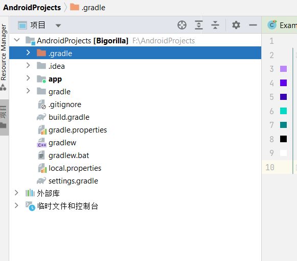
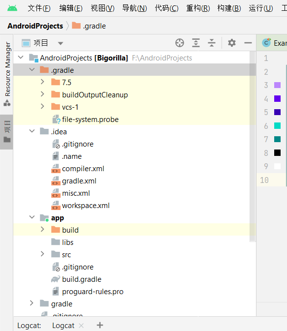
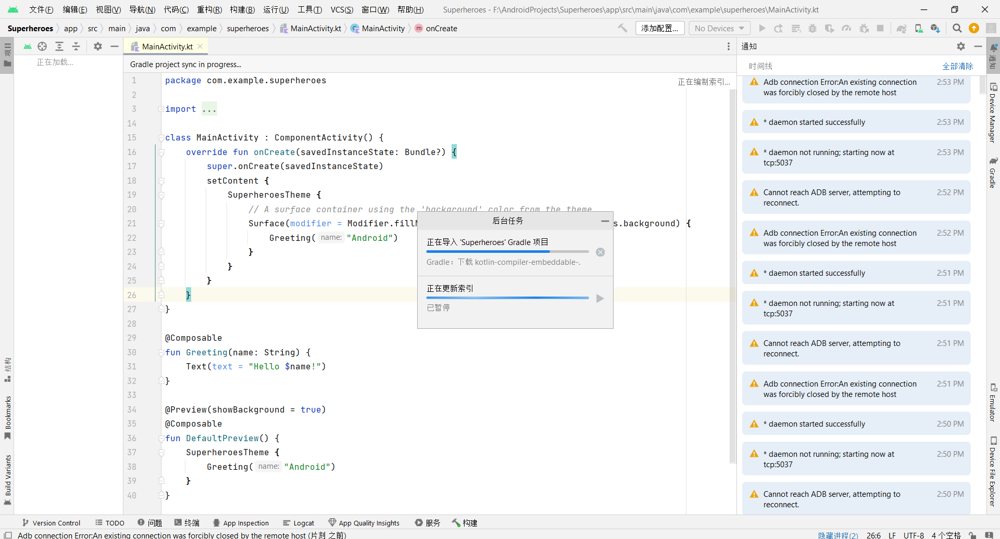
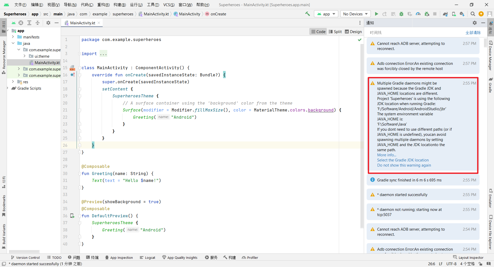
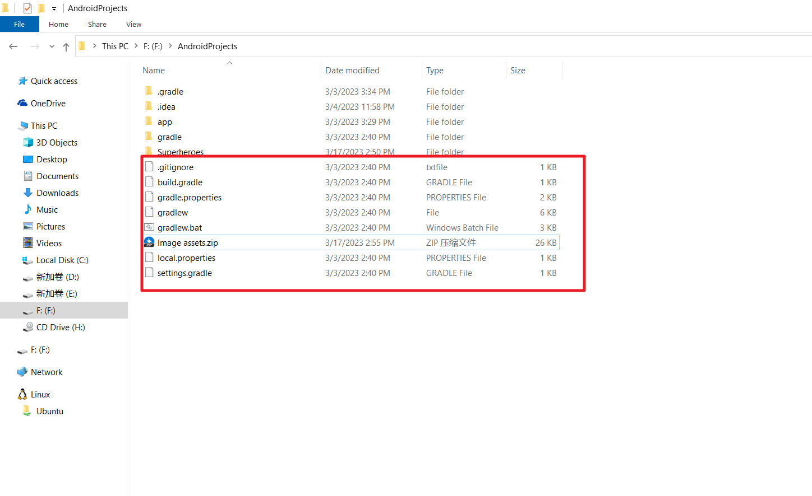
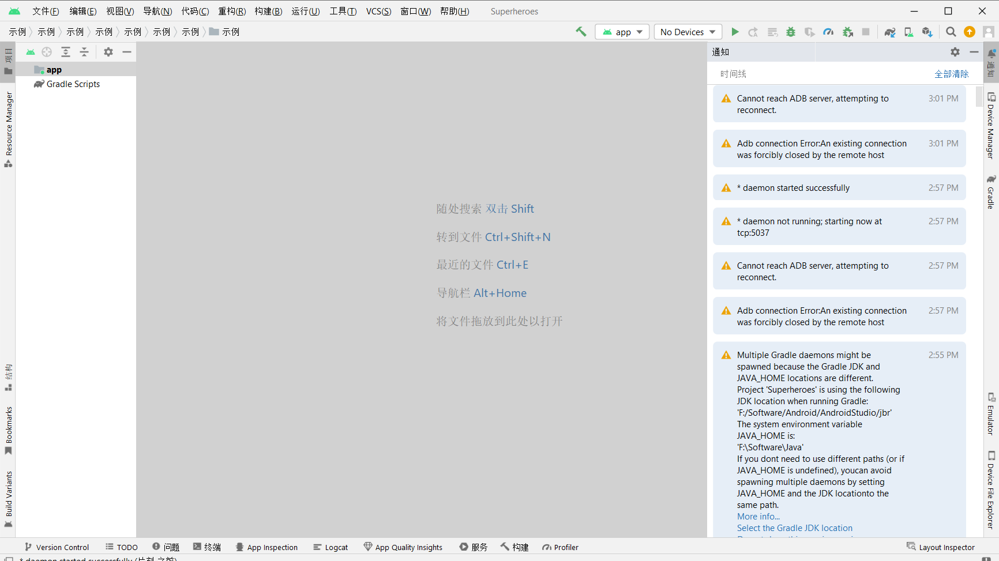
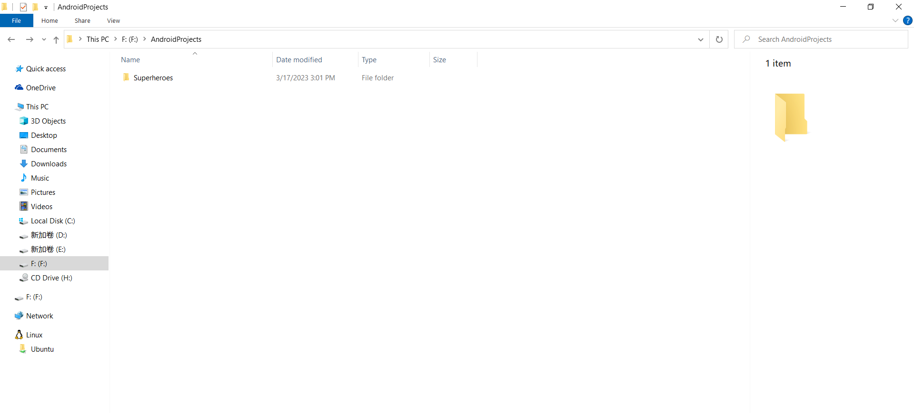

第四周 手机软件开发

> 项目结构是什么






> 安卓手机软件开发培养的技术栈

https://roadmap.sh/android

- [ ] 阅读完内容


> 课程资料快速抓取下载

```
没有通过爬虫实现抓取
直接打印出ppt之后一个一个下载的
比直接在网页上方便一点点
对比资料清单比较方便
```


> 创建项目的过程中最开始初始化的时候发生了什么





```
初始化过程中有一堆的提醒不知道如何处理
```

> 文件结构中自动产生的内容不知道怎么处理
>
> 想整理到一个文件夹下面







```
文件删除之后的样子
```


> 为什么codelabs上的项目推荐都是使用kotlin而不是直接java之类的

