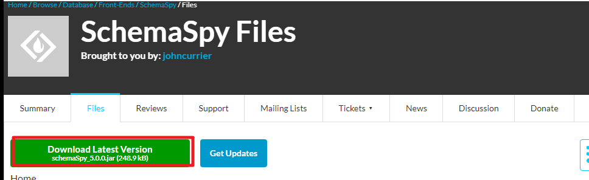
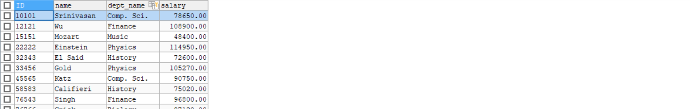
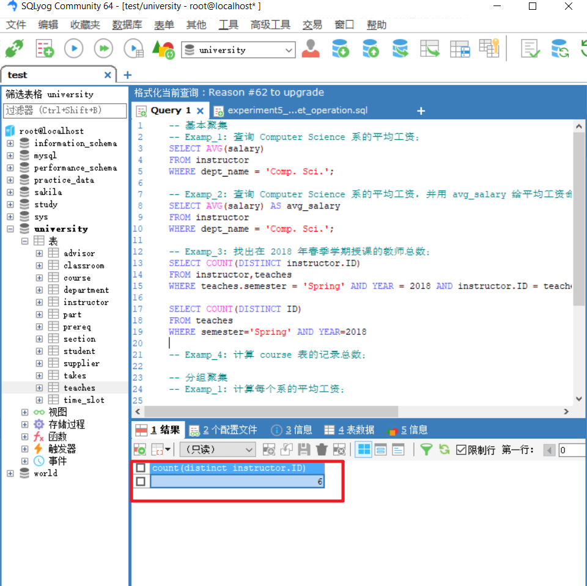
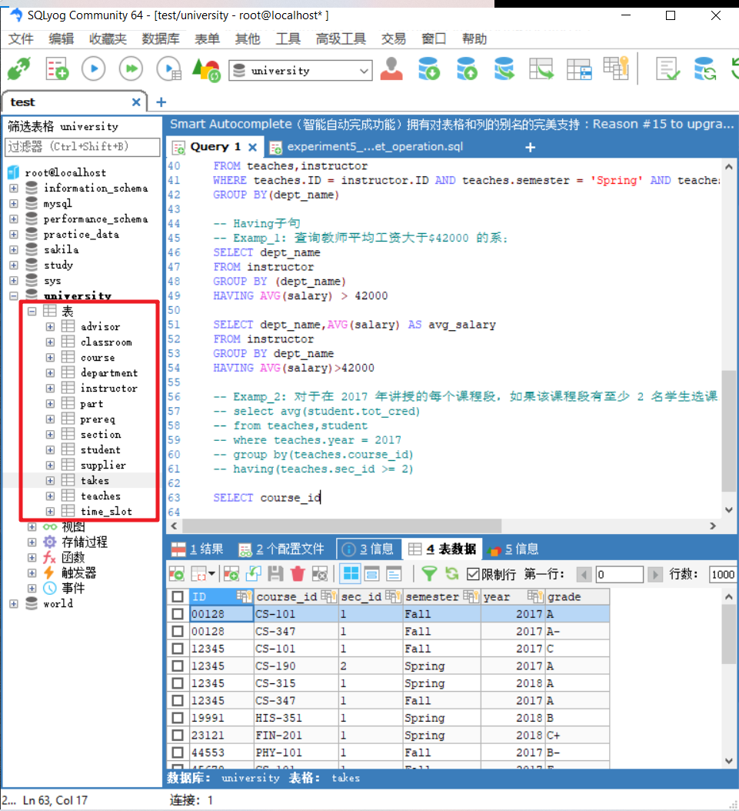

第四周 数据库作业

> 根据数据库文件生成ER图 sqlyog

> navicat datagrip各自介绍

> java语言开发的文件类型
>
> 这种文件类型和自己以前看到的exe文件类型的上层概念是什么
>
> 可执行文件类型
>
> .exe
>
> .jar?

> instructor id和teaches id怎么从数据表信息中看二者是相同的数据呢

> 写老师给的题目的时候
>
> 判断自己语句的对错与否非常不方便
>
> 需要自己将老师的命令粘贴进去之后重新执行一遍
>
> 实际开发场景中自己如何检查自己查询结果是否正确呢

> 不太理解其中一些数据表的定义
>
> 导致自己无法根据自然语言定位自己要查询的目标的表
>
> 实际开发场景对应的表是十几个以上的
>
> 这个问题应该不是我自己的

> group by 子句两边不能有括号的设定如何理解

> 给自己经常打开的文件夹建立快捷方式
>
> 每次提交文件下载文件转移文件到合适的位置都需要一些很繁琐重复的操作

