第四周 数据库问题记录

关系代数和SQL命令是一样的吗

- 实现区别是什么
- 之间存在包含关系吗
  - 关系代数的很多运算比如 查运算 交运算都不能直接通过sql对应命令实现


两个相似的查询结果生成之后没办法直观比较差异

```mysql
-- Examp_1: 找出 2017 年秋季开课，或 2018 年春季开课，或两个学期都开课的课程；（自动去重复）
(SELECT course.*,teaches.semester,teaches.year
FROM course,teaches
WHERE course.course_id = teaches.course_id AND teaches.semester = 'Fall' AND teaches.year = '2017')
UNION
(SELECT course.*,teaches.semester,teaches.year
FROM course,teaches
WHERE course.course_id = teaches.course_id AND teaches.semester = 'Spring' AND teaches.year = '2018')

-- Examp_2: 找出 2017 年秋季开课，或 2018 年春季开课，或两个学期都开课的课程；（使用 all 关键字保留重复）
(SELECT course.*,teaches.semester,teaches.year
FROM course,teaches
WHERE course.course_id = teaches.course_id AND teaches.semester = 'Fall' AND teaches.year = '2017')
UNION ALL
(SELECT course.*,teaches.semester,teaches.year
FROM course,teaches
WHERE course.course_id = teaches.course_id AND teaches.semester = 'Spring' AND teaches.year = '2018')
```


union能不能直接使用and or来实现

```mysql
SELECT course.*,teaches.semester,teaches.year
FROM course,teaches
WHERE course.course_id = teaches.course_id AND (teaches.semester = 'Fall' AND teaches.year = '2017') OR (teaches.semester = 'Spring' AND teaches.year = '2018')
```

> 生成的数据是不符合数据完整性约束的

> 为什么呢


`select`的语法定义结构如何理解

- 各个子句的执行顺序


```mysql
-- intersect交运算
-- Examp_1: 找出 2017 年秋季和 2018 年春季都开课的课程；

SELECT list1.*,teaches.semester,teaches.year
FROM 
	(SELECT course.*,teaches.semester,teaches.year 
	WHERE course.course_id = teaches.course_id AND teaches.semester = 'Fall' AND teaches.year = '2017') AS list1
	,
	(SELECT course.*,teaches.semester,teaches.year
	FROM course,teaches
	WHERE course.course_id = teaches.course_id AND teaches.semester = 'Spring' AND teaches.year = '2018') AS list2
 
WHERE list1.course_id = list2.course_id;
```

```
错误代码： 1051
Unknown table 'course'

错误代码： 1248
Every derived table must have its own alias
```

> 如何避免表的名称问题
>
> 感觉这种问题对自己来讲出现的频率会很高


提醒mysql语法错误的sqlyog插件或者工具


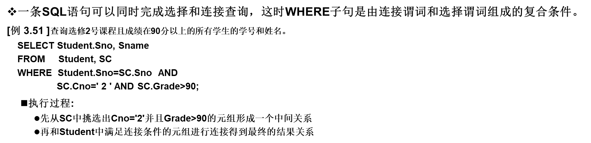

> 对一个子句组成成分的判断
>
> 依据是什么


为什么子查询不能使用ORDER BY子句


解释相关子查询和不相关子查询的查询原理


判断一个带有子查询的语句是相关还是不相关子查询

- 如何判断子句和父语句之间是否存在依赖关系

- in谓词的子查询为什么是不相关子查询

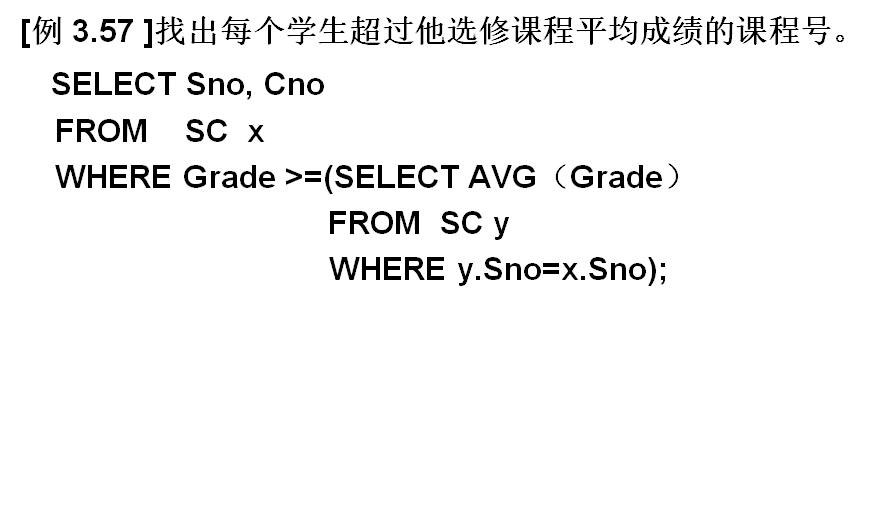

> 这个是相关子查询


不理解这里在分析的是哪个子查询的可能执行过程

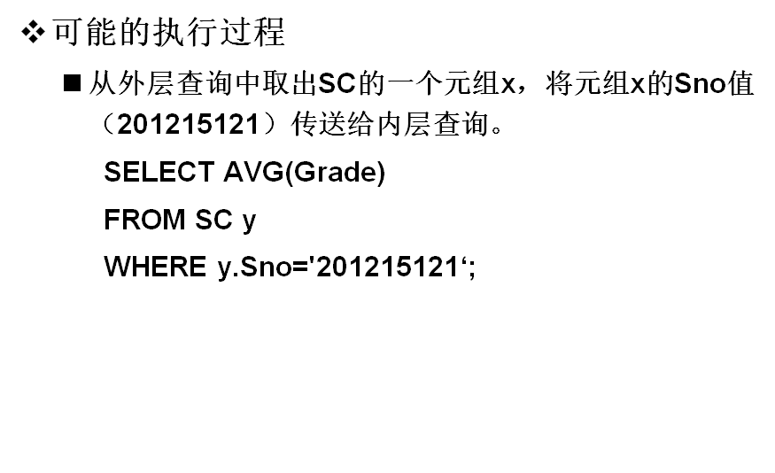


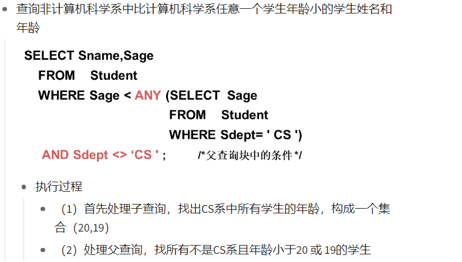

> `任意一个`和`所有`和`某个`的关系是什么
>
> 自己这里想用的是`ALL`


mysql的语法结构是什么

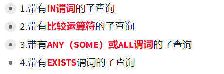

- 谓词
- 运算符


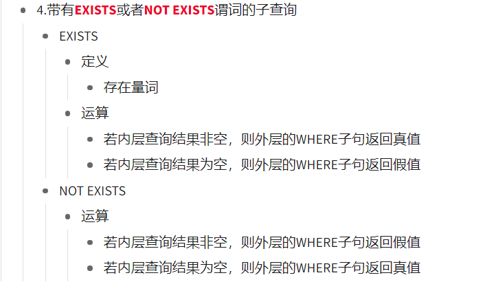

> 这里返回值的设置竟然和国外语言习惯是一样的
>
> 但是感觉技术上好理解很多


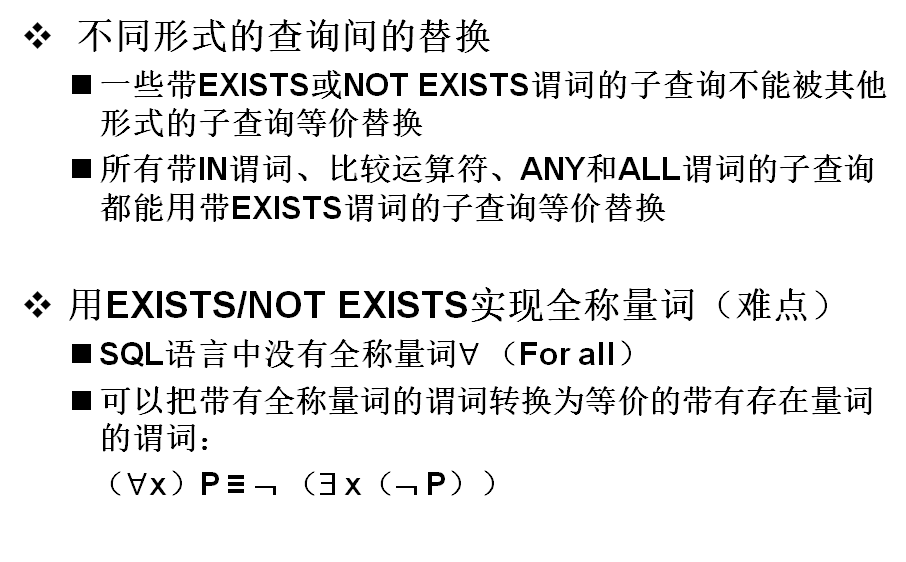


[例 3.60]查询所有选修了1号课程的学生姓名。

> 扫描所有ppt
>
> 将所有ppt中这种形式的例题导出
>
> 根据编号123进行章节分文件保存
>
> 整理出来自己的一个带答案的习题手册
>
> (如果答案也能导出也行)
>
> 接下来就是想办法把数据库给搞到了
>
> 数据库不是很能找得到


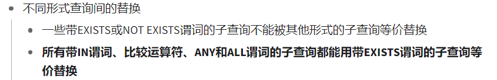

> 尝试一下不同查询
>
> 效率对比
>
> 替换原理
>
> 关系代数可以解释替换原理吗
>
> 为什么关系代数的有些理论并没有相关实现
>
> SQL语言中没有全称量词（For all）
>
> SQL语言中没有蕴涵（Implication）逻辑运算


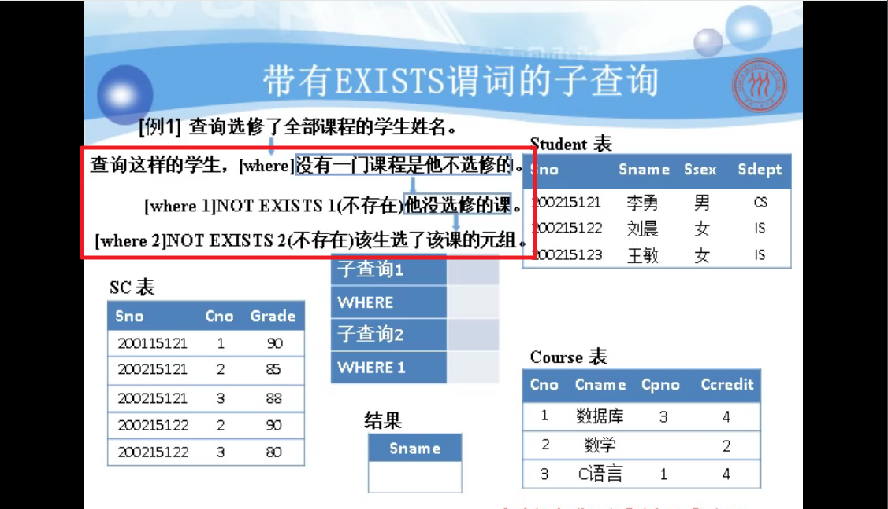

> 模仿这个对自然语言拆分的过程
>
> 数据处理过程理解比较困难
>
> 找到一个容易理解的方式


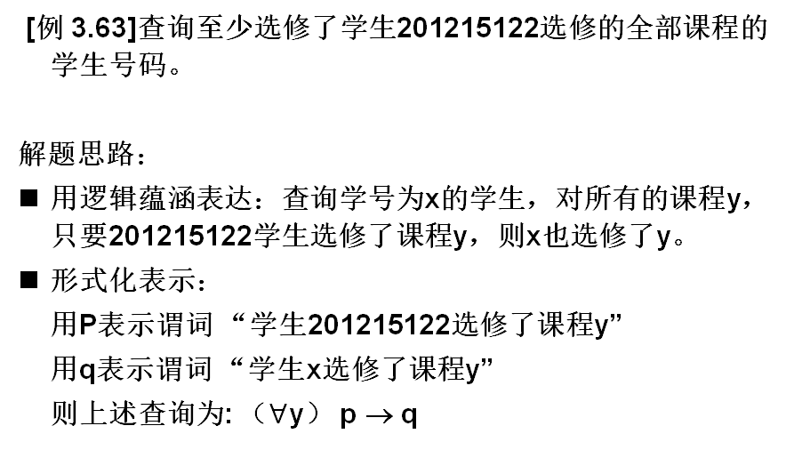

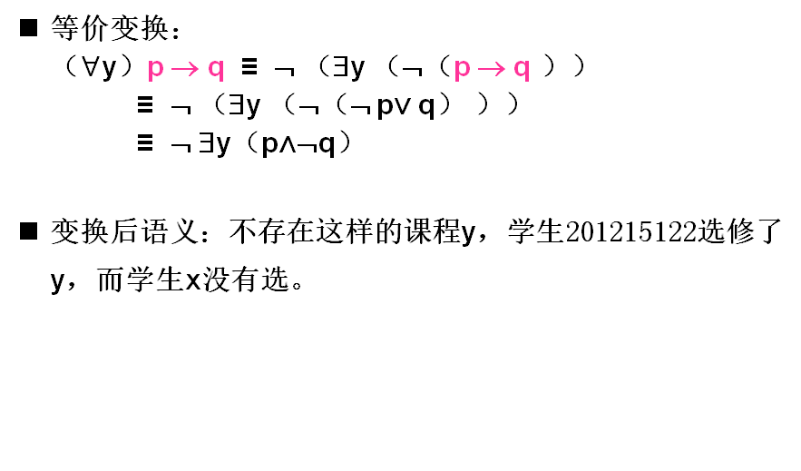

> 如何将自然表达的语句快速转换成谓词逻辑表达的句子
>
> (有没有什么逻辑识别的计算器之类的)

 

> 子查询可以出现的位置有哪些

```
子查询不仅可以出现在WHERE子句中，还可以出现在FROM子句中，这时子查询生成的临时派生表（Derived Table）成为主查询的查询对象
```


> SQL第三章需要自己通过实际的数据操作进行理解
>
> 比如下面这个理论自己不太理解

```
如果子查询中没有聚集函数，派生表可以不指定属性列，子查询SELECT子句后面的列名为其缺省属性
```


> 理解SQL中对空值的定义以及对比其他语言对空值的定义

```
“不知道”或“不存在”或“无意义”的值
空值是一个很特殊的值，含有不确定性。对关系运算带来特殊的问题，需要做特殊的处理。
```


> 时间久了就忘记了
>
> 没办法通过一些有意义的理解将其运算逻辑实现记忆存储

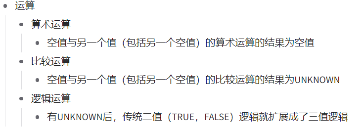


> 通过操作体会视图的如下作用

```
视图能够简化用户的操作
视图使用户能以多种角度看待同一数据 
视图对重构数据库提供了一定程度的逻辑独立性 
视图能够对机密数据提供安全保护
适当的利用视图可以更清晰的表达查询
```


> 不理解下面这个缺点的分析

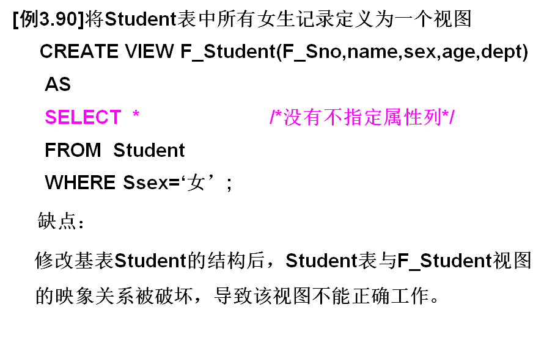


> 理解

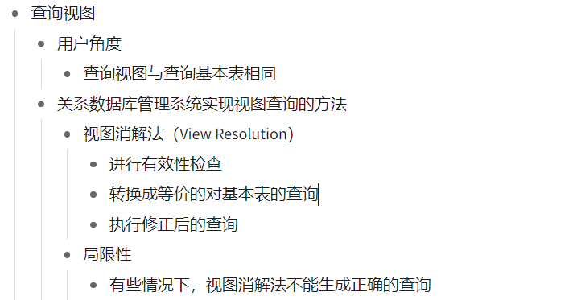

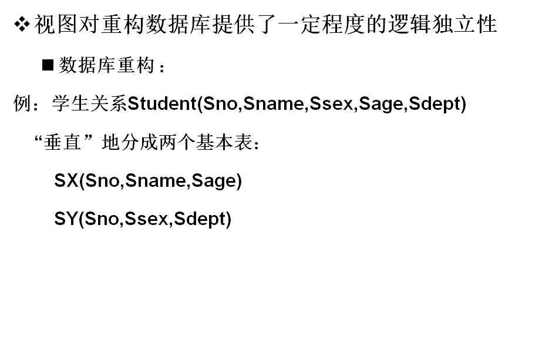

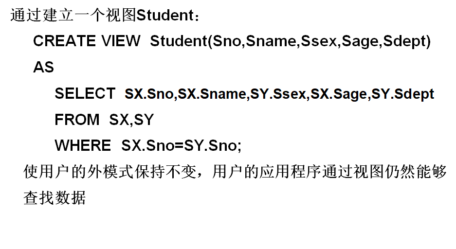


