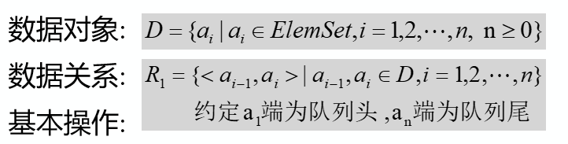
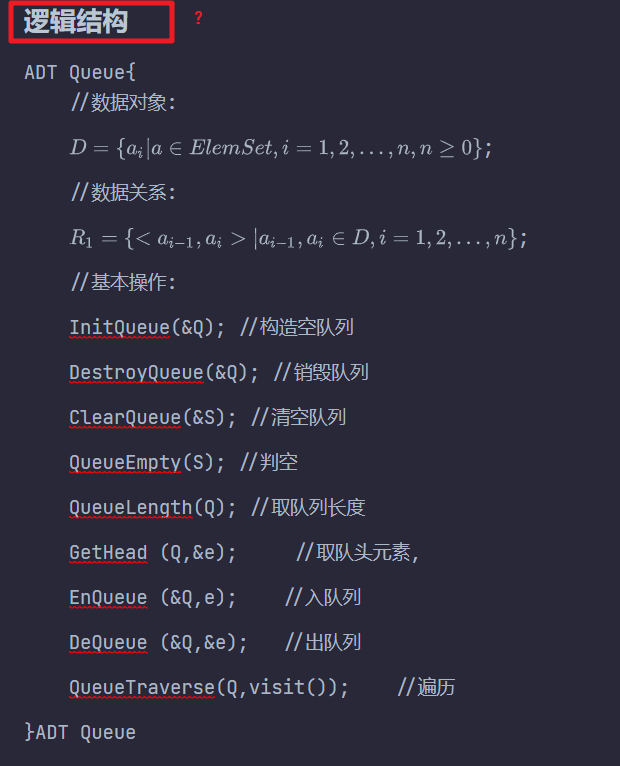
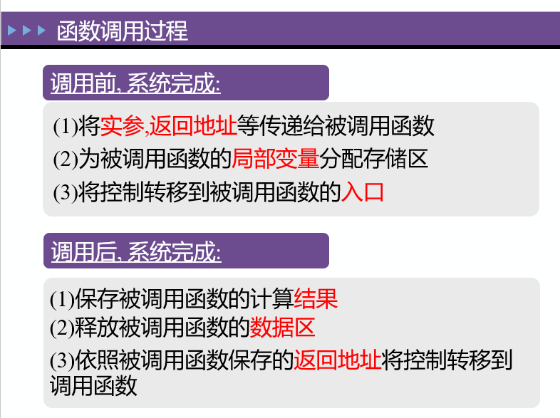
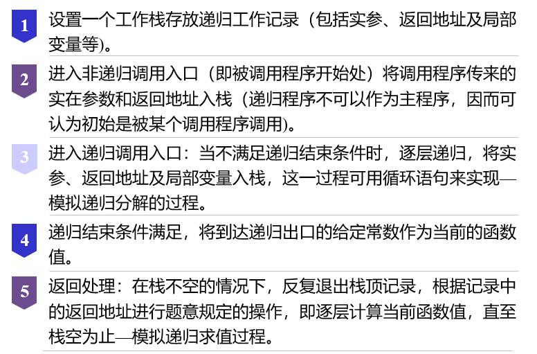
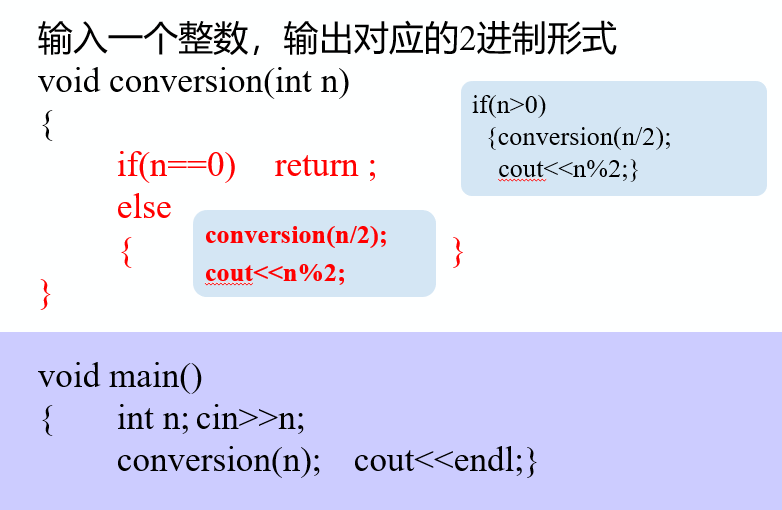
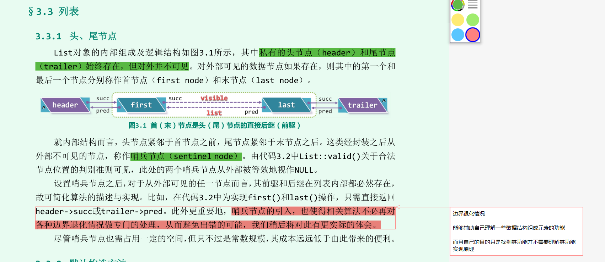

第四周 数据结构

线性表 (顺序表, 链表)

线性表: 栈 队列

> 根据概念的定义判断概念之间的关系
>
> 只能在表的一端（栈顶）进行插入和删除运算的线性表
>
> 队列是一种先进先出(FIFO) 的线性表. 在表一端插入,在另一端删除

数据结构之间的关系

为什么理论排列顺序是这样的


逻辑结构中的一对一关系是什么意思


运算规则定义是什么

> 运算规则：随机、顺序存取
>
> 运算规则：后进先出
>
> 运算规则：先进先出

> 感觉根据数据结构运算规则来判断应用常用场景的数据结构选择的时候有点儿抽象
>
> 比如括号匹配 进制转换的数据结构的选择


栈的数据结构定义的发展过程

The development process of the stack data structure definition.

> The development process of the stack data structure definition can be traced back to the early days of computer science when researchers were exploring ways to efficiently store and retrieve data in computer memory. The concept of a stack was first introduced in the 1940s and 1950s by researchers who were working on the design of programming languages and compilers.
>
> In the early days, the stack was primarily used as a way to store and retrieve subroutine return addresses and local variables. As programming languages evolved, the stack became a more important data structure and was used for a wide range of purposes, including expression evaluation, recursion, and parsing.
>
> Over time, researchers developed a more formal definition of the stack data structure, including the rules governing how data could be added and removed from the stack. This led to the development of stack-based programming languages and the widespread use of stacks in computer science and engineering.
>
> Today, the stack remains a fundamental data structure that is used in a wide range of applications, including operating systems, database management systems, and computer graphics. Its development process is a testament to the power of abstraction and formalization in computer science.


栈的数据结构定义的理论依据是什么

What is the theoretical basis for the definition of the stack data structure?

```cpp
typedef struct
{
    SElemType   *base;
    SElemType   *top;
    int stacksize;
}SqStack;

```

> The theoretical basis for the definition of the stack data structure is based on the concept of Last-In-First-Out (LIFO). LIFO is a fundamental principle in computer science that states that the last item added to a data structure will be the first item removed.
>
> In the case of a stack, data is added and removed from the top of the stack, which is also known as the "head" of the stack. This means that the most recently added item will always be the first item to be removed.
>
> The stack data structure is defined by a set of rules governing how data can be added and removed from the stack. These rules include the ability to push (add) an item onto the top of the stack and pop (remove) an item from the top of the stack.
>
> The stack data structure is widely used in computer science and engineering because it is simple, efficient, and easy to implement. It provides a powerful tool for managing data in a wide range of applications, including programming languages, operating systems, and database management systems.

判断两个操作的执行顺序本质上是在判断什么

```cpp
Status DestroyStack( SqStack &S )
{
    if( S.base )
    {
        delete S.base ;
        S.stacksize = 0;
        S.base = S.top = NULL;
    }
    return OK;
}
```


这种题目感觉应该更简单才对

使用cpp实现一个计算器能够实现计算输入序列的所有出栈序列的可能 

Implementing a calculator in C++ that can calculate all possible pop sequences of an input sequence.

explain this algorithm more detailed

> 1.如果一个栈的输入序列为123456，能否得到435612和135426的出栈序列？

> 1 2 3,(,表示压栈后是否直接弹出)
>
> 1,2,3,
>
> 1,2 3,
>
> 1 2,3,
>
> 1 2 3,


```cpp
#include <iostream>
#include <stack>
#include <vector>

using namespace std;

// Recursive function to calculate all possible pop sequences
void calculatePopSequences(stack<int>& st, vector<int>& input, vector<int>& output) {
    // Base case: if the stack is empty and all elements of the input have been processed
    if (st.empty() && input.empty()) {
        // Print the output sequence
        for (int i = 0; i < output.size(); i++) {
            cout << output[i] << " ";
        }
        cout << endl;
        return;
    }
	
    // Recursive case
    if (!input.empty()) {
        // Push the next input element onto the stack and recurse
        st.push(input.front());
        input.erase(input.begin());
        calculatePopSequences(st, input, output);
        input.insert(input.begin(), st.top());
        st.pop();
    }

    if (!st.empty()) {
        // Pop the top element of the stack and add it to the output sequence, then recurse
        output.push_back(st.top());
        st.pop();
        calculatePopSequences(st, input, output);
        st.push(output.back());
        output.pop_back();
    }
}

int main() {
    // Example input sequence
    vector<int> input = {1, 2, 3};

    // Call the recursive function to calculate all possible pop sequences
    stack<int> st;
    vector<int> output;
    calculatePopSequences(st, input, output);

    return 0;
}
```

```
               (empty stack, {1, 2, 3})
                      /            \
        (1 on stack, {2, 3})    (empty stack, {1, 2, 3})
               /         \          /        \
  (1 2 on stack, {3})  (2 on stack, {1, 3})  (1 on stack, {2, 3})
          |                 |                /        \
   (1 2 3) |          (2 1 3) |       (1 3 2) |       (3 1 2)

```

> 每个判断条件下的递归状态自己状态要弄清

> 将元素入栈的时机转换成不同的数组状态进行理解

> explain this code to a child

This program is like a game where you have a bunch of blocks and you want to see all the different ways you can take them off the top of a stack.

First, you start with a stack of blocks, and a list of blocks you want to put on the stack.

Then, the program takes one block from the list and puts it on top of the stack. Then, it calls itself again to see all the different ways to take blocks off the top of the stack.

After trying all the ways to take blocks off the stack, it puts the block it took off back onto the list, and takes off the block it put on earlier.

Then, it takes the next block from the list and puts it on top of the stack. It does this for every block in the list.

Finally, the program prints out all the different ways it found to take blocks off the top of the stack.

So, the program helps you see all the different ways you can take blocks off the top of a stack!

```cpp
#include <iostream>
#include <stack>
#include <vector>

using namespace std;

vector<vector<int>> calculatePopSequences(const vector<int>& input) {
    int n = input.size();
    vector<vector<int>> result;
    stack<int> st;
    int j = 0;
    for (int i = 0; i < n; i++) {
        st.push(input[i]);
        while (!st.empty() && st.top() == j+1) {
            j++;
            st.pop();
        }
    }
    if (!st.empty()) {
        // The input sequence is not a valid push sequence.
        return result;
    }
    for (int i = 1; i <= n; i++) {
        vector<int> popSequence(n, 0);
        stack<int> st;
        int j = 0;
        for (int k = 0; k < n; k++) {
            if (!st.empty() && st.top() == i) {
                st.pop();
                popSequence[k] = i;
            } else {
                while (j < n && (st.empty() || st.top() != i)) {
                    st.push(input[j]);
                    j++;
                }
                if (st.top() == i) {
                    st.pop();
                    popSequence[k] = i;
                } else {
                    // The input sequence is not a valid push sequence.
                    break;
                }
            }
        }
        if (st.empty()) {
            result.push_back(popSequence);
        }
    }
    return result;
}

int main() {
    vector<int> input = {1, 2, 3};
    vector<vector<int>> popSequences = calculatePopSequences(input);
    for (const auto& popSequence : popSequences) {
        for (int i : popSequence) {
            cout << i << " ";
        }
        cout << endl;
    }
    return 0;
}
```

==This implementation uses a stack to simulate the push and pop operations of a stack, and generates all possible pop sequences by trying each number as the first number to be popped.== The basic idea of the algorithm is to ==first check if the input sequence is a valid push sequence (i.e., whether it can be used to push items onto an empty stack and then pop them in a specific order)==. This can be done by using a stack to simulate the push operations, and for each input number, pushing it onto the stack and then popping all the items that can be popped based on the current state of the stack.

If the input sequence is a valid push sequence, we can then generate all possible pop sequences by trying each number from 1 to n as the first number to be popped. For each number i, we use another stack to simulate the pop operations, and for each input number, either pop it if it matches i, or push it onto the stack and try to pop more items until we can either pop i or determine that the input sequence is not a valid push sequence.

The time complexity of this algorithm is O(n^2) in the worst case, where n is the length of the input sequence, because we need to check all possible pop sequences by trying each number as the first number to be popped, and for each pop sequence, we need to simulate the pop operations using a stack. The space complexity is also O(n^2) in the worst case, because we need to store all possible pop sequences, each of which contains n numbers.

> 高地址作为base指针的时候
>
> 栈顶指针的运算是什么


递归算法的理论依据是什么, 如何快速理解递归算法, 从而快速应用递归算法解决问题

可视化递归代码的工具 辅助理解递归的工具有哪些

快速根据运算特点相出对应的逻辑结构的能力

recommend some tools for visualizing recursive code

There are several tools available for visualizing recursive code. Here are a few options:

1. VisuAlgo: VisuAlgo is a web-based tool that visualizes various data structures and algorithms, including recursive algorithms. It uses animated visualizations to show how the code executes, making it easier to understand the recursion.
2. PyCharm: PyCharm is an integrated development environment (IDE) for Python that includes a debugger with a feature for visualizing recursive calls. This allows you to see the call stack and step through the code to understand how it works.
3. Eclipse: Eclipse is a popular IDE for Java that includes a debugger with a feature for visualizing recursive calls. This allows you to see the call stack and step through the code to understand how it works.
4. Code.org: Code.org is a website that provides free resources for learning to code. They have an online tool called "App Lab" that allows you to create and visualize recursive code in JavaScript.
5. Code Visualizer: Code Visualizer is a desktop application that can generate visual representations of recursive code in several programming languages, including C++, Java, and Python. It creates flowcharts and other diagrams to help you understand the code.


能够使用递归解决的问题的特点是什么


链栈的base指针在哪里


训练递归能力的游戏和习题


> 这里对数据对象和数据关系的定义




> 数据结构的逻辑结构的代码表示是什么
>
> 是抽象数据类型的定义吗



> 不理解初始化动态分配存储空间中指针的作用

```cpp
#define MAXQSIZE  100   //最大队列长度
Typedef struct {
    QElemType *base;  //初始化的动态分配存储空间
    int  front;            //头指针   
    int  rear;             //尾指针
}SqQueue;  
```


> 指针刷题


> 为什么循环队列求长度的时候要加上一个MAXQSIZE

```cpp
int  QueueLength (SqQueue Q){
    return (Q.rear-Q.front+MAXQSIZE)%MAXQSIZE;                             
}
```


> 自己无法快速将栈和队列的数据结构抽象定义快速应用到对现实场景的识别上
>
> 比如递归对应的数据结构特点是栈 自己对这个的反应过程非常缓慢


> 计算函数调用的次数
>
> 理解递归好像还是要自己手动模拟一遍过程
>
> 但是比较奇怪的是 递归是接近人的思考方式的 为啥还要用这种非常耗时费力的枚举方法弄清楚每一步的栈空间状态呢

```
                   9x(8)
       5x(6)         +       3x(4)   + 1 = 9
  3x(4)  +  1x(0) + 1  1x(2) + 1x(0) + 1  
1x(2) + 1x(0) + 1
```

```
         	
         			8x(9)         
         4x(7)       +       3x(5) + 1
    2x(5) + 1x(3) + 1     1x(3) + 1x(1) + 1
1x(3) + 1x(1) + 1
```


> 循环队列部分困得想死
>
> 看不下去ppt
>
> 不太理解循环队列中模的应用解决了哪些问题
>
> 以及怎样就解决了这个问题


> 具有递归特性的数据结构
>
> 树 广义表
>
> 其他数据结构的特性对应的描述是什么呢


> 体会函数调用过程系统完成的工作
>
> 拿一个递归案例进行理解相对更方便




> 这部分内容理解得非常吃力
>
> 看不下去




> 感觉就是很简单的一个过程
>
> 自己对数据细节进行分析之后就直接写不出来了



```
10
10/2 -> 0
10/2/2 -> 1
10/2/2/2 -> 0
10/2/2/2/2 -> 1
```

```python
def conversion(number):
    if number == 1:
        result.append(resident)
    else:
    	number 
    return conversion(number)
```


```
😀>😀>😀>😀>😀>😀
 |  |
😀>   😀>😀>😀>😀
```


> 需要自己速通一下面向对象编程


> 看完ppt之后自己对数据结构大概结构和情况有感觉了
>
> 但是一些实现的细节上
>
> 指针运算
>
> 一些边界条件的处理
>
> 自己理解起来的效率都非常低
>
> 应该需要想办法让自己对数据结构有非常直观的感受


> 不理解这种题目考察的目的是什么
>
> 设栈S和队列Q的初始状态为空，元素e1、e2、e3、e4、e5和e6依次通过S，一个元素出栈后即进入Q，若6个元素出队的序列是e2、e4、e3、e6、e5和e1，则栈S的容量至少应该是（　）


> 在顺序表数据结构的定义中
>
> 自己对数据结构的组成元素各自代表的功能完全不理解

```cpp
typedef struct 
{
	string no;
	string name;
	double price;
}Book;

typedef struct
{
	Book *elem;
	int num;
}SqList;
```



> 邓的书目前能满足自己对数据结构组成元素功能的了解