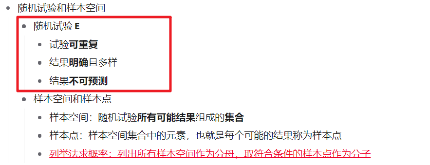
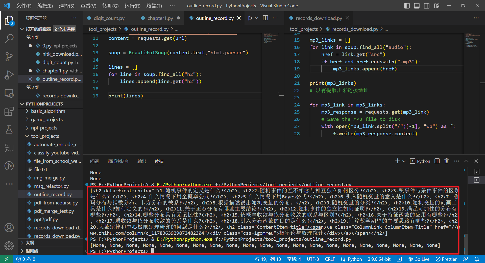
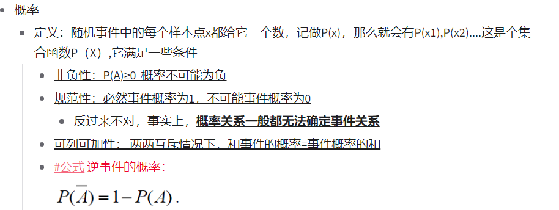
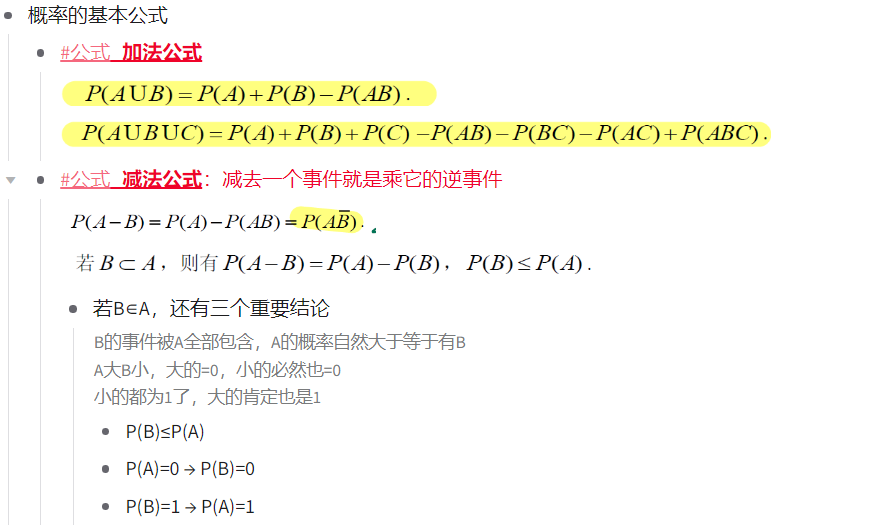
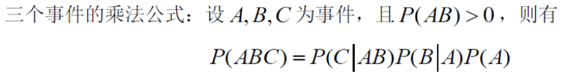
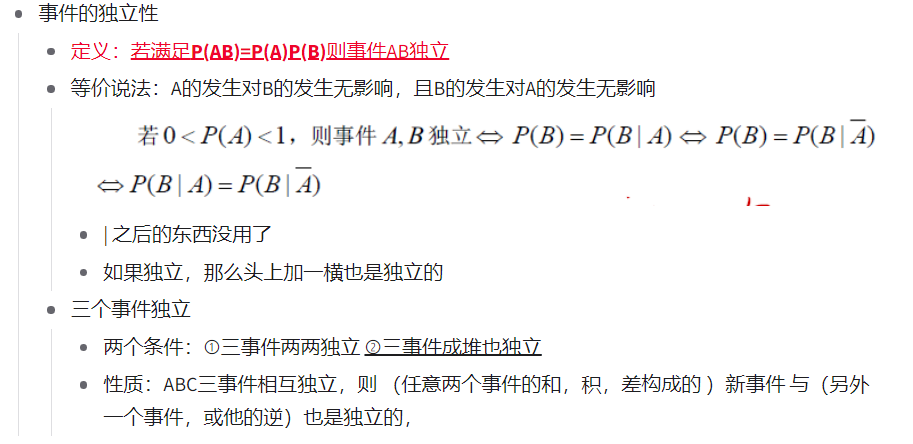
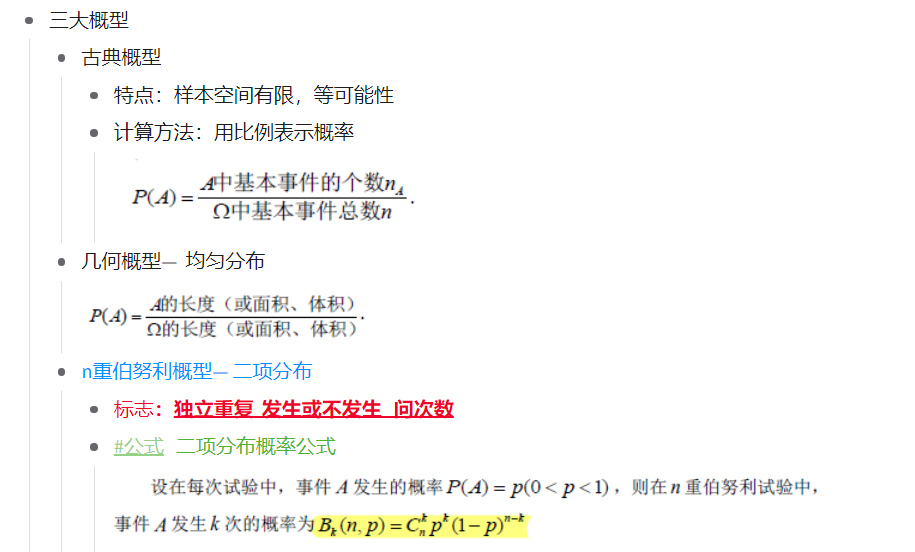
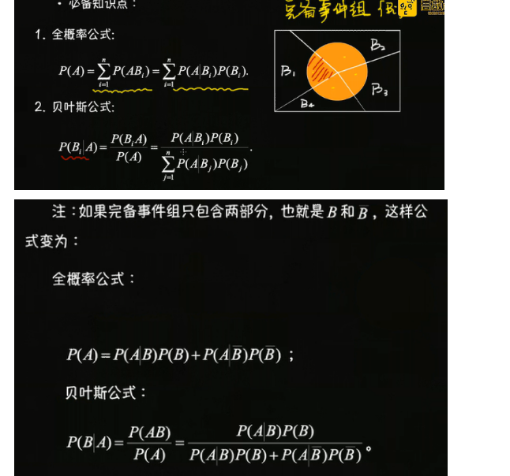

第四周 概率统计

> 使用python实现这道题目描述的功能 对某工厂出厂的产品进行检查，合格的记上“正品”，不合格的记上“次品”，如连续查出了2件次品就停止检查，或检查了4件产品就停止检查。根据条件计算所有能导致检查停止的产品数据情况

> 自己希望是题目中可变的条件是两个终止条件
>
> 样本空间生成器

> 对某工厂出厂的产品进行检查，合格的记上“正品”,使用1表示，不合格的记上“次品”，使用0表示, 如连续查出了2件次品就停止检查，或检查了4件产品就停止检查。 其中参数2和参数4更换成用户可输入得变量, 使用python计算生成用户输入下能使检查停止得所有样本数据


> 设计一个质检计算器 用户设定连续检查出现次品的个数和检查停止时所有产品的个数 质检计算器生成所有不满足条件的产品组成表和满足条件的产品组成表 用户可以使用查表方式判断当前产品是否满足条件 比如 连续检查出现两次次品就停止检查或连续检查四次就停止检查
>
> Design a quality inspection calculator. Users set the number of consecutive defective products to be checked and the total number of products to be checked before stopping the inspection. The quality inspection calculator generates a table of all products that do not meet the conditions and a table of products that meet the conditions. Users can use a lookup method to determine whether the current product meets the conditions. For example, if two consecutive defective products are found during inspection, the inspection will stop or if four consecutive inspections are performed, the inspection will stop.


```python
def quality_inspection(num_defective, total_products):
    consecutive_defects = 0
    all_products = []
    defective_products = []
    
    for product in range(total_products):
        is_defective = input(f"Is product {product+1} defective? (y/n)")
        
        if is_defective == 'y':
            consecutive_defects += 1
            defective_products.append(product+1)
        else:
            consecutive_defects = 0
        
        all_products.append(product+1)
        
        if consecutive_defects == num_defective:
            print(f"Inspection stopped after {num_defective} consecutive defects.")
            break
        elif product+1 == total_products:
            print(f"Inspection completed for all {total_products} products.")
    
    if len(defective_products) > 0:
        print(f"The following products did not meet the conditions: {defective_products}")
    else:
        print("All products met the conditions.")
    
    return all_products, defective_products

all_products, defective_products = quality_inspection(2, 10)

```

> 还是没办法给出所有可能结果
>
> 自己对题目的计算的目的转换得非常费劲


> 感觉比较好的是
>
> 自己通过编程能体会到随机试验的概念了
>
> 直接将题目动作转换成一段程序
>
> 体会题目描述的机器运行的原理
>
> 不过难受的是自己没办法描述出对应能直接生成样本空间情况的工具工作过程




> 感觉事件运算到事件之间概率的运算公式
>
> 两个之间的衔接非常奇怪
>
> 自己在这个过程中过渡得很不自然
>
> 但是不管是习题还是笔记都直接将两部分放在一起了


> 关于概率统计上的一些概念性的问题


> 将页面中的内容结构抓取下来
>
> 想处理掉标签的显示 但是一直出错
>
> 




1.随机事件的定义是什么?
2.随机事件的互不相容与相互独立如何区分? 

> 能通过venn图表示的事件关系是从哪个层次上进行的定义(集合吗)
>
> 相互独立是通过概率定义的概念, 通过概率定义的概念还有哪些, 自己如何判断
>
> 概率运算和集合运算之间的关系是什么

3.积事件与条件事件的区别是什么？    

> 

4.什么情况下用全概率公式? 
5.什么情况下用Bayes公式? 
6.引入随机变量的意义是什么? 
7.伽玛分布与指数分布、卡方分布的关系?  
8.根据描述说出随机变量的分布。 
9.随机变量的分类? 
10.随机变量的刻画工具是什么?如何定义的? 
11.关于正态分布有哪些主要结论? 
12.随机事件的独立性如何证明? 
13.满足可加性的分布有哪些? 
14.哪些分布具有无记忆性? 
15.依概率收敛与依分布收敛的联系与区别? 
16.关于特征函数的应用有哪些? 
17.弱收敛与依分布收敛的关系是什么? 
18.引入分布函数的目的是什么? 
19.计算数学期望的主要思路有哪些? 
20.大数定律和中心极限定理研究的问题是什么?

https://zhuanlan.zhihu.com/p/98131878


> 为啥要从这个角度定义概率 感觉很奇怪 
>
> 知道一个概念的目的是要自己使用的 
>
> 这tm我都用不起来
>
> 当作操作手册还行




> 在概率和集合的关系上
>
> 自己是通过venn图来记忆概率运算的基本公式的




> 注意理解这个拆解过程




> 如何理解事件的独立性和条件概率两个概念之间的关联
>
> 注意看等价说法 
>
> 以及条件概率定义实质上说是缩减了样本空间
>
> 那事件独立的在样本空间上的变化是怎样的呢
>
> 独立事件的性质很神奇




> 三大概型是用来做什么的 
>
> 对分别满足三大概型特征的(事件)的快速判断




> 感觉计算机专业学生或者其他工科类的学生的任务类型是
>
> 通过各种手段(包括原理了解, 概念对比, 实践应用)快速发现不同概念或公式之间的关联 快速建立前后逻辑的连接 方便快速应用知识工具

> 全概率和贝叶斯这里大概扫了一下


