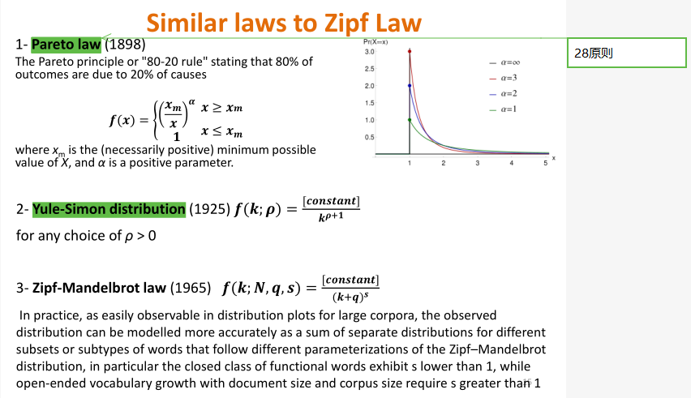
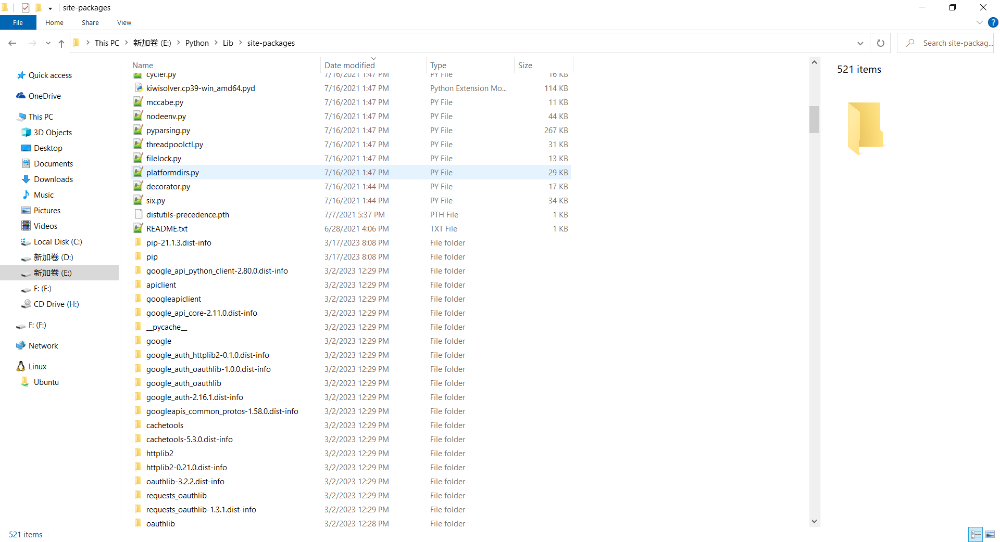
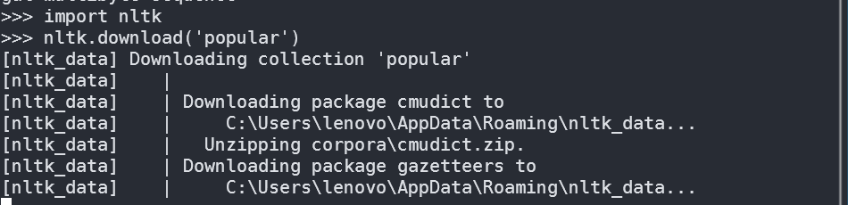
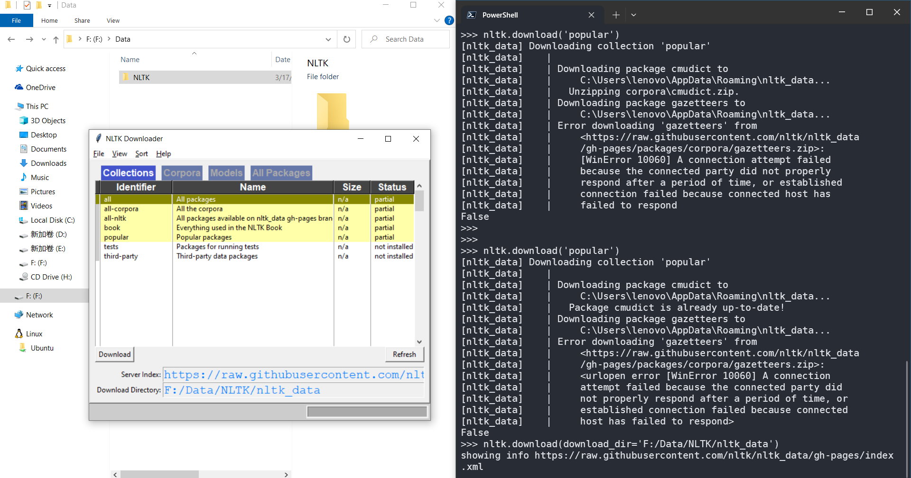
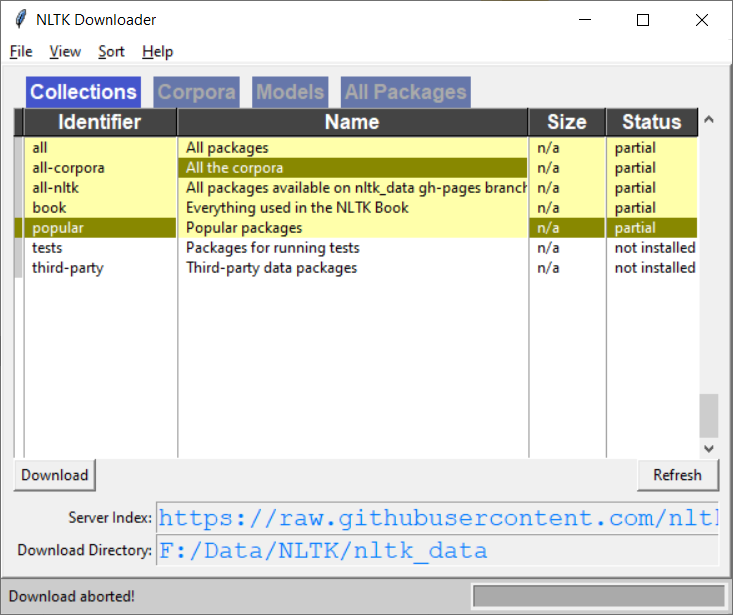
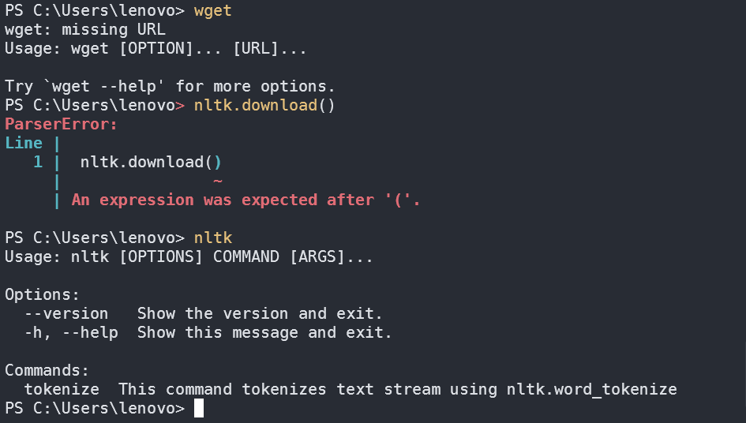
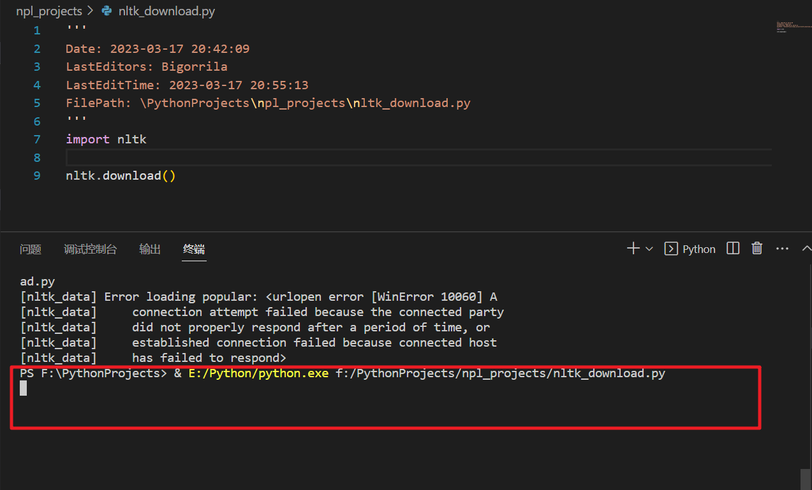
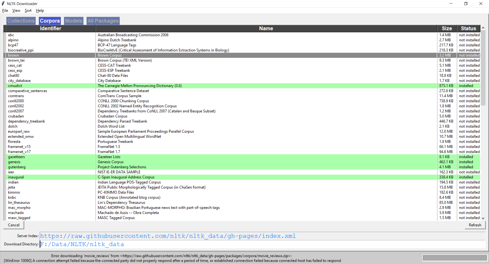

第四周 语料库构建与应用

> 这些法则的作用是什么
>
> 如何更高效的学习使用这些法则




> 看老师给得ppt的内容很累
>
> 中文没有对应的英文标注 不方便自己查找资料
>
> 英文术语正确但是表达方式非常不方便自己阅读
>
> 目前自己能找到利用的语料库的材料只有老师给的ppt
>
> 老师ppt结构给的也很烂
>
> 找本书来整理结构
>
> 

Herdan dimension

Zipf law

- Pareto law

- Yule-Simon distribution

- Zipf-Mandelbrot law

Heaps' law or Herdan's law

Bradford Law of scattering

Benford law or Newcomb–Benford law law of anomalous numbers

Brevity law Zipf's law of abbreviation

Menzerath's law, or Menzerath–Altmann law

```
尝试整理ppt结构 放弃了
解决测试和作业
```


> How to learn the course of corpus construction and application

Learning the course of corpus construction and application involves a few steps that you can follow:

1. Familiarize yourself with the basics: Start by understanding the fundamentals of corpus construction and application. This includes learning about the different types of corpora, how to collect and process data, and how to use different tools and software.
2. Read up on the subject: There are many books, articles, and online resources available that can help you learn more about corpus construction and application. Look for reputable sources that provide in-depth information on the topic.
3. Take a course: Consider enrolling in a course on corpus construction and application. This will provide you with a structured learning experience and access to an instructor who can answer your questions and provide feedback.
4. Practice, practice, practice: The best way to learn corpus construction and application is by doing it yourself. Collect and process your own data, use different software and tools, and experiment with different approaches to see what works best.
5. Collaborate with others: Working with others who are also interested in corpus construction and application can help you learn more and develop new skills. Consider joining a study group or participating in online forums or communities to connect with other learners.

> 解释这个报错并解决
>
> ```
> PS C:\Users\lenovo> pip install nltk
> Traceback (most recent call last):
>   File "E:\Python\lib\runpy.py", line 197, in _run_module_as_main
>     return _run_code(code, main_globals, None,
>   File "E:\Python\lib\runpy.py", line 87, in _run_code
>     exec(code, run_globals)
>   File "E:\Python\Scripts\pip.exe\__main__.py", line 4, in <module>
> ModuleNotFoundError: No module named 'pip'
> ```

The error message indicates that the Python interpreter is unable to find the 'pip' module, which is required to install other Python packages using the pip command. This could be due to a few reasons such as:

1. The Python installation on your system might not have included the pip module.
2. The environment variables might not be set up correctly.
3. The pip module might be corrupted or missing.

To resolve this issue, you can try the following steps:

1. Check if pip is installed on your system by running the following command in your terminal or command prompt: `python -m pip --version`. If pip is installed, it will display the version number. If not, you can download and install it from the official website: https://pip.pypa.io/en/stable/installation/
2. If pip is already installed, you can try upgrading it to the latest version by running the command `python -m pip install --upgrade pip`.
3. If upgrading doesn't work, you can try uninstalling and reinstalling pip by running the commands `python -m pip uninstall pip` and `python -m ensurepip --default-pip`.
4. If none of the above steps work, you can try reinstalling Python on your system. Make sure to select the option to include pip during the installation process.

Once you have successfully installed or reinstalled pip, you should be able to use it to install packages such as NLTK.

> 自己的python lib里面乱七八糟的
>
> 感觉很心烦
>
> 如果使用venv的话能解决这个问题吗
>
> 如果不能有其他解决办法吗




> 今天比较奇怪
>
> 自己之前挂梯使用pip install的时候经常会出现错误
>
> 但是今天都下载成功了


> 使用nltk下载数据的时候 数据也是直接放到C盘下了
>
> 数据库资料都下载失败了
>
> 想指定下载的路径




> 指定nltk下载语料库数据的路径而不是默认下载到C盘中"
>
> Specify the path for downloading the NLTK corpus data instead of downloading it to the default C drive location.

To specify a custom path for downloading the NLTK corpus data, you can use the `nltk.download()` function with the `download_dir` parameter. For example, if you want to download the corpus data to a folder named "nltk_data" in your user directory, you can do the following:

```python
import nltk
nltk.download(download_dir='/Users/yourusername/nltk_data')
```

Replace "yourusername" with your actual user name on your system. This will download the corpus data to the specified directory instead of the default C drive location.

> nltk本身是什么





> 如何直接跳过自己下载不了的语料库
>
> 使用nltk下载数据的时候一直出现网络问题 如何跳过一些无法请求下载的内容 从而方便进行其他数据的下载
>
> When using NLTK to download data, there are always network issues. How can I skip some of the content that cannot be downloaded and make it easier to download other data?


If you encounter network issues while downloading data with NLTK, you can skip downloading specific files by using the `nltk.download()` function's `skip()` method.

For example, if you want to skip downloading the file named "file_to_skip", you can run the following code:

```python
import nltk

try:
    nltk.download("all")
except Exception as e:
    print(str(e))
    # Skip the file named "file_to_skip"
    nltk.download("all", skip=["file_to_skip"])
```

In this way, you can skip downloading specific files that are causing network issues and continue with other data downloads.


> I want to download the corpora data nltk provided but the internet connection is very violate, how to download these data

If you have a slow or unstable internet connection, you may experience difficulty downloading large corpora datasets provided by NLTK. Here are a few steps you can take to try to download the datasets:

1. Use the `nltk.download()` function: The easiest way to download datasets provided by NLTK is to use the `nltk.download()` function in Python. This function allows you to download specific datasets or all of the datasets provided by NLTK. To use this function, open a Python shell or start a Python program and enter the following commands:

```
pythonCopy codeimport nltk
nltk.download()
```

This will open the NLTK Downloader GUI, which allows you to select the datasets you want to download. If your internet connection is too slow or unstable, you can try selecting a smaller subset of the datasets.

1. Use a ==download manager==: If you're downloading large datasets, you may find that your internet connection is not stable enough to download the entire dataset at once. In this case, you can try using a download manager such as `wget` or `curl` to download the dataset in smaller chunks. For example, you can use the following command to download the `brown` corpus dataset using `wget`:

```
rubyCopy code
wget https://archive.org/download/nltk_data/nltk
```

> 这些东西都能直接脱离python使用了吗
>
> 感觉直接就是一个软件了



> 如何加快这个东西的退出过程




> 之后下载数据来这里
>
> 用到什么自己下载什么就好了

