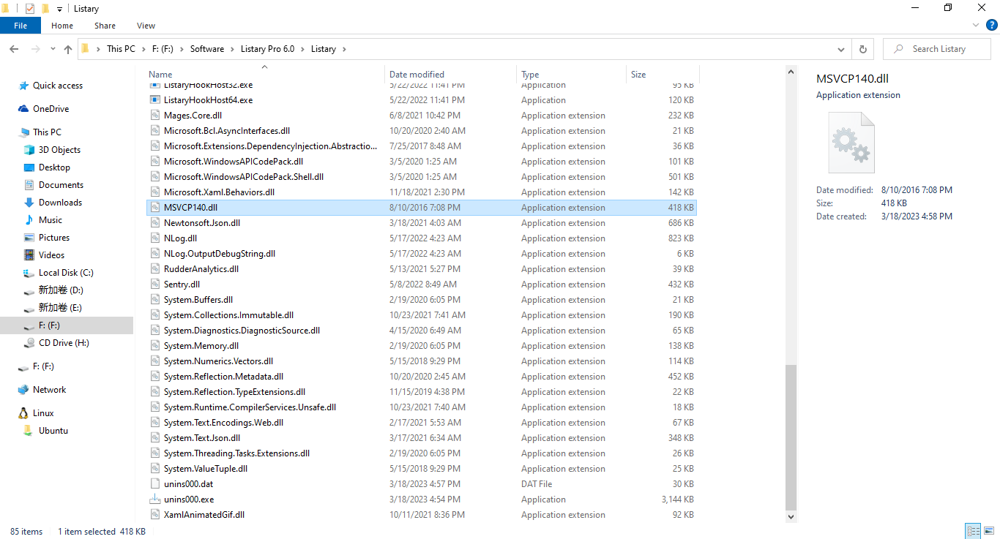

# 第四周 问题解决记录

软件工程很重要，但是好像跟你的困境没多大关系。
所以个人感觉你现在当务之急是“如何把一个大的软件拆分成多个小的、简单的模块”（抽象思维、或者有人说计算思维）；而不是“如何管理已经被拆得乱七八糟的模块，或者将来会出现的乱七八糟的模块”（软件工程要解决的最基本最现实的问题就是这个，当然也不仅限于这个问题）。
所以，可能你看看数据结构与算法的书？或者看看别的工程是如何拆分功能的？

https://www.v2ex.com/t/630512

首先理解设计原则，然后再看设计模式，就很自然了

https://www.v2ex.com/t/907356

我编译原理是大学的时候选修的虽然没有好好听课，都是后面做大作业的时候自己看龙书（中文的）……但是在讲例子的时候都有认真在听

所以我觉得在学习自动机分析器这些内容的时候，有个视频一步步带着，就像 debug 一样还是比较好理解的

> 对就是很神奇
>
> 编译原理这个课程
>
> 老师一步一步带着自己听自己基本上能听个七七八八
>
> 但是要自己看的话绝对会劝退 而且兴趣也不大
>
> 是不是说对于一些自己没有很大动力学习 或者难度大的任务
>
> 可以尝试合作学习
>
> 将一些管理理解任务外包出去

> 数据库设计开发 自己想开始设计数据库

一些角色定位: SQL数据库开发人员与管理人员

> 破解listary的过程
>
> 教程自己看得比较粗糙
>
> 自己还是在看这种步骤类的东西的时候感觉非常焦虑
>
> 急躁

https://www.buxiaoyao.com/listary-pro-v6/

> 将所有课程相关的通知聚集起来

- 按照学科分类
  - 方便手动添加
  - 设置日期提醒
  - 做一个类似提ios醒事项的win桌面软件

> 硬件连接优先级

