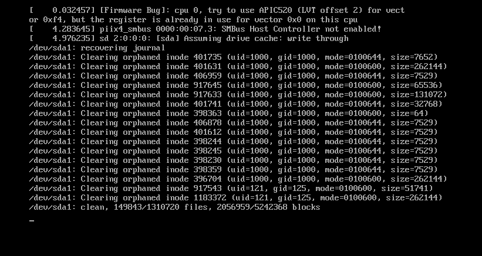

第五周 Linux开发环境搭建

> 大猩猩 5:22:42 PM
> 我不想用win了
>
> 大猩猩 5:22:46 PM
> win真的好恶心
>
> 大猩猩 5:22:59 PM
> 开发上出现了好多乱七八糟的问题
>
> 大猩猩 5:26:05 PM
> 不想用wsl了感觉自己用wsl还是在win的基础上去解决问题的
>
> 自己win c爆红了 移动wsl到别的盘符 不知道会报什么错 直接放弃了
>
> 人家下载都是十个mb起的
>
> 大猩猩 5:38:38 PM
> 每次都是因为安装环境重装系统浪费时间
> 自己因为时间损耗问题都不敢大胆做一些尝试
>
> 大猩猩 5:38:47 PM
> 学得真tm憋屈
>
> 大猩猩 5:39:06 PM
> 毕业选房子条件就是网速要好
>
> 大猩猩 5:39:22 PM
> 自己还要提前了解一些关于网络速度的内容


> 看别人给的安装包都有点儿不舒服
>
> 需要自己去查证的


> 解释这个提示的意思


> Installer detected the host has Hyper-V or Device/Credential Guard enabled.To run VMware Workstation Pro on hosts with Hyper-v or Device/CredentialGuard enabled , install Windows Hypervisor Platform (WHP) on the hostthrough 'turn Windows features on or off , or remove the Hyper-v role fromthe system. Check the following checkbox if you want the installer to installWHP on the host automatically.
> 安装程序检测到主机具有Hyper-V或设备/凭据保护。要在启用Hyper-v或设备/CredentialGuard的主机上运行VMware WorkStation Pro，在主机上安装Windows Hypervisor平台(WHP)，打开或关闭Windows功能，或从系统中删除Hyper-v角色。如果希望安装程序自动在主机上安装WHP，请选中以下复选框。


So imagine you have a really cool toy called "VMware Workstation Pro" that you want to play with on your computer. But your computer has some special settings called =="Hyper-V" or "Device/Credential Guard"== that make it a bit tricky to use the toy.

To make it work, you need to do one of two things: either add another special setting called "Windows Hypervisor Platform" (WHP) to your computer, or take away the "Hyper-V" setting from your computer.

The person who made the toy has made it easy for you by giving you a special tool called an "installer" that can automatically add the WHP setting for you, if you want. All you have to do is check a little box on the installer, and it will take care of the rest.


explain this prompt to a child Enhanced Keyboard Driver (a reboot will be required to use this feature)This feature requires 10MB on your host drive.


> 虚拟机按安装过程解释


> 自己的虚拟机上没有摄像头硬件


> 调整了一下分辨率
>
> 刚刚好


> Linux相关评论

https://www.bilibili.com/video/BV1s24y1y7M8/


> 就是删了一个wsl
>
> 然后还另外安装了一个vmware


> 使用中文的时候真的很不敏感对象是什么


> 从虚拟机向主机进行内容的复制粘贴不方便


> 虚拟机网络的相关设置


> VMware 虚拟机 宿主机 之间的关系是什么
>
> 虚拟机运行产生的数据存储的位置在哪里
>
> 虚拟机如果产生的数据的位置在win上
>
> 数据是通过vmware传送到win上的吗


> 虚拟机上网的原理
>
> win的所有软件都可以上网

常规软件上网原理

网卡硬件 + win系统 + 应用 <u>借助端口号</u>> 通过win系统(理解了为什么说网络是一种特殊的IO模式了)

虚拟机上网原理

网卡软件 + win系统 + VMware + ubuntu(通过vmware来实现上网)

具体上网方式 (ubuntu如何通过VMware和win系统之间建立关联)

两种上网方式的区别

NAT方式 更简单 要求少

- 类似普通软件的上网方式

桥接方式 

- 和win并列对接外部网络(分时复用网卡)
- 相当于外部网络多出来了主机


> VMware虚拟机（Ubuntu）通过主机代理实现翻墙（shadowsocks）
>
> 问题描述优化
>
> 外网 -->翻墙
>
> ++主机代理

https://steemit.com/ubutnu/@yanwu/vmware-ubuntu-shadowsocks

> 不理解主机中输入ipconfig得到的ipv4地址是什么
>
> 通过what is my ip不能找到相关信息


> 有没有对电脑性能指标进行监控提醒的用户工具
>
> 网速 硬件资源占用(CPU 内存 磁盘空间等)
>
> 让用户能清楚知道当前操作不流程对应的直观指标是什么
>
> 方便用户从指标上寻找解决方案


> 如何使用snapshots


> 开机自动启动虚拟机设置


> 虚拟机会自动调整分辨率到一个比较小的值


在vmware中实现日常开发


像运维工程师一样管理自己的电脑


> 笔记本如何提高电脑内存配置呢


> 电脑支持的内存最大值


> 自己电脑的相关指标


> 电脑本身能显示的信息


> 构建linux操作系统集群的时候直接复制粘贴即可


> 虚拟机ubunt的开关机速度都非常慢


> 拷贝克隆和快照的区别是什么


> Ubuntu在下载的过程中
>
> 每部分文件下载的位置都非常清楚的提示了


```makefile
root@kristen-virtual-machine:/opt/vmware-tools-distrib# ./vmware-install.pl
open-vm-tools packages are available from the OS vendor and VMware recommends
using open-vm-tools packages. See http://kb.vmware.com/kb/2073803 for more
information.
Do you still want to proceed with this installation? [no] yes

INPUT: [yes]

Creating a new VMware Tools installer database using the tar4 format.

Installing VMware Tools.

In which directory do you want to install the binary files?
[/usr/bin]

INPUT: [/usr/bin]  default

What is the directory that contains the init directories (rc0.d/ to rc6.d/)?
[/etc]

INPUT: [/etc]  default

What is the directory that contains the init scripts?
[/etc/init.d]

INPUT: [/etc/init.d]  default

In which directory do you want to install the daemon files?
[/usr/sbin]

INPUT: [/usr/sbin]  default

In which directory do you want to install the library files?
[/usr/lib/vmware-tools]

INPUT: [/usr/lib/vmware-tools]  default

The path "/usr/lib/vmware-tools" does not exist currently. This program is
going to create it, including needed parent directories. Is this what you want?
[yes] yes

INPUT: [yes]

In which directory do you want to install the common agent library files?
[/usr/lib]

INPUT: [/usr/lib]  default

In which directory do you want to install the common agent transient files?
[/var/lib]

INPUT: [/var/lib]  default

In which directory do you want to install the documentation files?
[/usr/share/doc/vmware-tools]

INPUT: [/usr/share/doc/vmware-tools]  default

The path "/usr/share/doc/vmware-tools" does not exist currently. This program
is going to create it, including needed parent directories. Is this what you
want? [yes] yes

INPUT: [yes]

The installation of VMware Tools 10.3.23 build-16594550 for Linux completed
successfully. You can decide to remove this software from your system at any
time by invoking the following command: "/usr/bin/vmware-uninstall-tools.pl".

Before running VMware Tools for the first time, you need to configure it by
invoking the following command: "/usr/bin/vmware-config-tools.pl". Do you want
this program to invoke the command for you now? [yes] yes

INPUT: [yes]

Initializing...


Making sure services for VMware Tools are stopped.

Stopping VMware Tools services in the virtual machine:
   Guest operating system daemon:                                      done
   VMware User Agent (vmware-user):                                    done
   Unmounting HGFS shares:                                             done
   Guest filesystem driver:                                            done


The module vmci has already been installed on this system by another installer
or package and will not be modified by this installer.

The module vsock has already been installed on this system by another installer
or package and will not be modified by this installer.

The module vmxnet3 has already been installed on this system by another
installer or package and will not be modified by this installer.

The module pvscsi has already been installed on this system by another
installer or package and will not be modified by this installer.

The module vmmemctl has already been installed on this system by another
installer or package and will not be modified by this installer.

The VMware Host-Guest Filesystem allows for shared folders between the host OS
and the guest OS in a Fusion or Workstation virtual environment.  Do you wish
to enable this feature? [yes] yes

INPUT: [yes]

The vmxnet driver is no longer supported on kernels 3.3 and greater. Please
upgrade to a newer virtual NIC. (e.g., vmxnet3 or e1000e)

The vmblock enables dragging or copying files between host and guest in a
Fusion or Workstation virtual environment.  Do you wish to enable this feature?
[yes] yes

INPUT: [yes]


Skipping configuring automatic kernel modules as no drivers were installed by
this installer.


Disabling timer-based audio scheduling in pulseaudio.

Do you want to enable Guest Authentication (vgauth)? Enabling vgauth is needed
if you want to enable Common Agent (caf). [yes] yes

INPUT: [yes]

Do you want to enable Common Agent (caf)? [no] yes

INPUT: [yes]


Detected X server version 1.19.6


Distribution provided drivers for Xorg X server are used.

Skipping X configuration because X drivers are not included.


Skipping rebuilding initrd boot image for kernel as no drivers to be included
in boot image were installed by this installer.

Generating the key and certificate files.
Successfully generated the key and certificate files.
The configuration of VMware Tools 10.3.23 build-16594550 for Linux for this
running kernel completed successfully.

You must restart your X session before any mouse or graphics changes take
effect.

To enable advanced X features (e.g., guest resolution fit, drag and drop, and
file and text copy/paste), you will need to do one (or more) of the following:
1. Manually start /usr/bin/vmware-user
2. Log out and log back into your desktop session
3. Restart your X session.

Found VMware Tools CDROM mounted at /media/kristen/VMware Tools. Ejecting
device /dev/sr0 ...
umount: /media/kristen/VMware Tools: target is busy.
/usr/bin/eject:卸载 `/media/kristen/VMware Tools'失败
Eject Failed:  If possible manually eject the Tools installer from the guest
cdrom mounted at /media/kristen/VMware Tools before canceling tools install on
the host.
Enjoy,

--the VMware team
```


昨天设置的代理不能用了


> 今天虚拟机开机的时间非常长
>
> log文件如何理解




