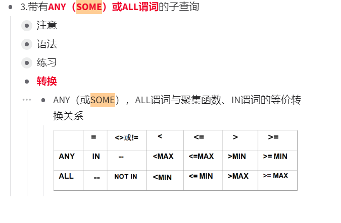
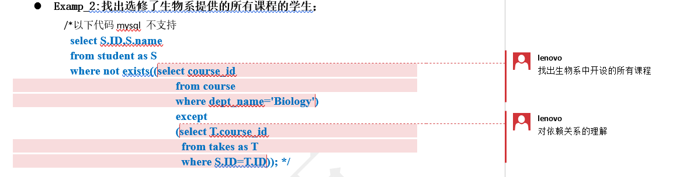

> 是不是sql进行数据操作之后显示的结果不直观 
> 所以自己不太能高效地对sql语言的功能形成直观感受
> 导致自己学了之后基本上不太会记得住 也不知道什么时候能用


> 使用sqlyog编写数据库的时候没办法对自己的书写内容进行自动校验
>
> 在使用vs配置mysql的时候注意一下


> 自己无法在zeal中查找到相关的子句表达



> Every derived table must have its own alias

```mysql
-- Examp_1: 找出2017年秋季和2018年春季都开课的课程；
select course_id
from
	(select fa17.course_id 
	from section as fa17
	where semester = 'Fall' and year = 2017)
	,
	(select sp18.course_id
	from section as sp18
	where semester = 'Spring' and year = 2018)
where fa17.course_id = sp18.course_id;
```

弄清楚这种错误发生背后的逻辑是什么


> 是不是sql进行数据操作之后显示的结果不直观 
> 所以自己不太能高效地对sql语言的功能形成直观感受
> 导致自己学了之后基本上不太会记得住 也不知道什么时候能


> 自己需要训练快速阅读理解别人查询语句的能力


> 除法运算用来表达两个集合之间的包含关系
> 弄清楚集合之间的关系


