第五周 软件工程之作业

5.6、采用结构化分析方法写出==书店管理系统==的需求文档，包括数据流图及数据字典。书店JS是一家从事图书销售的传统公司，对系统的要求如下：

(1)记录每本图书的库存。

(2)实现图书的零售(包括打折)，实行开架售书。

(3)可每日统计销售情况。

(4)实现图书的采购，退货及结算，实现与==供货商==的**销售及结算关系**。

(5)遵守出版行业的行规:在书店到书后，若在3个月内未实现销售，可全部或部分退货，在发书后3个月内给予发票，书店在3个月后可部分或全部付款，该项规则对采购或批发均有效。

> 这项规则要求我实现的是什么

(6)该书店还可将该产品批发给其他书店。

(7)在==供应商==、==书店==、==其他书店==、==零售客户==之间的结算采用码洋折扣方式进行，即，如果图书的实价为X、则图书码洋为X、而以7折给书店，则图书实洋就为0.7x、供应商、书店等以相对固定的折扣进行交易。

(8)==管理人员==可随时查看库存、采购，销售、付款，到款情况，并能提供日/月销售报表、应付/付款情况分析表、应收/到款情况分析表。

由于销售商品是==图书==,图书除有书名、作者、出版社外,还有版次,印次、出版日期以及ISBN号,条码,定价;

由于出版领域的特殊性，一种图书(如软件工程)只有一个ISBN 号以及一个条码,而该图书依据不同的版次,印次,可有不同的定价,这给条码扫描(销售及入/出货时)确定一本图书带来了一定的困难。

> 看完题目之后完全不知道自己能做什么

> 如何高效阅读需求规格说明书

数据流

- 库存单

- 零售单

- 销售报表

  - 日/月销售报表
  - 应付/付款情况分析表
  - 应收/到款情况分析表

- 采购单

  - 采购信息
  - 退货信息
  - 结算信息

- 图书信息

  - 书名
  - 作者
  - 出版社

  

  - 版次
  - 印次
  - 出版日期

  

  - ISBN号
  - 条码
  - 定价

加工

- 记录库存
- ~~图书零售~~
- 统计销售
- 图书批发

实体

- 供货商
- JS书店
- 其他书店
- 零售客户
- 管理人员
- 图书

> 感觉自己看得图太少了
>
> 还是画不出来

> 自己没办法从需求信息里找到这些明确的数据流

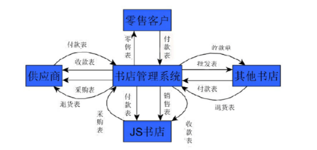

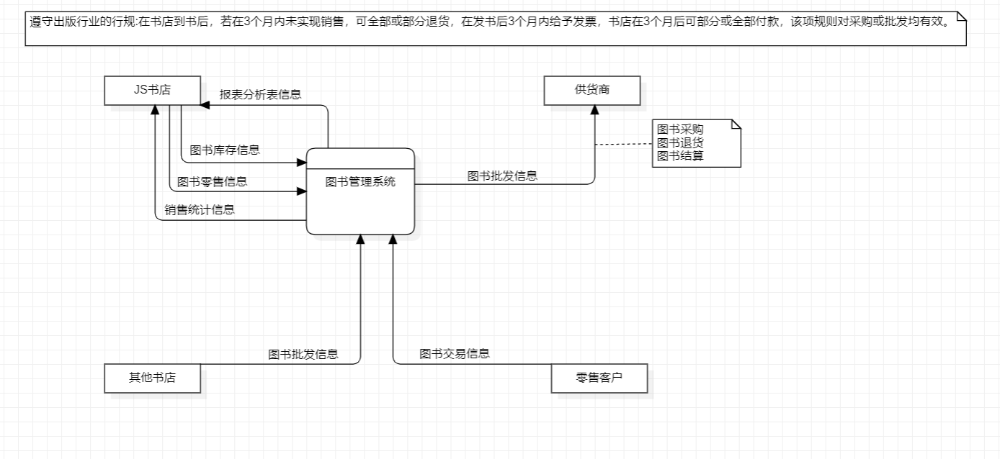

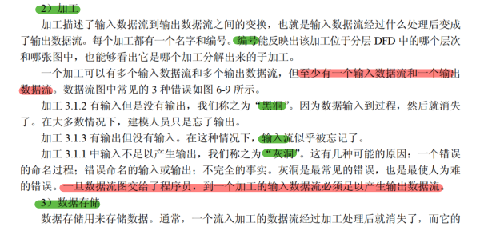

> 为啥这种要求不能在绘图工具中实现约束

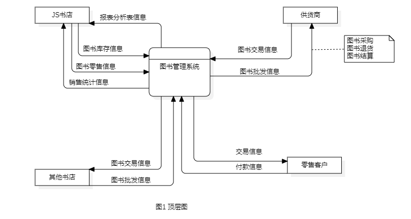

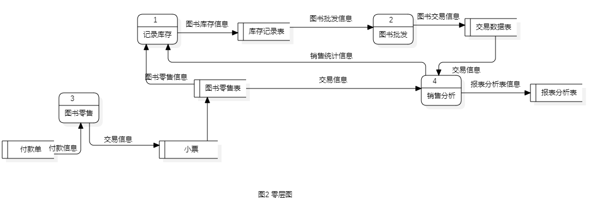

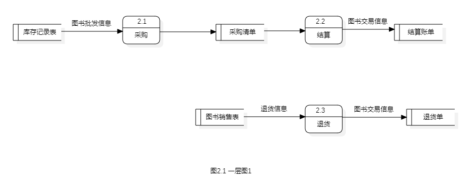

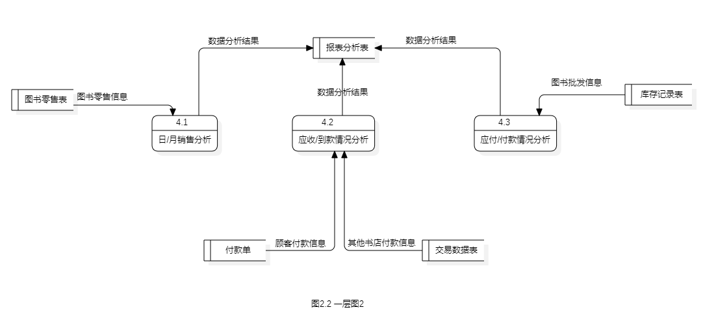

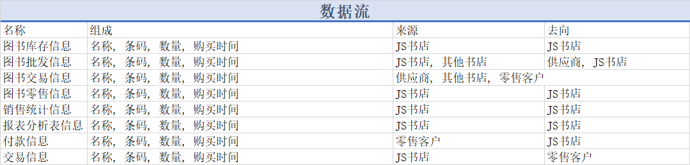

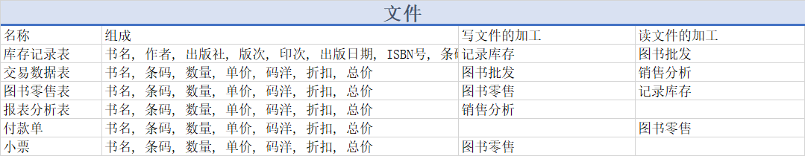

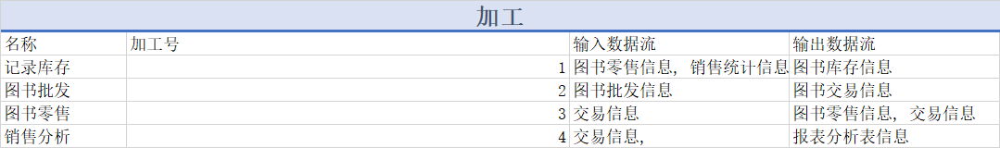

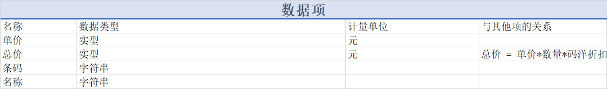