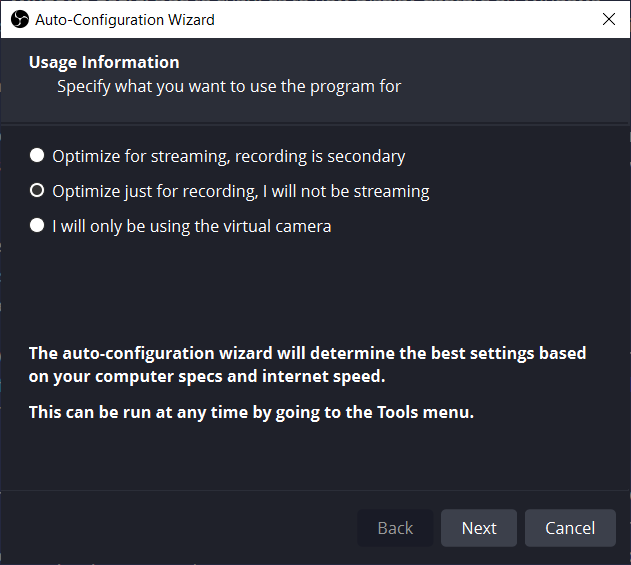
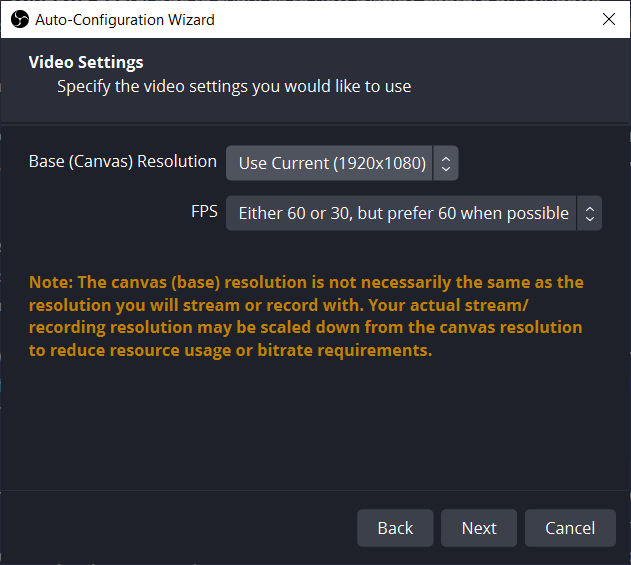
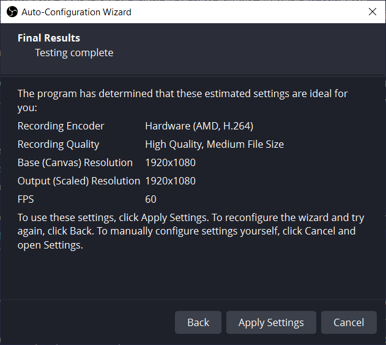
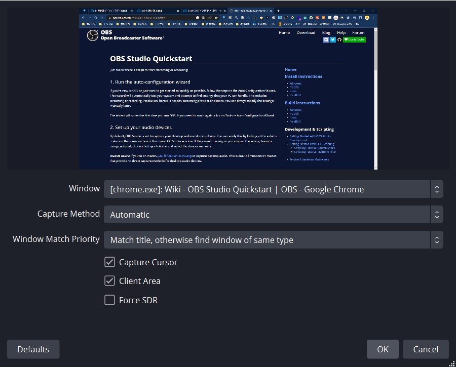
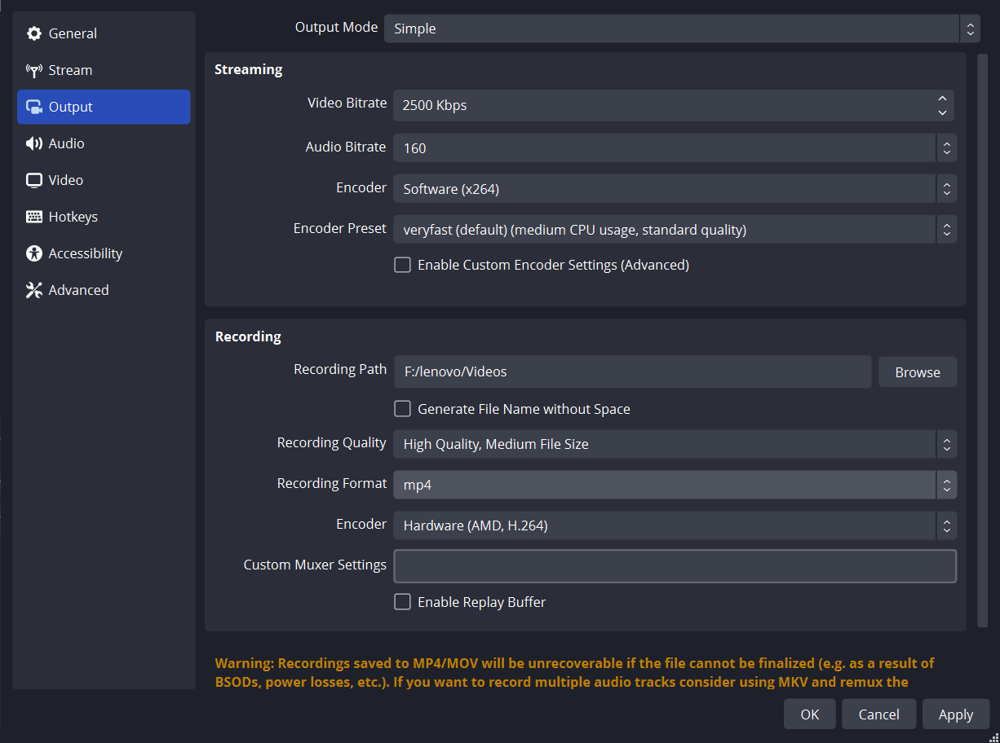

第五周 输出环境搭建记录

> 音频输出设置
>
> 自己录的视频一直没有声音

By default, OBS Studio is set to capture your desktop audio and microphone. You can verify this by looking at the volume meters in the mixer section of the main OBS Studio window. If they aren't moving, or you suspect the wrong device is being captured, click on Settings -> Audio and select the devices manually.

