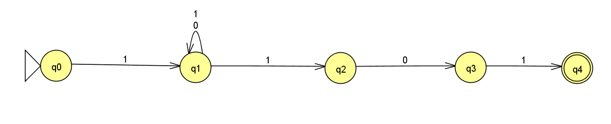
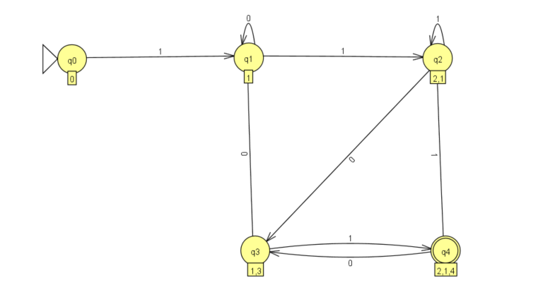
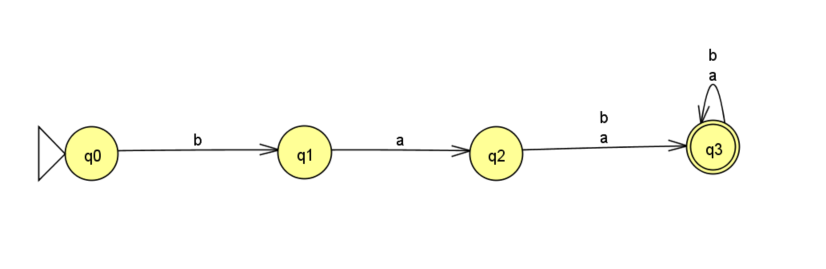
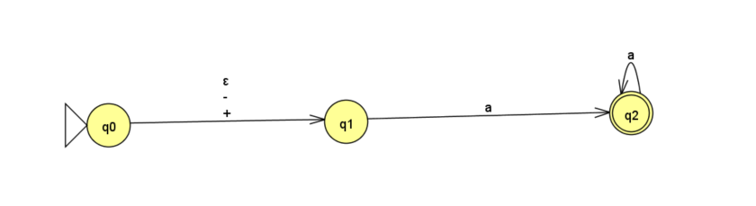

# 第三次作业

$$
秦颖欣 \ \ \ 20191103371 \ \ \ 计科2004
$$

1. 构造下列正规式的DFA

   $1(0|1)^*101$

   - NFA
     

   - 状态转换表

     |      | 0    | 1     |
     | ---- | ---- | ----- |
     | ->q0 |      | q1    |
     | q1   | q1   | q1,q2 |
     | q2   | q3   |       |
     | q3   |      | q4    |
     | *q4  |      |       |

     注: ->标出初始状态, *标出终止状态

   - 重新标记的表格

     |            | 0     | 1        |
     | ---------- | ----- | -------- |
     | ->q0       |       | q1       |
     | q1         | q1    | q1,q2    |
     | q1,q2      | q1,q3 | q1,q2,   |
     | q1,q3      | q1    | q1,q2,q4 |
     | * q1,q2,q4 | q1,q3 | q1,q2    |

   - DFA图
     

   $ba(a|b)(a|b)^*$

   - NFA
     

   - 状态转换表

     |      | a    | b    |
     | ---- | ---- | ---- |
     | ->q0 |      | q1   |
     | q1   | q2   |      |
     | q2   | q3   | q3   |
     | *q3  | q3   | q3   |

   - 重新标记的表格

     |      | a    | b    |
     | ---- | ---- | ---- |
     | ->q0 |      | q1   |
     | q1   | q2   |      |
     | q2   | q3   | q3   |
     | *q3  | q3   | q3   |

     

   - DFA图
     

   $(+|-|\varepsilon)aa^*$

   - NFA
     

   - 状态转换表

     |      | $\epsilon$ | -    | +    | a    |
     | ---- | ---------- | ---- | ---- | ---- |
     | ->q0 | q1         | q1   | q1   |      |
     | q1   |            |      |      | q2   |
     | *q2  |            |      |      | q2   |

     

   - 重新标记的表格

     |      | $\epsilon$ | -    | +    | a    |
     | ---- | ---------- | ---- | ---- | ---- |
     | ->q0 | q1         | q1   | q1   |      |
     | q1   |            |      |      | q2   |
     | *q2  |            |      |      | q2   |

     

   - DFA图
     

2. 写出P16页和P35页程序中每个变量、函数的作用

   > 输入数据

   ```
   include
   using namespace std;
   int main(){
       cout<<"hello world"<<endl;
   }
   ```

   > p16源程序

   ```cpp
   #include <fstream>
   #include <cstring>
   #include <iostream>
   #include "pretreatment.h"
   
   const int WordLen = 20;
   
   struct CodeVal //用来构造二元式
   {
       char code;
       char value[WordLen + 1];
   };
   
   void Concat(char token[], char c) //用来将字符拼接成token
   {
       int len = strlen(token);
       token[len] = c;
       token[len+1] = '\0';
   }
   
   char Reserve(const char* token) //查关键字
   {
       const char* reservedWords[] = {"begin", "end", "integer", "real"};
       const char codes[] = "{}ac"; //codes和reservedwords是对应的, 对应上去就能理解为什么codes的值这样设置了
       const int numReservedWords = sizeof(reservedWords) / sizeof(reservedWords[0]);
   
       for (int i = 0; i < numReservedWords; ++i) 
       {
           if (strcmp(token, reservedWords[i]) == 0)
           {
               return codes[i];
           }
       }
   
       return 'i';
   }
   
   CodeVal Scanner(char buffer[], int& i)
   {
       CodeVal t = {'\0', "NULL"};
       char token[WordLen + 1] = "";
   
       // 变量识别
       if (buffer[i] > 'a' && buffer[i] <= 'z')
       {
           while (isalnum(buffer[i])) //通过函数判断字符后不断拼接token直到遇到非字符符号出现
           {
               Concat(token, buffer[i++]); 
           }
   
           t.code = Reserve(token);
   
           if (t.code == 'i')
           {
               strcpy(t.value, token);
           }
   
           return t;
       }
   
       // 数字识别整数+浮点数(整数.小数)
       if (isdigit(buffer[i]))
       {
           while (isdigit(buffer[i])) //通过函数判断数字不断拼接token直到遇到非数字符号出现
           {
               Concat(token, buffer[i++]);
           }
   
           if (buffer[i] == '.') 
           {
               Concat(token, buffer[i++]);
   
               while (isdigit(buffer[i]))
               {
                   Concat(token, buffer[i++]);
               }
   
               t.code = 'y';
           }
           else
           {
               t.code = 'x';
           }
           strcpy(t.value, token);
           return t;
       }
       //浮点数(.小数)
       if (buffer[i] == '.'){
           Concat(token,buffer[i++]);
           if(isdigit(buffer[i])){
               while(isdigit(buffer[i])){
                   Concat(token,buffer[i++]);
               }
               t.code = 'y';
               strcpy(t.value,token) ;
               return t;
           }
           else{
               cout << "Error word ->" << token << endl;
               exit(0);
           }
       }
       //其他标点识别
       switch (buffer[i])
       {
           case ',':
               t.code = ',';
               break;
           case ';':
               t.code = ';';
               break;
           case '(':
               t.code = '(';
               break;
           case ')':
               t.code = ')';
               break;
           case '=':
               t.code = '=';
               break;
           case '+':
               if (buffer[++i] == '+')
                   t.code = '$';
               else
                   t.code = '+', i--;
               break;
           case '*':
               t.code = '*';
               break;
           case '#':
               t.code = '#';
               break;
           default:
               cout << "Error char->" << buffer[i] << endl;
               exit(0);
       }
       i++;
       return t;
   }
   
   
   int main()
   {
       char Buf[4048] = {'\0'};
       pretreatment("source.txt", Buf);//通过pretreatment中的函数预处理源文件中的注释信息
       cout << endl;
       ofstream coutf("Lex_r.txt", ios::out);
       CodeVal t;
       cout << "<单词二元式>" << endl;
       int i = 0;
       do // 循环使用scanner对Buf进行扫描
       {
           while (Buf[i] == ' ')
               i++;
           t = Scanner(Buf, i);
           coutf << t.code << '\t' << t.value << endl; //向Lex_r.txt中输出结果
           cout << '(' << t.code << ',' << t.value << ')';
       } while (t.code != '#');
       cout << endl;
       return 0;
   }
   ```

   

   

   > p36源程序

   ```cpp
   #include <fstream>
   #include <string>
   #include <iostream>
   #include <cstring>
   #include "pretreatment.h"
   
   using namespace std;
   
   const int WordLen = 20;
   
   struct code_val //用来构造存储所要输出的二元式
   {
       char code;
       char val[WordLen + 1];
   };
   
   int col(char c, const char str[]) //由于输入的所有小写字母和数字进行通过状态转换矩阵进行的转换类型相同, 所有都使用相同的数组下标表示
   {
       if (c >= 'a' && c < 'z')
           c = 'a';
       if (c >= '0' && c <= '9')
           c = '0';
       for (int i = 0; str[i]; i++) //将字符转换成对应的下标表示 可能是为了简化代码书写吧 目前不太理解
       {
           if (c == str[i])
               return i;
       }
       cout << "Error char->" << c << endl;
       exit(0);
   }
   
   char search_table(char *token)
   {
       char *table[] = { //所要识别的语言的关键字(这里的关键字内容更加复杂了 也能体现使用DFA的优点是什么了)
           "begin", "end", "integer", "real", "=", "+", "++", "*", ",", ";", "(", ")", "#"};
       char code[] = "{}ac=+$,;()#"; //对应关键字的值
       for (int i = 0; i < sizeof(table) / sizeof(char *); i++)
       {
           if (strcmp(token, table[i]) == 0)
               return code[i];
       }
       return NULL;
   }
   
   struct code_val scanner(char *Buf, int &i)
   {
       const char col_char[] = "a0=+*,;()#\x20";
       int M[][sizeof(col_char) / sizeof(char) - 1] = { //状态转换矩阵表 之后是可以通过一些工具辅助自己生成这个矩阵的 不需要自己手动计算
           {1, 2, 3, 4, 5, 6, 7, 8, 9, 10, 0},
           {11, 11},
           {0, 12},
           {0},
           {0, 0, 0, 13},
           {0},
           {0},
           {0},
           {0},
           {0},
           {0},
           {11, 11},
           {0, 12},
           {0}};
       struct code_val t = {'\0', "NULL"};
       char token[WordLen + 1] = "\0";
       int p = -1;
       int s = 0, j = col(Buf[i], col_char);
       while (M[s][j]) //因为除初态外 其他所有状态均为终态 (也是可能这里为什么没有单独对终态进行处理描述的原因)
       {
           token[++p] = Buf[i];
           if (Buf[i] == '#')
               break;
           s = M[s][j];
           j = col(Buf[++i], col_char);
       }
       t.code = search_table(token);
       if (t.code == NULL) //对非关键字的标识符的识别
       {
           if (token[0] >= 'a' && token[0] <= 'z')
               t.code = 'i';
           else
               t.code = 'x';
           strcpy(t.val, token);
       }
       return t;
   }
   
   int main(int argc, char* argv[])
   {
       char Buf[4048] = {'\0'};
       pretreatment("source.txt", Buf);
       cout<<endl;
       ofstream coutf("Lex_r.txt", ios::out);
       code_val t;
       int i = 0;
       cout << "<单词二元式>" << endl;
       do //循环扫描Buf中内容
       {
           while (Buf[i] == ' ') //如果非空格就进行一个token的扫描
               i++;
           t = scanner(Buf, i);
           cout << '(' << t.code << ',' << t.val << ')';
           coutf << t.code << '\t' << t.val << endl;
       } while (t.code != '#');
       cout << endl;
       return 0;
   }
   ```

   > 输出结果

   ```
   <源程序>
   include
   using namespace std;
   int main(){
       cout<<"hello world"<<endl;
   }
   <单词二元式>
   (i,include)(i,using)(i,namespace)(i,std)((,NULL)(i,int)(i,main)(),NULL)(#,NULL)
   ```

   > 对比两种写法

   1. 前者需要对每个输入使用函数进行判断, 函数可能存在的循环增加了时间复杂度
   2. 前者需要人为通过结构化代码对输入内容的类型进行分类, 如果内容规律更加复杂, 代码规模可能会更加复杂
   3. 所以第二种使用DFA状态转换矩阵的写法更加高效方便简洁, 是一个有力的工具

   


```mermaid
stateDiagram - v2
    [*] --> S0
    state S0 {
        --> S1 : "for (" 
    }
    state S1 {
        --> S2 : "("    
        --> S3 : Identifier 
        --> S4: ";"
    }
    state S2 {
        --> S5 :<identifier> 
        --> S6 :<number>  
    } 
    state S3 { --> S7 : "=" }
    state S4 { --> S8 : Expression } 
    state S5 { --> S9 : ")"   }
    state S6 { --> S10 : "<" } 
    state S7 { --> S11 : Expression   }
    state S8 { --> S12 : ";" }
    state S9 { --> S13 : "}" } 
    state S10 { --> S14 : "=" }
    state S11 { --> S15 : "cout<<" }
    state S12 {  --> S16 : Expression }
    state S13 { --> [*]  } 
    state S14 { --> S17 : Expression }
    state S15 { --> S18 :<identifier>   }
    state S16 { --> S19:";"   } 
    state S17 { --> S20 : ";" }
    state S18 { -->  S21 : ";" }
    state S19 {  --> [*] }  
    state S20 { --> [*] }
    state S21 { --> [*] }  
```


```

```

