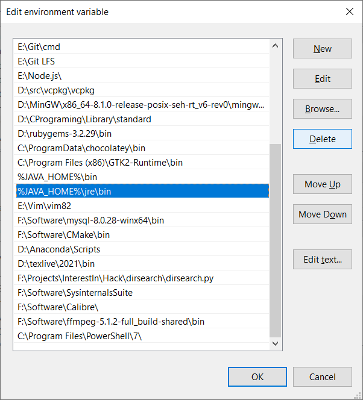
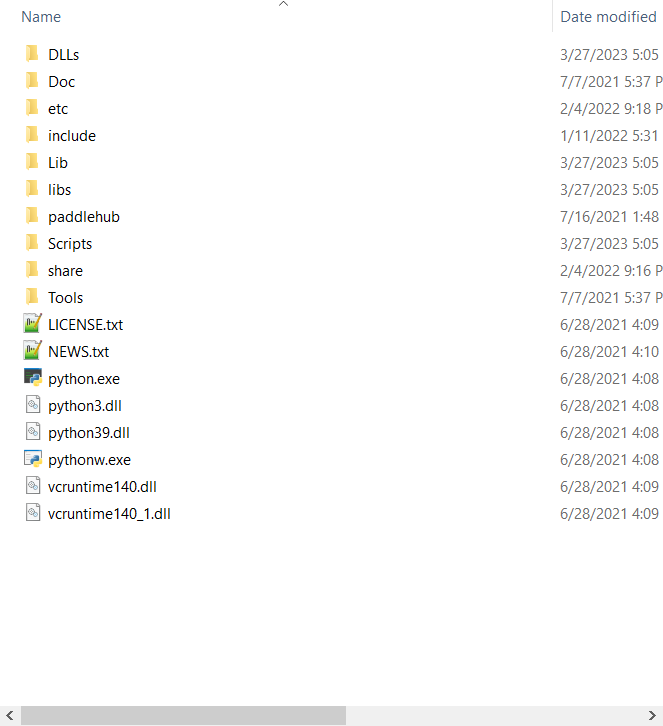
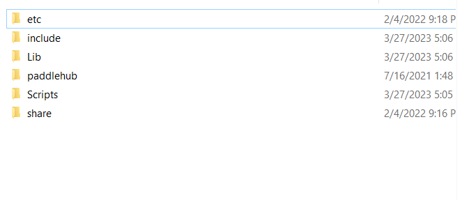
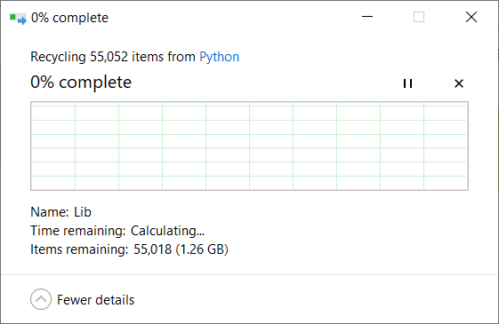
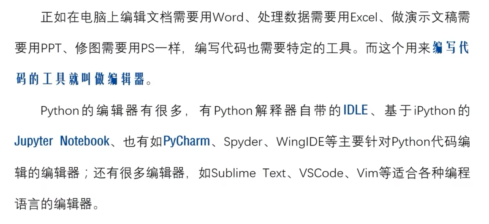
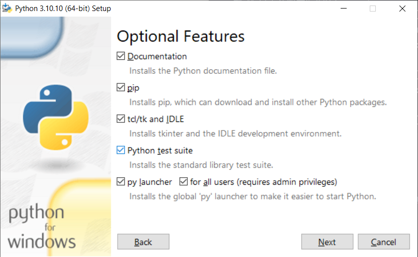
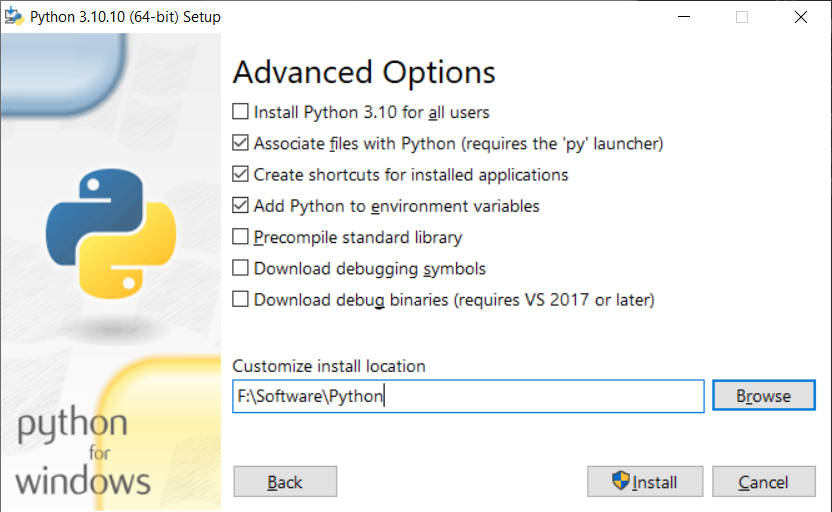
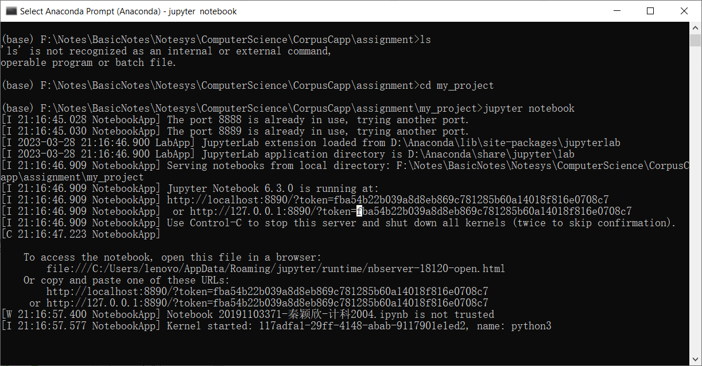
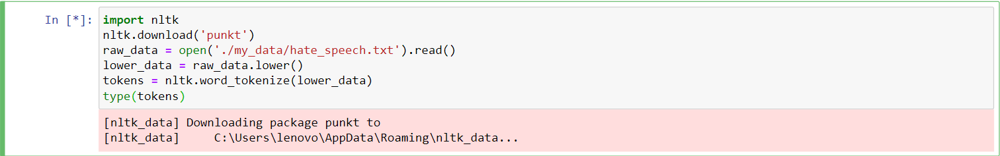
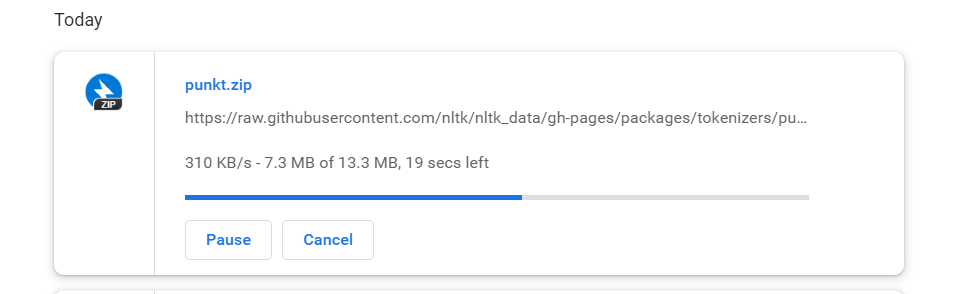

第六周 python开发环境搭建

- [x] 删除干净开发环境









- [x] ~~python win 稳定的开发环境搭建~~ [管理python环境的工具](https://s.v2ex.com/t/676709)

  - [x] 明确需求: 为什么需要python环境管理工具

    - [x] 最开始在学习的时候大家为什么不教这些内容

      https://www.youtube.com/watch?v=x1cbYa2SSlE

    - [x] python从入门到实践中这个工具是在最后开发项目的时候出现的

  - [x] 解决之前自己工具使用过程中出现的一些疑惑

- [x] 下载途径问题补充ms商店下载

  - [x] 上述视频作者说经常会出现一些意想不到的错误

    https://www.youtube.com/watch?v=x1cbYa2SSlE

- [ ] 下载版本选择的问题

  https://www.v2ex.com/t/521756

  - [ ] 明确问题解决需求

    python3.4 我认为不错，更成熟点。 库的支持比较多，3.7 太新了，可能很多优秀的库还不支持

    https://www.v2ex.com/t/521756


> 大猩猩 10:23:18 AM
> 给下午写自己的作业省出来时间
>
> 大猩猩 10:24:16 AM
> 要么直接就用anaconda
>
> 大猩猩 10:24:31 AM
> 之后抽时间再配置自己的python开发环境


> 执行流程弄清楚流程的每一个步骤之间的逻辑联系时什么
>
> 每一步安装到底在做什么
>
> 为什么要这么安装
>
> 这样安装的目的是什么


安装的内容

- 解释器 --> 代码翻译
- 编辑器 --> 代码编写
- 包管理工具 --> 包管理


> 查看 anaconda版本

```
(base) C:\Users\lenovo>conda -v
usage: conda-script.py [-h] [-V] command ...
conda-script.py: error: the following arguments are required: command

(base) C:\Users\lenovo>conda -v
usage: conda-script.py [-h] [-V] command ...
conda-script.py: error: the following arguments are required: command

(base) C:\Users\lenovo>conda -V
conda 4.10.1

(base) C:\Users\lenovo>
```


> 早期版本在官网找不到以前的下载地址









> 在云环境直接下载包文件非常方便
>
> 本地好多很麻烦的操作



```
https://raw.githubusercontent.com/nltk/nltk_data/gh-pages/packages/tokenizers/punkt.zip
```




> 如何将anaconda和python结合起来用
>
> anaconda中的一些库不需要自己额外下载到python的库中 直接在anaconda中使用


