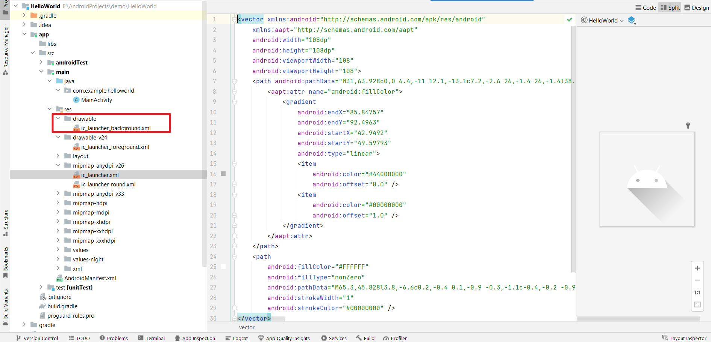
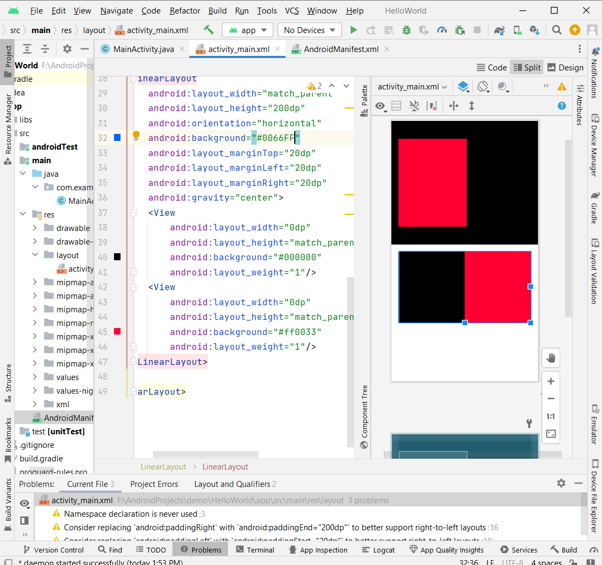

第六周 手机软件开发实践学习

> 解释as创建新项目之后项目的目录结构

When you create a new project in Android Studio, the program creates a folder that will contain all of the files and resources you will use to build your app. This folder is called the project directory.

Inside the project directory, you will find several sub-folders that organize different types of files. For example, the "app" folder contains the code and resources that make up the main part of your app, while the "res" folder contains various resources like images, layouts, and strings.

The project directory also contains other important files like the "build.gradle" file, which tells Android Studio how to build your app, and the "AndroidManifest.xml" file, which describes your app to the Android operating system.

Understanding the project directory is an important part of building an Android app, as it will help you keep track of all of the files and resources you need to create a successful project.

> 为什么图像资源都是直接使用前端代码实现的呢
>
> 为什么不直接像自己平时操作的那样呢下载别人设计的图片
>
> 或者自己设计好之后上传到项目目录中

> 深入了解as新建项目的目录结构

> 按照视频的思路做ui感觉很机械 虽然能了解一些页面布局的逻辑(数字绘图的逻辑) 感觉自己的重心应该不是这个

