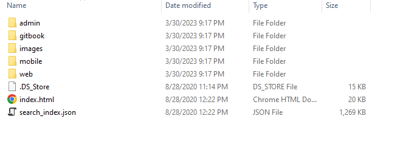

第六周 手机软件开发项目设计

需求分析

> 找一个问卷类型的工具辅助自己明确且完善地描述清楚自己的需求

①确立项目
②项目功能介绍
③绘制项目的功能模块和操作流程图
④具体功能描述
⑤项目运行环境要求
⑥项目具体完成时间和报价
⑦验收标准

概要设计

详细设计

程序编码

单元测试

集成测试

系统测试

发布

维护

> 自己可以模仿这个项目做一个自己的需求分析文档

> Django开发的移动端项目能放到某个操作系统上运行吗

相关练手项目

目标参考项目

https://www.bilibili.com/video/BV1634y1H7sm/?spm_id_from=333.337.search-card.all.click&vd_source=bd363ff17b54594b4e6ad483160d92e2

https://www.bilibili.com/video/BV1eo4y117ym/?spm_id_from=333.788.recommend_more_video.-1&vd_source=bd363ff17b54594b4e6ad483160d92e2

https://www.bilibili.com/video/BV1MK411p7dp/?spm_id_from=333.337.search-card.all.click&vd_source=bd363ff17b54594b4e6ad483160d92e2

https://www.bilibili.com/video/BV14841157pa/?spm_id_from=333.999.0.0&vd_source=bd363ff17b54594b4e6ad483160d92e2

https://www.bilibili.com/video/BV1Mt4y1y7to/?spm_id_from=333.788.recommend_more_video.1&vd_source=bd363ff17b54594b4e6ad483160d92e2

链接：https://pan.baidu.com/s/1X6IC8AYME9pnSn9iDyZlNQ 
提取码：j5n7 
复制这段内容后打开百度网盘手机App，操作更方便哦

> 这个视频用来提交平时作业的时候进行参考