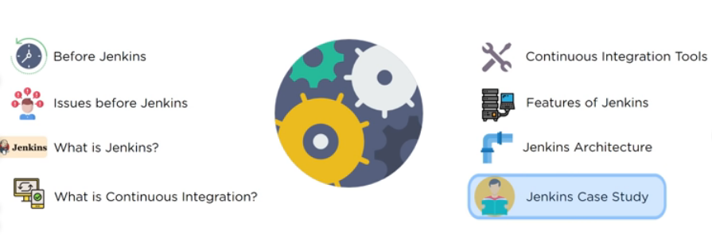
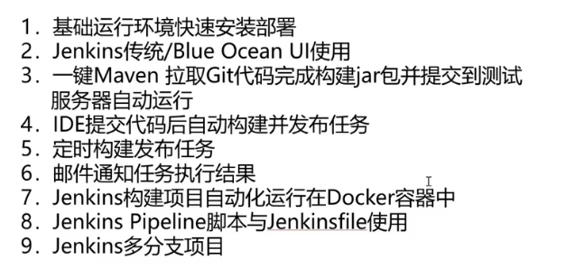
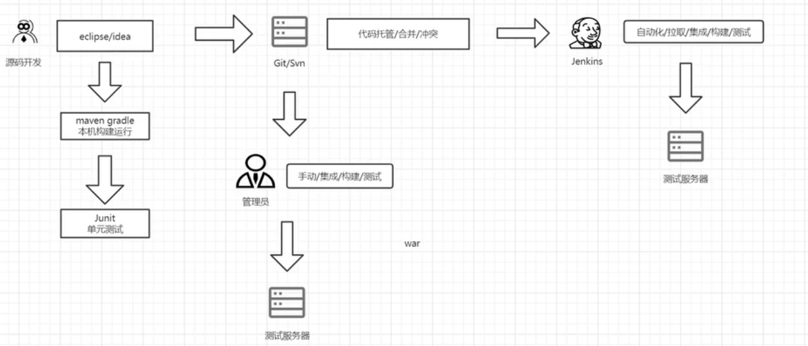

第六周 爱好碎片之工具使用记录

今天的一个模式

chatgpt推荐相关软件 得到一系列软件列表

搜索视频网站看别人的使用体验或者评测

节省自己下载试用软件的时间了

> 推荐一些个人敏捷软件开发的工具集

当涉及到个人敏捷软件开发时，下面这些工具集可能会对您有所帮助：

1. 任务管理工具：任务管理工具（如Trello，Todoist和Asana等）可帮助您跟踪任务，设置截止日期和优先级等。
2. 版本控制系统：版本控制系统（如Git和Subversion等）是一种管理代码的方式，可以帮助您跟踪您的代码更改并协作与他人开发项目。
3. 整合开发环境：整合开发环境（IDE）是一种软件应用程序，可以让您在同一个环境中进行代码编写、调试和测试等工作。流行的IDE包括Visual Studio Code，Eclipse和IntelliJ IDEA等。
4. 单元测试框架：单元测试框架（如JUnit，NUnit和PyUnit等）是一种用于测试代码的框架。它可以让您编写代码来检查您的代码是否按照预期工作，以便更容易地捕获和解决任何错误。
5. 代码质量工具：代码质量工具（如SonarQube和CodeClimate等）可以帮助您检查代码的质量和性能，并提供建议以改进您的代码。
6. 自动化构建工具：自动化构建工具（如Maven和Gradle等）可帮助您自动化构建和部署软件，并自动执行测试。
7. 代码片段管理器：代码片段管理器（如Gist和Snippets等）是一种工具，可让您管理和共享代码片段，以便快速复制和粘贴代码块。
8. 文档工具：文档工具（如Confluence和Google Docs等）可帮助您编写、共享和组织文档，以便更容易地协作与他人开发项目。

以上这些工具都可以帮助您更高效地进行个人敏捷软件开发，并提高您的工作效率。

> 以上这些工具如何根据敏捷软件开发过程搭建对应的工具链

根据敏捷软件开发过程的不同阶段，可以选择和组合上述工具，以搭建相应的工具链，以下是一个示例：

1. 需求收集和管理阶段：在这个阶段，您可以使用Trello、Jira等任务管理工具来收集和管理用户需求和故事。
2. 设计和规划阶段：在这个阶段，您可以使用白板工具（如Miro和Lucidchart等）来进行头脑风暴和设计，并使用GitHub等版本控制系统来存储代码。
3. 开发阶段：在这个阶段，您可以使用整合开发环境（IDE）（如Visual Studio Code、IntelliJ IDEA等）来编写代码，并使用版本控制系统（如Git）进行代码管理。在编写代码时，可以使用单元测试框架（如JUnit、NUnit和PyUnit等）进行自动化测试，以保证代码的质量。
4. 持续集成和交付阶段：在这个阶段，您可以使用自动化构建工具（如Maven和Gradle等）进行自动化构建和部署软件，并使用代码质量工具（如SonarQube和CodeClimate等）来检查代码的质量和性能。此外，还可以使用持续集成和交付工具（如Jenkins和Travis CI等）来管理构建和部署流程，以确保代码的高质量和快速交付。
5. 维护和支持阶段：在这个阶段，您可以使用代码片段管理器（如Gist和Snippets等）来管理和共享代码片段，并使用文档工具（如Confluence和Google Docs等）来编写、共享和组织文档，以便更容易地协作与他人开发项目。

请注意，这只是一个示例，实际上，您可以根据自己的需求和偏好选择和组合这些工具，以搭建适合您的工具链。

> 能进一步说明这些工具的出现是为了解决开发阶段的哪些问题的吗

这些工具的出现都是为了解决敏捷软件开发过程中的一些具体问题，具体如下：

1. 任务管理工具：任务管理工具主要是为了解决敏捷开发中的任务分配和跟踪问题，包括任务的创建、指派、进度跟踪、截止日期等。
2. 版本控制系统：版本控制系统的出现是为了解决团队协作开发中代码版本管理和协同开发的问题，可以保证团队成员对代码进行更好的合作开发，并且可以快速恢复代码到任意历史版本。
3. 整合开发环境：整合开发环境是为了提高开发效率和代码质量，IDE能够提供多种代码检查、自动化测试和调试等功能，让开发人员能够快速编写、测试和调试代码。
4. 单元测试框架：单元测试框架能够自动化执行测试，节省开发人员的时间和精力，并且可以及早发现代码中的错误和缺陷，避免后期大规模重构和修复。
5. 代码质量工具：代码质量工具可以自动化检测代码的质量和性能，发现代码中的错误和问题，并提供建议和指导以改进代码。
6. 自动化构建工具：自动化构建工具可以自动化执行构建和部署过程，节省时间和精力，并且可以确保代码的可靠性和稳定性。
7. 代码片段管理器：代码片段管理器能够快速地复制和粘贴代码块，提高开发效率，并且可以共享代码片段，让团队成员能够更好地协作。
8. 文档工具：文档工具能够让团队成员共享和协作编写文档，提高沟通效率，并且可以更好地记录项目历史和知识积累。

总的来说，这些工具的出现是为了帮助开发人员更好地进行敏捷软件开发，并提高团队的协作效率和代码质量，同时也能够快速发现和解决问题，提高软件开发的效率和质量。

> 对于一个软件开发者新手 应该如何合理利用这些工具

对于一个软件开发者新手，以下是一些合理利用这些工具的建议：

1. 了解工具的作用和使用方法：在开始使用这些工具之前，需要了解它们的作用和使用方法，可以通过官方文档、网络资源、视频教程等方式来学习。
2. 选择合适的工具：根据自己的开发需求和项目特点选择合适的工具，不要盲目跟风或者使用不必要的工具，否则可能会浪费时间和精力。
3. 熟练掌握使用技巧：熟练掌握使用工具的技巧，可以提高开发效率和代码质量，避免出现一些低级错误和问题。
4. 不断学习和探索新工具：不断学习和探索新的工具，可以让自己保持在技术前沿，更好地应对不断变化的开发需求和挑战。
5. 与他人分享和交流：与他人分享和交流使用工具的经验和技巧，可以互相学习和提高，也可以促进团队协作和共同成长。

总的来说，合理利用这些工具可以帮助软件开发者新手更快速、更高效地完成开发任务，并且可以提高代码质量和开发效率。在使用这些工具的过程中，需要不断学习和实践，不断完善自己的技能和经验。

> 对于一个想成为软件设计师的本科生小白来说, 有哪些可操作性的建议吗

以下是对于想成为软件设计师的本科生小白的可操作性建议：

1. 学习计算机基础知识：软件设计师需要掌握计算机基础知识，如数据结构、算法、计算机组成原理等，这些基础知识是软件设计师的核心能力。
2. 掌握编程技能：掌握至少一门编程语言，建议选择多种不同的编程语言进行学习和实践，如Java、Python、C++等。
3. 学习软件设计理论：了解软件设计的理论知识，如面向对象设计、设计模式、设计原则等，可以帮助你更好地理解和应用软件设计的方法和技巧。
4. 实践项目开发：通过实践项目开发，可以提高自己的软件设计和编程能力，建议选择一些实用性强的开源项目进行学习和参与。
5. 学习软件开发流程：了解软件开发的整个流程，包括需求分析、设计、开发、测试、部署等，可以帮助你更好地理解软件设计的实际应用。
6. 注重实践经验：除了学习理论知识外，注重实践经验也非常重要，可以通过参加实习、参与开源项目、参加编程比赛等方式来积累实践经验。
7. 培养良好的沟通和团队协作能力：软件设计师需要与其他开发人员、测试人员、产品经理等多个岗位进行协作和沟通，因此需要具备良好的沟通和团队协作能力。

总的来说，想成为软件设计师的本科生小白需要通过学习计算机基础知识、掌握编程技能、学习软件设计理论、实践项目开发、学习软件开发流程、注重实践经验以及培养良好的沟通和团队协作能力来不断提升自己的能力和水平。

> 有哪些获取实践经验的途径和方法推荐给这类人的呢

获取实践经验是成为一个合格软件设计师的关键。以下是几个途径和方法推荐给想获取实践经验的本科生小白：

1. 参加实习：通过参加实习，可以了解实际的软件开发流程和项目管理方式，并且能够在实践中学习和掌握各种开发工具和技术。建议选择大型软件企业或互联网公司实习，因为这些公司拥有成熟的软件开发体系和流程，并且能够提供优秀的工作环境和培训机会。
2. 参加开源项目：通过参加开源项目，可以学习到业界先进的技术和方法，了解其他优秀开发人员的实践经验，并且有机会参与到高质量软件的开发过程中。建议选择与自己技术水平相符合的开源项目，并积极参与社区讨论和贡献代码。
3. 参加编程比赛：通过参加编程比赛，可以锻炼自己的编程能力和团队协作能力，并且有机会接触到业界领先的技术和最新的软件开发趋势。建议选择知名的编程比赛，如ACM、Google Code Jam等，并与其他选手交流学习。
4. 自主开发项目：通过自主开发项目，可以锻炼自己的软件设计和开发能力，并且可以在实践中发现和解决问题。建议选择实用性强的项目进行开发，如个人博客、社交网站等，并且可以积极参与开源社区，获取其他开发人员的意见和建议。

总的来说，想获取实践经验的本科生小白可以通过参加实习、参加开源项目、参加编程比赛、自主开发项目等方式来积累实践经验，并不断提高自己的软件设计和开发能力。

> 有哪些开源项目技术小白能参加呢, 以及在参加开源项目的时候需要注意什么

开源项目可以提供给技术小白一个学习和实践的机会。以下是一些适合技术小白参加的开源项目：

1. Mozilla Firefox：Firefox是一款流行的Web浏览器，其开源社区提供了大量的学习资源和贡献机会。技术小白可以通过阅读文档、提交代码修复Bug等方式来参与该项目。
2. React Native：React Native是Facebook推出的一种跨平台移动应用程序开发框架，通过该项目，技术小白可以学习到React、JavaScript等相关技术，并且有机会贡献代码和修复Bug。
3. Python：Python是一种简单易学的编程语言，在开源社区中有许多Python相关项目，如Django、Flask等。技术小白可以通过参与这些项目来学习Python语言和相关开发技术。

在参加开源项目的时候，需要注意以下几点：

1. 选择合适的项目：选择适合自己技术水平的开源项目，避免在技术难度过高或过低的项目中浪费时间。
2. 阅读文档：在参加开源项目之前，先仔细阅读项目文档，了解项目的目的、结构和规范。
3. 与社区成员交流：积极参与社区讨论和交流，与其他开发人员沟通学习，获取帮助和建议。
4. 提交代码：在参加开源项目时，尽量贡献自己的代码，并按照项目规范提交，以获得更多的贡献机会。
5. 遵守项目规范：在参加开源项目时，要遵守项目规范，包括代码风格、贡献流程等，以确保贡献的代码符合项目标准。

总的来说，参加开源项目可以让技术小白了解到业界先进的技术和方法，并且锻炼自己的编程能力和团队协作能力。但是在参加开源项目时需要注意以上几点，以确保能够有一个成功的贡献经验。

> 有哪些有趣的开源项目可以推荐给这类人的呢

以下是一些有趣的开源项目，适合那些想要寻找新奇刺激和有趣体验的技术爱好者和开发者参与：

1. Sonic Pi：一个基于Ruby的音乐编程软件，它可以让你用代码来创建音乐。你可以通过编写代码来生成任何音乐，从简单的节奏到复杂的曲子。
2. Processing：一种用于创作可交互的视觉效果的编程语言，非常适合初学者。Processing提供了大量的库和教程，可以帮助你快速入门并创作出漂亮的视觉艺术作品。
3. OpenCV：一个流行的计算机视觉库，它提供了很多有趣的功能，比如人脸检测、物体识别、图像处理等。你可以在这个项目中学到很多计算机视觉方面的知识和技术。
4. Raspberry Pi：一个基于ARM处理器的微型计算机，可以运行Linux操作系统，并且有很多可用的扩展模块，比如摄像头、传感器等。你可以在这个项目中学到很多嵌入式系统和物联网方面的知识。
5. Scrapy：一个用于抓取网页数据的Python框架，非常适合那些对数据挖掘和爬虫技术感兴趣的人。你可以用Scrapy来获取网站上的各种数据，并用Python进行处理和分析。

以上这些项目不仅有趣，而且还提供了很多学习机会和贡献机会，可以帮助你锻炼自己的技能并扩展自己的知识领域。

这是一个软件启动失败的报错信息，其中提到了一个叫做Listary的服务无法启动。具体错误原因为“System.IO.PipeException”，两者的错误信息均为“there was an error reading from the pipe: The pipe has been ended. (109, Ox6d)”，意味着某个进程试图从一个已经关闭的命名管道中读取数据导致出错。建议重启Listary软件，如果问题仍然存在，可以尝试重新安装该软件或联系软件开发商寻求技术支持。

使用chatgpt帮自己读了一下代码报错
自己重装了一下软件
但是软件安装结果很奇怪 没有安装到c盘

而且更改信息还是18号的
重装的时候自己并没有进行重新注册和破解
感觉软件自动直接关联起来了