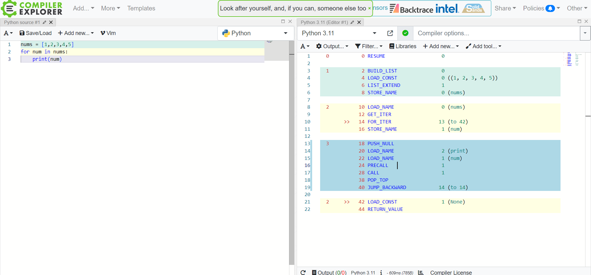
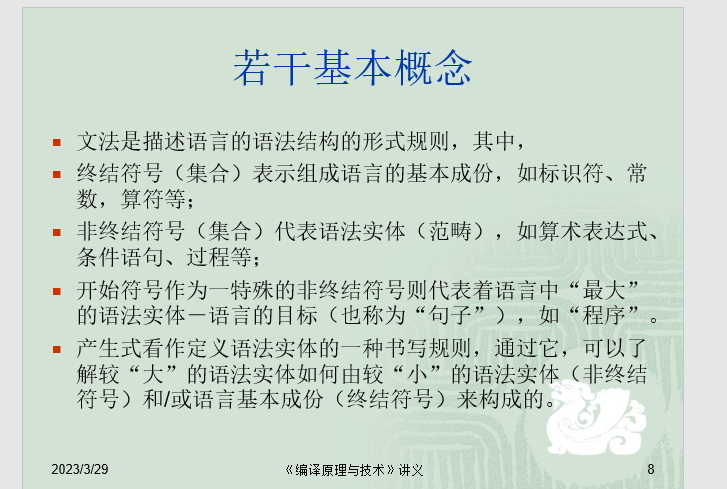
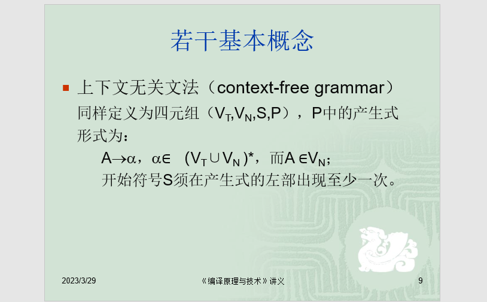
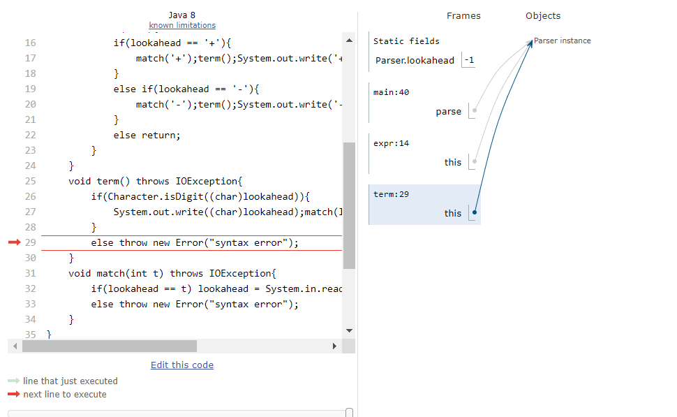
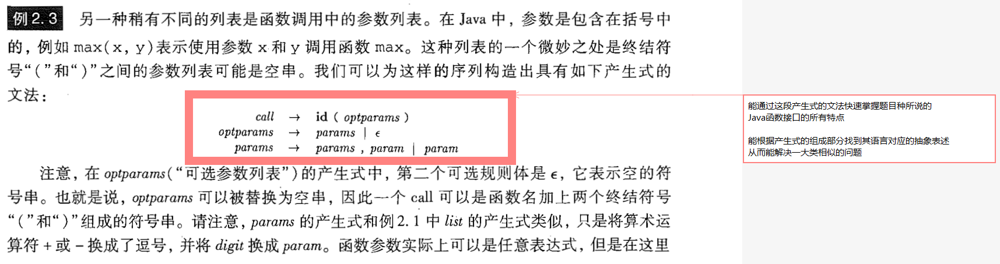

第六周 编译原理settledown实录

> 最开始

https://www.bilibili.com/video/BV1Bs4y187kK/?spm_id_from=333.999.0.0&vd_source=bd363ff17b54594b4e6ad483160d92e2


> 不是很感兴趣一个编写编译器的项目

https://www.bilibili.com/video/BV1iQ4y1h7HX/?spm_id_from=333.788&vd_source=bd363ff17b54594b4e6ad483160d92e2

面向编译原理初学者，从编译器界面，使用方法，实际使用谈起 ，再然后逐步深入讲解原理及实现程序，应该本着这样的原则，即以讲解实现程序来带动理解原理为主，而不是以讲解原理为主，点缀一点实现程序。那么这样，这套视频就肯定会大受欢迎的。因为其实编译原理相当重要，本不应该成冷门，只是由于编译原理教程或视频搞得过于抽象难懂，学者望而生畏所致。


> 找到的一个视频感觉还行

https://www.bilibili.com/video/BV1mU4y1r7LB/?spm_id_from=333.788.recommend_more_video.3&vd_source=bd363ff17b54594b4e6ad483160d92e2


> 前端各种文法除了考试其实感觉没啥意思，后端光看书也没啥用。头脑一热报了个编译器与编程语言开发岗，明天瞎扯吧


> 弄清楚自己学习编译原理的目的是什么
>
> 想解决什么样的问题

了解编译原理思想更要了解当前主要编译器才会产生强大作用，这样你才能根据编译器的实现机制去做语言如C++上面的优化，就像一些关键字、智能指针等实质上载编译器层面是做了怎样的处理，只有够了解才能更加优化。


> how to build a learning environment  for beginners of compilation principles course
>
> 编译原理初学者如何搭建这门课程的学习环境

To build a learning environment for beginners of a compilation principles course, you can consider the following steps:

1. Start with the basics: Before delving into complex topics, start by introducing the basics of compilation principles. This could include topics such as lexical analysis, parsing, semantic analysis, and code generation.
2. Use interactive tools: Interactive tools can be a great way to engage beginners and help them understand complex concepts. ==Consider using online tools such as interactive compilers, debuggers, and interpreters that allow students to experiment with different code snippets and see how they are transformed during the compilation process.==
3. Provide hands-on projects: Assigning hands-on projects that involve building a compiler or interpreter can be a great way to reinforce learning and build practical skills. Provide detailed instructions and step-by-step guidance to help students build their projects.
4. Use visual aids: Visual aids such as diagrams, flowcharts, and animations can help students visualize abstract concepts and understand how different components of a compiler work together.
5. Encourage collaboration: Collaboration is an important aspect of learning, particularly in a field as complex as compilation principles. Encourage students to work together on projects and assignments, and provide opportunities for peer review and feedback.
6. Provide feedback and assessment: Provide regular feedback and assessment to help students identify areas where they need to improve and reinforce areas where they are doing well. Provide constructive feedback that highlights both strengths and weaknesses, and offer guidance on how to improve.

Overall, creating a supportive and interactive learning environment that emphasizes practical skills and collaboration can help beginners of a compilation principles course build a strong foundation in this complex field.


> 众所周知，大学的编译原理只教到前端，就是文法分析自动机那部分。
>
> 那么编译原理的理论，在大学课堂上的当前个人情况是，老师对着ppt讲题，人肉解析，写完一张表格，手写这答案。
>
> 那么为什么老师不结合代码来写自动机，做词法分析而是对着课表的定义一个一个自己算？

最上面的实验视频应该刚好够用了


> 编译原理中原理技术的实现


可以用 flex 和 bison （ lec 和 yacc ）写一个计算器，就能疏通一遍了


https://www.bilibili.com/video/BV12t411v7YH/?vd_source=bd363ff17b54594b4e6ad483160d92e2


> 上述记录过程没有给出自己settledown的对象和目的是什么
>
> 一直沉迷在找一些能让自己应用概念的方法


> 根据编译原理相关理论知识开发出的用户可使用的工具有哪些
>
> 除了编译器这种比较大的项目, 一些小项目, 类似正则表达式的图形化工具


> 根据编译原理相关理论知识开发出的用户可使用的工具有哪些

编译原理相关的理论知识可以用来开发多种用户可使用的工具。以下是一些可能的工具：

1. 编译器：编译器是一种将源代码转换成目标代码的程序。用户可以使用编译器将自己的代码编译成可执行文件或者库，从而使其可以在不同的计算机上运行。编译器还可以提供语法检查和错误提示等功能，帮助用户更好地编写代码。
2. 解释器：解释器是一种直接执行源代码的程序。用户可以使用解释器运行自己的代码，而不需要先编译成目标代码。解释器还可以提供实时调试和交互式环境等功能，使用户更方便地测试和修改代码。
3. 语言工具：语言工具是一些用于分析和处理编程语言的程序。用户可以使用语言工具来验证自己的代码是否符合语言规范，或者对代码进行优化和重构。常见的语言工具包括语法分析器、语义分析器、优化器和代码生成器等。
4. 调试器：调试器是一种用于调试程序的工具。用户可以使用调试器来定位和修复程序中的错误，以及观察程序在运行过程中的变量和状态。调试器通常提供单步执行、断点设置和变量监视等功能，使用户更轻松地调试程序。
5. 性能分析器：性能分析器是一种用于分析程序性能的工具。用户可以使用性能分析器来确定程序的瓶颈和优化机会，以及观察程序在不同条件下的性能表现。性能分析器通常提供内存分析、时间分析和 CPU 使用率分析等功能。
6. 版本控制系统：版本控制系统是一种用于管理代码版本的工具。用户可以使用版本控制系统来跟踪代码的修改历史，以及协作开发和管理分支等。常见的版本控制系统包括 Git、SVN 和 Mercurial 等。
7. 集成开发环境（IDE）：集成开发环境是一种综合性的开发工具。用户可以使用 IDE 来编写、调试和测试代码，以及管理项目和资源。IDE 通常包括代码编辑器、调试器、版本控制系统和构建工具等。常见的 IDE 包括 Visual Studio、Eclipse 和 IntelliJ IDEA 等。


> 能详细举出对应使用的理论和例子吗

当开发编译原理相关的工具时，需要涉及到多个理论和技术。以下是一些可能的例子：

1. 语法分析器：语法分析器是编译器中的重要组成部分，其使用的理论包括上下文无关文法、递归下降分析、LL(k)分析器等。例如，ANTLR是一款广泛使用的语法分析器生成器，它支持多种语言和平台，可以用来生成高效、准确的语法分析器。
2. 代码生成器：代码生成器是编译器中的另一个重要组成部分，其使用的理论包括中间代码表示、目标机器架构等。例如，LLVM是一款广泛使用的代码生成器，它可以将中间代码转换成多种目标机器架构的汇编代码，从而实现跨平台的代码编译和优化。
3. 解释器：解释器是直接执行源代码的程序，其使用的理论包括解释器设计、解释器优化等。例如，Python是一种广泛使用的解释型语言，其解释器采用了多种优化技术，如字节码优化、调用优化等，从而提高了解释器的性能和效率。
4. 调试器：调试器是用于调试程序的工具，其使用的理论包括断点设置、单步执行、变量监视等。例如，GDB是一款广泛使用的命令行调试器，它支持多种编程语言和平台，可以用来调试各种类型的程序。
5. 版本控制系统：版本控制系统是用于管理代码版本的工具，其使用的理论包括分布式版本控制、并发控制等。例如，Git是一款广泛使用的分布式版本控制系统，它可以用来跟踪代码的修改历史，并支持多人协作和分支管理等功能。
6. 集成开发环境（IDE）：集成开发环境是一种综合性的开发工具，其使用的理论包括代码编辑、调试、测试等。例如，Visual Studio是一款广泛使用的IDE，它支持多种编程语言和平台，可以用来编写、调试和测试各种类型的程序。


> 平时使用这些工具会产生哪些能用编译原理解释的问题呢

使用编译原理相关的工具时，可能会遇到以下一些能用编译原理解释的问题：

1. 语法错误：当使用语法分析器时，可能会出现语法错误的情况，例如缺少分号、括号不匹配等。这时需要使用编译原理中的语法分析技术来检测和修复这些错误。
2. 性能问题：当使用代码生成器时，可能会出现性能问题，例如生成的代码执行速度慢、内存占用过高等。这时需要使用编译原理中的优化技术来优化生成的代码，以提高性能和效率。
3. 调试问题：当使用解释器或调试器时，可能会遇到调试问题，例如程序崩溃、死循环等。这时需要使用编译原理中的调试技术来定位和修复这些问题。
4. 版本管理问题：当使用版本控制系统时，可能会出现版本管理问题，例如代码合并冲突、版本回退等。这时需要使用编译原理中的并发控制技术来解决这些问题。
5. 编辑器问题：当使用集成开发环境时，可能会出现编辑器问题，例如代码高亮不正确、自动补全错误等。这时需要使用编译原理中的词法分析技术来解决这些问题。


> 有没有类似的一些比较小的玩具型工具供非开发人员使用, 从而能体会编译原理的一些理论应用

是的，有一些比较小的玩具型工具可以供非开发人员使用，帮助他们理解编译原理的一些理论应用。以下是一些可能的例子：

1. 编译器前端：编译器前端是编译器中的一个组成部分，负责将源代码转换成中间代码或解释器可以直接执行的形式。有一些比较小的编译器前端工具可以供非开发人员使用，例如ANTLRWorks和PEG.js，它们可以用来构建简单的编译器并生成解析树或语法树，从而帮助用户理解编译原理中的语法分析和词法分析技术。
2. 中间代码生成器：中间代码生成器是编译器中的一个组成部分，负责将源代码转换成中间代码，以便后续的优化和代码生成。有一些比较小的中间代码生成器工具可以供非开发人员使用，例如LLVM IR Builder和TinyVM，它们可以用来生成简单的中间代码，并帮助用户理解编译原理中的中间代码表示和优化技术。
3. 解释器：解释器是直接执行源代码的程序，可以帮助用户理解编译原理中的解释器设计和优化。有一些比较小的解释器工具可以供非开发人员使用，例如Python解释器和JS Bin，它们可以用来执行简单的脚本并展示解释器的执行过程。
4. 词法分析器：词法分析器是编译器中的一个组成部分，负责将源代码转换成记号或标记流。有一些比较小的词法分析器工具可以供非开发人员使用，例如Regexper和Regex101，它们可以用来构建简单的正则表达式，并展示词法分析器的执行过程。

这些工具都比较小巧、易用，可以让非开发人员轻松地体验编译原理的一些理论应用。


> 能够显示python编译过程的工具

有多个工具可以用来显示 Python 编译过程，以下是其中的一些：

1. `trace`: Python 自带的 trace 模块可以用于追踪代码执行的情况，包括编译过程。使用 `python -m trace -t yourscript.py` 命令可以运行 trace 工具并追踪编译过程。
2. `dis`: Python 的 `dis` 模块可以用于反汇编 Python 代码并显示字节码指令。使用 `dis.dis(yourfunction)` 命令可以显示函数的字节码指令，并可以通过查看字节码指令来了解编译过程。
3. `ast`: Python 的 `ast` 模块可以用于分析 Python 代码的抽象语法树（AST），并可以显示编译过程中生成的 AST。使用 `ast.parse(yourcode)` 命令可以解析代码并生成 AST，然后可以使用 `ast.dump(ast)` 命令来显示 AST。
4. `Python Compiler Explorer`: 这是一个基于 Web 的工具，可以在线显示 Python 代码的编译过程。只需在网站上输入代码并点击编译按钮，就可以看到编译器生成的字节码和汇编代码。


> 如何让自己清楚地知道python程序地执行过程




> 通过使用上下文无关文法中的概念对一些编程语言(如python c++ Java)进行抽象建模, 从而实现对上下文无关文法定理的理解
>
> 理论工具能解决的编程人员的困惑而不是机器的
>
> 比如对编程语言的学习


> 这两部分应该是两种层次的抽象了
>
> 第一页ppt自己是找了一些理解简单理解然后平滑过渡到的第二页






```python

/*
Online Java - IDE, Code Editor, Compiler

Online Java is a quick and easy tool that helps you to build, compile, test your programs online.
*/
import java.io.*;
class Parser{
    static int lookahead;
    public Parser() throws IOException{
        lookahead = System.in.read();
    }
    void expr() throws IOException{
        term();
        while(true){
            if(lookahead == '+'){
                match('+');term();System.out.write('+');
            }
            else if(lookahead == '-'){
                match('-');term();System.out.write('-');
            }
            else return;
        }
    }
    void term() throws IOException{
        if(Character.isDigit((char)lookahead)){
            System.out.write((char)lookahead);match(lookahead);
        }
        else throw new Error("syntax error");
    }
    void match(int t) throws IOException{
        if(lookahead == t) lookahead = System.in.read();
        else throw new Error("syntax error");
    }
}
public class Main
{
    public static void main(String[] args) throws IOException{
        Parser parse = new Parser();
        parse.expr();
        System.out.write('\n');
    }
}

```


> visualize的结果自己是看不懂的
>
> 不知道这部分内容应该从哪个角度进行理解
>
> https://pythontutor.com/visualize.html#mode=display




> 这里开始感觉出来编译原理的作用了

