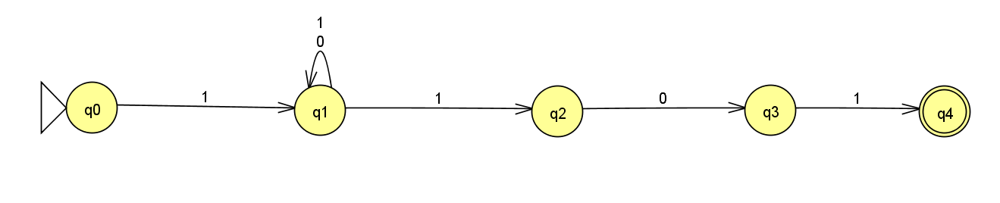
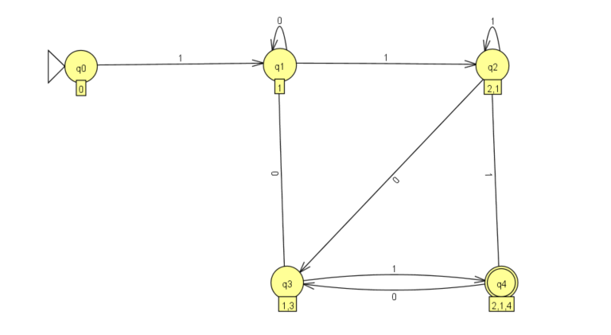
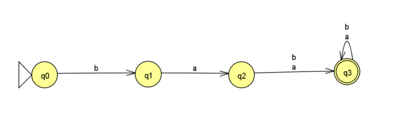
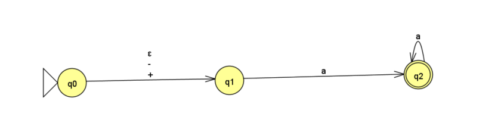
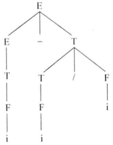
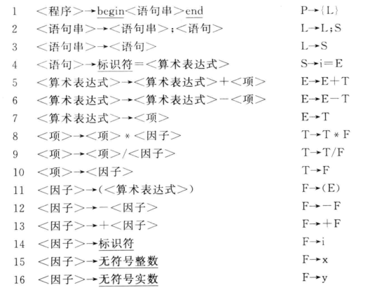
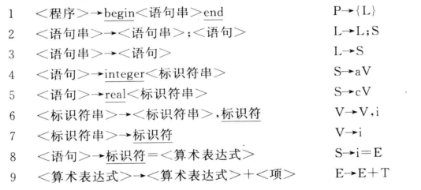

第六周 编译原理作业提交

## 第二次作业

1. $\sum =\{a,b\}$，写出下列正规集

   $L(a|b^*)$

   - 一个a,任意个b的串集

   $L((a|b)^*)$

   - 任意数量a拼接任意数量b构成的串集

   $L((a^*|b^*)(abb))$

   - 任意数量a开头以abb结尾和任意数量b开头abb结尾构成的串集

2. 调试程序
   P16程序（在书上给出注释)

   > 输入

   ```
   include
   using namespace std;
   int main(){
       cout<<"hello world"<<endl;
   }
   ```

   > 头文件

   ```cpp
   /*
    * @Date: 2023-03-01 14:04:03
    * @LastEditors: Bigorrila
    * @LastEditTime: 2023-04-18 16:06:36
    * @FilePath: \Projects\compilation\from_class\pretreatment.cpp
    */
   #include <fstream>
   #include <iostream>
   using namespace std;
   
   void pretreatment(char filename[], char Buf[]) {
       ifstream cinf(filename, ios::in);
   
       if (!cinf.is_open()) {
           cout << "Error opening file" << endl;
           return;
       }
   
       int i = 0;
       char c0 = '$',c1;
       bool in_comment = false;
   
       cout << "<源程序>" << endl;
       
       while (cinf.read(&c1, sizeof(char))) {
           cout << c1;
           switch (in_comment) {
               case false:
                   if(c0 == '/' && c1 == '*'){
                       in_comment = true;
                       i--;
                   }
                   else 
                       if(c0 == '\\' && c1=='\n'){
                           i--;
                       }
                       else{
                           if(c1>='A' && c1<='Z'){
                               c1+=32;
                           }
                           if(c1 == '\t' || c1 == '\n'){
                               c1 = ' ';
                           }
                        Buf[i++]=c1;
                       }
                break;
               case true:
                if(c0=='*'&& c1 == '/'){
                       in_comment = false;
                   }
           }
           c0=c1;
       }
       
       Buf[i] = '#';
   }
   
   int main() {
       char Buf[4048] = {'\0'};
       pretreatment("source.txt", Buf);
       cout << "<预处理结果>" << endl;
       cout << Buf << endl;
   }
   ```
   
   > 词法分析器
   
   ```cpp
   #include <fstream>
   #include <cstring>
   #include <iostream>
   #include "pretreatment.h"
   
   const int WordLen = 20;
   
   struct CodeVal
   {
       char code;
       char value[WordLen + 1];
   };
   
   void Concat(char token[], char c)
   {
       int len = strlen(token);
       token[len] = c;
       token[len+1] = '\0';
   }
   
   char Reserve(const char* token)
   {
       const char* reservedWords[] = {"begin", "end", "integer", "real"};
       const char codes[] = "{}ac";
       const int numReservedWords = sizeof(reservedWords) / sizeof(reservedWords[0]);
   
       for (int i = 0; i < numReservedWords; ++i)
       {
           if (strcmp(token, reservedWords[i]) == 0)
           {
               return codes[i];
           }
       }
   
       return 'i';
   }
   
   CodeVal Scanner(char buffer[], int& i)
   {
       CodeVal t = {'\0', "NULL"};
       char token[WordLen + 1] = "";
   
       // 变量识别
       if (buffer[i] > 'a' && buffer[i] <= 'z')
       {
           while (isalnum(buffer[i]))
           {
               Concat(token, buffer[i++]);
           }
   
           t.code = Reserve(token);
   
           if (t.code == 'i')
           {
               strcpy(t.value, token);
           }
   
           return t;
       }
   
       // 数字识别
       if (isdigit(buffer[i]))
       {
           while (isdigit(buffer[i]))
           {
               Concat(token, buffer[i++]);
           }
   
           if (buffer[i] == '.')
           {
               Concat(token, buffer[i++]);
   
               while (isdigit(buffer[i]))
               {
                   Concat(token, buffer[i++]);
               }
   
               t.code = 'y';
           }
           else
           {
               t.code = 'x';
           }
           strcpy(t.value, token);
           return t;
       }
       if (buffer[i] == '.'){
           Concat(token,buffer[i++]);
           if(isdigit(buffer[i])){
               while(isdigit(buffer[i])){
                   Concat(token,buffer[i++]);
               }
               t.code = 'y';
               strcpy(t.value,token) ;
               return t;
           }
           else{
               cout << "Error word ->" << token << endl;
               exit(0);
           }
       }
       //其他标点识别
       switch (buffer[i])
       {
           case ',':
               t.code = ',';
               break;
           case ';':
               t.code = ';';
               break;
           case '(':
               t.code = '(';
               break;
           case ')':
               t.code = ')';
               break;
           case '=':
               t.code = '=';
               break;
           case '+':
               if (buffer[++i] == '+')
                   t.code = '$';
               else
                   t.code = '+', i--;
               break;
           case '*':
               t.code = '*';
               break;
           case '#':
               t.code = '#';
               break;
           default:
               cout << "Error char->" << buffer[i] << endl;
               exit(0);
       }
       i++;
       return t;
   }
   
   
   int main()
   {
       char Buf[4048] = {'\0'};
       pretreatment("source.txt", Buf);
       cout << endl;
       ofstream coutf("Lex_r.txt", ios::out);
       CodeVal t;
       cout << "<单词二元式>" << endl;
       int i = 0;
       do
       {
           //TODO:目的是取出缓冲区的每个字符
           while (Buf[i] == ' ')
               i++;
           t = Scanner(Buf, i);
           coutf << t.code << '\t' << t.value << endl;
           cout << '(' << t.code << ',' << t.value << ')';
       } while (t.code != '#');
       cout << endl;
       return 0;
   }
   ```
   
   > 输出结果
   
   ```
   <源程序>
   include
   using namespace std;
   int main(){
       cout<<"hello world"<<endl;
   }
   <单词二元式>
   (i,include)(i,using)(i,namespace)(i,std)(;,NULL)(i,int)(i,main)((,NULL)(),NULL)(#,NULL)
   ```
   
   

## 第三次作业

1. 构造下列正规式的DFA

   $1(0|1)^*101$

   - NFA
     

   - 状态转换表

     |      | 0    | 1     |
     | ---- | ---- | ----- |
     | ->q0 |      | q1    |
     | q1   | q1   | q1,q2 |
     | q2   | q3   |       |
     | q3   |      | q4    |
     | *q4  |      |       |

     注: ->标出初始状态, *标出终止状态

   - 重新标记的表格

     |            | 0     | 1        |
     | ---------- | ----- | -------- |
     | ->q0       |       | q1       |
     | q1         | q1    | q1,q2    |
     | q1,q2      | q1,q3 | q1,q2,   |
     | q1,q3      | q1    | q1,q2,q4 |
     | * q1,q2,q4 | q1,q3 | q1,q2    |

   - DFA图
     

   $ba(a|b)(a|b)^*$

   - NFA
     

   - 状态转换表

     |      | a    | b    |
     | ---- | ---- | ---- |
     | ->q0 |      | q1   |
     | q1   | q2   |      |
     | q2   | q3   | q3   |
     | *q3  | q3   | q3   |

   - 重新标记的表格

     |      | a    | b    |
     | ---- | ---- | ---- |
     | ->q0 |      | q1   |
     | q1   | q2   |      |
     | q2   | q3   | q3   |
     | *q3  | q3   | q3   |

     

   - DFA图
     

   $(+|-|\varepsilon)aa^*$

   - NFA
     

   - 状态转换表

     |      | $\epsilon$ | -    | +    | a    |
     | ---- | ---------- | ---- | ---- | ---- |
     | ->q0 | q1         | q1   | q1   |      |
     | q1   |            |      |      | q2   |
     | *q2  |            |      |      | q2   |

     

   - 重新标记的表格

     |      | $\epsilon$ | -    | +    | a    |
     | ---- | ---------- | ---- | ---- | ---- |
     | ->q0 | q1         | q1   | q1   |      |
     | q1   |            |      |      | q2   |
     | *q2  |            |      |      | q2   |

     

   - DFA图
     

2. 写出P16页和P35页程序中每个变量、函数的作用

   > 输入数据

   ```
   include
   using namespace std;
   int main(){
       cout<<"hello world"<<endl;
   }
   ```

   > p16源程序

   ```cpp
   #include <fstream>
   #include <cstring>
   #include <iostream>
   #include "pretreatment.h"
   
   const int WordLen = 20;
   
   struct CodeVal //用来构造二元式
   {
       char code;
       char value[WordLen + 1];
   };
   
   void Concat(char token[], char c) //用来将字符拼接成token
   {
       int len = strlen(token);
       token[len] = c;
       token[len+1] = '\0';
   }
   
   char Reserve(const char* token) //查关键字
   {
       const char* reservedWords[] = {"begin", "end", "integer", "real"};
       const char codes[] = "{}ac"; //codes和reservedwords是对应的, 对应上去就能理解为什么codes的值这样设置了
       const int numReservedWords = sizeof(reservedWords) / sizeof(reservedWords[0]);
   
       for (int i = 0; i < numReservedWords; ++i) 
       {
           if (strcmp(token, reservedWords[i]) == 0)
           {
               return codes[i];
           }
       }
   
       return 'i';
   }
   
   CodeVal Scanner(char buffer[], int& i)
   {
       CodeVal t = {'\0', "NULL"};
       char token[WordLen + 1] = "";
   
       // 变量识别
       if (buffer[i] > 'a' && buffer[i] <= 'z')
       {
           while (isalnum(buffer[i])) //通过函数判断字符后不断拼接token直到遇到非字符符号出现
           {
               Concat(token, buffer[i++]); 
           }
   
           t.code = Reserve(token);
   
           if (t.code == 'i')
           {
               strcpy(t.value, token);
           }
   
           return t;
       }
   
       // 数字识别整数+浮点数(整数.小数)
       if (isdigit(buffer[i]))
       {
           while (isdigit(buffer[i])) //通过函数判断数字不断拼接token直到遇到非数字符号出现
           {
               Concat(token, buffer[i++]);
           }
   
           if (buffer[i] == '.') 
           {
               Concat(token, buffer[i++]);
   
               while (isdigit(buffer[i]))
               {
                   Concat(token, buffer[i++]);
               }
   
               t.code = 'y';
           }
           else
           {
               t.code = 'x';
           }
           strcpy(t.value, token);
           return t;
       }
       //浮点数(.小数)
       if (buffer[i] == '.'){
           Concat(token,buffer[i++]);
           if(isdigit(buffer[i])){
               while(isdigit(buffer[i])){
                   Concat(token,buffer[i++]);
               }
               t.code = 'y';
               strcpy(t.value,token) ;
               return t;
           }
           else{
               cout << "Error word ->" << token << endl;
               exit(0);
           }
       }
       //其他标点识别
       switch (buffer[i])
       {
           case ',':
               t.code = ',';
            break;
           case ';':
            t.code = ';';
               break;
           case '(':
               t.code = '(';
               break;
           case ')':
               t.code = ')';
               break;
           case '=':
               t.code = '=';
               break;
        case '+':
               if (buffer[++i] == '+')
                t.code = '$';
               else
                   t.code = '+', i--;
               break;
           case '*':
               t.code = '*';
               break;
           case '#':
               t.code = '#';
               break;
           default:
               cout << "Error char->" << buffer[i] << endl;
               exit(0);
       }
       i++;
       return t;
   }
   
   
   int main()
   {
       char Buf[4048] = {'\0'};
       pretreatment("source.txt", Buf);//通过pretreatment中的函数预处理源文件中的注释信息
       cout << endl;
       ofstream coutf("Lex_r.txt", ios::out);
       CodeVal t;
       cout << "<单词二元式>" << endl;
       int i = 0;
       do // 循环使用scanner对Buf进行扫描
       {
           while (Buf[i] == ' ')
               i++;
           t = Scanner(Buf, i);
           coutf << t.code << '\t' << t.value << endl; //向Lex_r.txt中输出结果
           cout << '(' << t.code << ',' << t.value << ')';
       } while (t.code != '#');
       cout << endl;
       return 0;
   }
   ```
   
   
   
   
   
   > p36源程序
   
   ```cpp
   #include <fstream>
   #include <string>
   #include <iostream>
   #include <cstring>
   #include "pretreatment.h"
   
   using namespace std;
   
   const int WordLen = 20;
   
   struct code_val //用来构造存储所要输出的二元式
   {
       char code;
       char val[WordLen + 1];
   };
   
   int col(char c, const char str[]) //由于输入的所有小写字母和数字进行通过状态转换矩阵进行的转换类型相同, 所有都使用相同的数组下标表示
   {
       if (c >= 'a' && c < 'z')
           c = 'a';
    if (c >= '0' && c <= '9')
           c = '0';
       for (int i = 0; str[i]; i++) //将字符转换成对应的下标表示 可能是为了简化代码书写吧 目前不太理解
       {
           if (c == str[i])
               return i;
       }
       cout << "Error char->" << c << endl;
       exit(0);
   }
   
   char search_table(char *token)
   {
       char *table[] = { //所要识别的语言的关键字(这里的关键字内容更加复杂了 也能体现使用DFA的优点是什么了)
           "begin", "end", "integer", "real", "=", "+", "++", "*", ",", ";", "(", ")", "#"};
       char code[] = "{}ac=+$,;()#"; //对应关键字的值
       for (int i = 0; i < sizeof(table) / sizeof(char *); i++)
       {
           if (strcmp(token, table[i]) == 0)
               return code[i];
       }
       return NULL;
   }
   
   struct code_val scanner(char *Buf, int &i)
   {
       const char col_char[] = "a0=+*,;()#\x20";
       int M[][sizeof(col_char) / sizeof(char) - 1] = { //状态转换矩阵表 之后是可以通过一些工具辅助自己生成这个矩阵的 不需要自己手动计算
           {1, 2, 3, 4, 5, 6, 7, 8, 9, 10, 0},
           {11, 11},
           {0, 12},
           {0},
           {0, 0, 0, 13},
           {0},
           {0},
           {0},
           {0},
           {0},
           {0},
           {11, 11},
           {0, 12},
           {0}};
       struct code_val t = {'\0', "NULL"};
       char token[WordLen + 1] = "\0";
       int p = -1;
       int s = 0, j = col(Buf[i], col_char);
       while (M[s][j]) //因为除初态外 其他所有状态均为终态 (也是可能这里为什么没有单独对终态进行处理描述的原因)
       {
           token[++p] = Buf[i];
           if (Buf[i] == '#')
               break;
           s = M[s][j];
           j = col(Buf[++i], col_char);
       }
       t.code = search_table(token);
       if (t.code == NULL) //对非关键字的标识符的识别
       {
           if (token[0] >= 'a' && token[0] <= 'z')
               t.code = 'i';
           else
               t.code = 'x';
           strcpy(t.val, token);
       }
       return t;
   }
   
   int main(int argc, char* argv[])
   {
       char Buf[4048] = {'\0'};
       pretreatment("source.txt", Buf);
       cout<<endl;
       ofstream coutf("Lex_r.txt", ios::out);
       code_val t;
       int i = 0;
       cout << "<单词二元式>" << endl;
       do //循环扫描Buf中内容
       {
           while (Buf[i] == ' ') //如果非空格就进行一个token的扫描
               i++;
           t = scanner(Buf, i);
           cout << '(' << t.code << ',' << t.val << ')';
           coutf << t.code << '\t' << t.val << endl;
       } while (t.code != '#');
       cout << endl;
       return 0;
   }
   ```
   
   > 输出结果
   
   ```
   <源程序>
   include
   using namespace std;
   int main(){
       cout<<"hello world"<<endl;
   }
   <单词二元式>
   (i,include)(i,using)(i,namespace)(i,std)((,NULL)(i,int)(i,main)(),NULL)(#,NULL)
   ```
   
   > 对比两种写法
   
   1. 前者需要对每个输入使用函数进行判断, 函数可能存在的循环增加了时间复杂度
   2. 前者需要人为通过结构化代码对输入内容的类型进行分类, 如果内容规律更加复杂, 代码规模可能会更加复杂
   3. 所以第二种使用DFA状态转换矩阵的写法更加高效方便简洁, 是一个有力的工具
   
   
   
   

## 第四次作业

1. 修改P35程序,实现下述代码的词法分析

```
main(){
	int i, num2;
	for(i = 0; i < 5;i++) num2 = num2 + i;
	cout<<num2;
}
```

> 需要对状态转换矩阵进行修改

```cpp
#include <fstream>
#include <string>
#include <iostream>
#include <cstring>
#include "pretreatment.h"

using namespace std;

const int WordLen = 20;

struct code_val //用来构造存储所要输出的二元式
{
    char code;
    char val[WordLen + 1];
};

int col(char c, const char str[]) //由于输入的所有小写字母和数字进行通过状态转换矩阵进行的转换类型相同, 所有都使用相同的数组下标表示
{
    if (c >= 'a' && c < 'z')
        c = 'a';
    if (c >= '0' && c <= '9')
        c = '0';
    for (int i = 0; str[i]; i++) //将字符转换成对应的下标表示 可能是为了简化代码书写吧 目前不太理解
    {
        if (c == str[i])
            return i;
    }
    cout << "Error char->" << c << endl;
    exit(0);
}

char search_table(char *token)
{
    char *table[] = { //所要识别的语言的关键字(这里的关键字内容更加复杂了 也能体现使用DFA的优点是什么了)
        "{", "}", "int", "=", "+", "++", "*", ",", ";", "(", ")", "#","<"};
    char code[] = "{}a=+$*,;()#<"; //对应关键字的值
    for (int i = 0; i < sizeof(table) / sizeof(char *); i++)
    {
        if (strcmp(token, table[i]) == 0)
            return code[i];
    }
    return NULL;
}

struct code_val scanner(char *Buf, int &i)
{
    const char col_char[] = "a0=+*,;(){}<>#\x20";
    int M[][sizeof(col_char) / sizeof(char) - 1] = { //改变了一下状态转换矩阵 没有对<<进行细致处理
        {1, 2, 3, 4, 5, 6, 7, 8, 9, 10,14,15,16,17,0},
        {11, 11},
        {0, 12},
        {0},
        {0, 0, 0, 13},
        {0},
        {0},
        {0},
        {0},
        {0},
        {0},
        {11, 11},
        {0, 12},
        {0}};
    struct code_val t = {'\0', "NULL"};
    char token[WordLen + 1] = "\0";
    int p = -1;
    int s = 0, j = col(Buf[i], col_char);
    while (M[s][j]) //因为除初态外 其他所有状态均为终态 (也是可能这里为什么没有单独对终态进行处理描述的原因)
    {
        token[++p] = Buf[i];
        if (Buf[i] == '#')
            break;
        s = M[s][j];
        j = col(Buf[++i], col_char);
    }
    t.code = search_table(token);
    if (t.code == NULL) //对非关键字的标识符的识别
    {
        if (token[0] >= 'a' && token[0] <= 'z')
            t.code = 'i';
        else
            t.code = 'x';
        strcpy(t.val, token);
    }
    return t;
}

int main(int argc, char* argv[])
{
    char Buf[4048] = {'\0'};
    pretreatment("source.txt", Buf);
    cout<<endl;
    ofstream coutf("Lex_r.txt", ios::out);
    code_val t;
    int i = 0;
    cout << "<单词二元式>" << endl;
    do //循环扫描Buf中内容
    {
        while (Buf[i] == ' ') //如果非空格就进行一个token的扫描
            i++;
        t = scanner(Buf, i);
        cout << '(' << t.code << ',' << t.val << ')';
        coutf << t.code << '\t' << t.val << endl;
    } while (t.code != '#');
    cout << endl;
    return 0;
}
```

> 输出结果

```
<源程序>
main(){
	int i, num2;
	for(i = 0; i < 5;i++) num2 = num2 + i;
	cout<<num2;
}
<单词二元式>
(i,main)((,NULL)(),NULL)({,NULL)(a,NULL)(i,i)(,,NULL)(i,num2)(;,NULL)(i,for)((,NULL)(i,i)(=,NULL)(x,0)(;,NULL)(i,i)(<,NULL)(x,5)(;,NULL)(i,i)($,NULL)(),NULL)(i,num2)(=,NULL)(i,num2)(+,NULL)(i,i)(;,NULL)(i,cout)(<,NULL)(<,NULL)(i,num2)(;,NULL)(},NULL)(#,NULL)
```


2. 已知文法G为

   $E\rightarrow T|E+T|E-T$

   $T \rightarrow F|T*F|T/F$

   $F\rightarrow (E)|i$

   (1) 证明$i-i/i$是文法G的一个句型
   $$
   \begin{align*}\label{}
       &E\Rightarrow E - T \ \ \ \ \ \  E \rightarrow E - T\\
       &E\Rightarrow T - T  \ \ \ \ \ \  E \rightarrow T\\
       &E\Rightarrow T - T/F  \ \ \ \ \ \  T\rightarrow T/F\\
       &E\Rightarrow T - T/i  \ \ \ \ \ \  F\rightarrow i\\
       &E\Rightarrow T - F/i  \ \ \ \ \ \  T\rightarrow F\\
       &E\Rightarrow T - i/i  \ \ \ \ \ \  F\rightarrow i\\
       &E\Rightarrow F - i/i  \ \ \ \ \ \  T\rightarrow F\\
       &E\Rightarrow i - i/i  \ \ \ \ \ \  F\rightarrow i
   \end{align*}
   $$

   (2) 画出$i-i/i$的句法分析树

   

3. 用最左推导证明下列源程序语法正确

   ```
   Begin
   	X = -1; y = +1.0
   End
   ```

   文法

   

   
   $$
   \begin{align*}\label{}
       &使用终结符对该程序进行符号化得:\\ 
       &\{i=-x;i=+y\}\\
       &P\Rightarrow {L} \ \ \ \ \ \ \ \ \ \ \ \ \ 1\\ 
       &P\Rightarrow {L;S}\ \ \ \ \ \ \ \ \ \ \ \ \ 2\\
       &P\Rightarrow {S;S}\ \ \ \ \ \ \ \ \ \ \ \ \ 3\\
       &P\Rightarrow {i=E;S}\ \ \ \ \ \ \ \ \ \ \ \ \ 4\\
       &P\Rightarrow {i=T;S}\ \ \ \ \ \ \ \ \ \ \ \ \ 7\\
       &P\Rightarrow {i=F;S}\ \ \ \ \ \ \ \ \ \ \ \ \ 10\\
       &P\Rightarrow {i=-F;S}\ \ \ \ \ \ \ \ \ \ \ \ \ 12\\
       &P\Rightarrow {i=-x;S}\ \ \ \ \ \ \ \ \ \ \ \ \ 15\\
       &P\Rightarrow {i=-x;i=E}\ \ \ \ \ \ \ \ \ \ \ \ \ 4\\
       &P\Rightarrow {i=-x;i=T}\ \ \ \ \ \ \ \ \ \ \ \ \ 7\\
       &P\Rightarrow {i=-x;i=F}\ \ \ \ \ \ \ \ \ \ \ \ \ 10\\
       &P\Rightarrow {i=-x;i=+F}\ \ \ \ \ \ \ \ \ \ \ \ \ 13\\
       &P\Rightarrow {i=-x;i=+y}\ \ \ \ \ \ \ \ \ \ \ \ \ 16\\
   \end{align*}
   $$
   

4. 用最左推导证明下列源程序是文法的一个合法句子

   文法

   

   

   ```
   Begin
   	integer num1;
   	num1 = num1 + 5;
   End
   ```

   5. 用最左推导证明下列源程序是文法的一个合法句子

      文法

      

      

      ```
      Begin
      	integer num1;
      	num1 = num1++;
      End
      ```

      
## 第五次作业

1. 设有文法$G[S]$

   $S\rightarrow A$

   $A \rightarrow B|AiB$

   $B \rightarrow C|B+C$

   $C\rightarrow )A^*($

   求出每个非终符的FIRST集和FOLLOW集

2. 设有文法$G[A]$

   $A\rightarrow AaB|B$

   $B\rightarrow BbC|C$

   $C\rightarrow dD|D$

   $D\rightarrow (A)|i$

   求出每个非终符的FIRST集和FOLLOW集

3. 设有文法$G[A]$

   $A\rightarrow Ba|Aa|c$

   $B\rightarrow Bb|Ab|d$

   求出每个非终符的FIRST集和FOLLOW集

4. 预习递归下降算法, 调试程序73程序


## 第六次作业


1. 设有文法$G[S]:$
   $$
   \begin{align*}\label{}
       &S \rightarrow A \\
       &A \rightarrow B|AiB\\
       &B \rightarrow C|B+C\\
       &C \rightarrow )A*|(
   \end{align*}
   $$
   

   消除上面文法左递归,形成新的文法$G'$

   判断该文法是否符合$LL(1)$文法


2. 设有文法$G[A]:$
   $$
   \begin{align*}\label{}
       & A \rightarrow AaB|B \\
       & B \rightarrow BbC|C \\
       & C \rightarrow dD|D \\
       & D \rightarrow (A)|i \\
   \end{align*}
   $$
   

   

   消除上面文法左递归,形成新的文法$G'$

   判断该文法是否符合$LL(1)$文法


3. 设有文法$G[A]:$
   $$
   \begin{align*}\label{}
       & A \rightarrow Ba|Aa|c \\
       & B \rightarrow Bb|Ab|d \\
   \end{align*}
   $$
   

   

   消除上面文法左递归,形成新的文法$G'$

   判断该文法是否符合$LL(1)$文法


4. 相关题目要求

   (1)基于下面文法修改, 可以识别 $+,-,*,/$
   $$
   \begin{align*}\label{}
       & E \rightarrow TE' \\
       & E' \rightarrow +TE'|\varepsilon \\
       & T \rightarrow F|T' \\
       & T' \rightarrow *FT'|\varepsilon \\
       & F \rightarrow (E)|i|x|y
   \end{align*}
   $$
   

   (2)基于修改后的文法, 手动写出$(i-i)*i$的下降分析过程和预测分析过程


5. 预测分析程序(P78)每个变量, 每个函数写出功能说明


> 编译原理理论框架是什么

   


```

```


