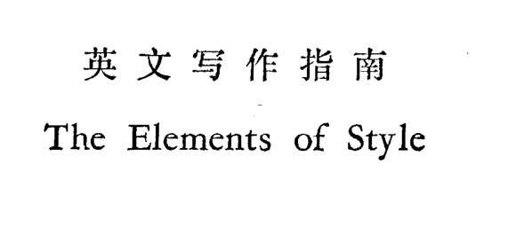

第六周 英语技能之写作训练

> 这本书比较适合自己在拿不准的时候作为查找手册

> 使用bxn来调用deepl的翻译不限次数欸

> Some people think children have the freedom to make mistakes, while other people believe that adults should prevent children from making mistakes. Discuss both sides and give your opinion.

I totally agree with that children have right to make mistakes freely. I would like to support my standpoints from three parts.
From the aspect of children's growth, there is a long time for them to try to make their choices to experience life, to find what they are interested in before they hush into adulthood. During this period of time, they can recognize the world by spending their time dealing with those mistakes without pressure under the protect of their parents. It will be a little cost for them to become strong enough to support their ambition to live without their families.
Another consideration is from human's living condition, everyone's life is a unique game, many factors contribute to it, include their family partners, social interactions, and other many type of resources children owned when they born. Those things are static, what will make children's life dynamic are the mistakes they make and solutions they think up during the period they experience their life game. 
Further, every individual’s life is complex from the beginning to the end. Telling children the totally right what you parents think is just constraining their chances to understand how those success patterns are created. More importantly, what children are faced with when they in their childhood is not so complex that parents can try to offer help to help them get feedback from confronting with mistakes. Only in this way, they build their problems solving strategies to face straight with more complex ones in their adulthood.
To sum up, mistakes are important for children's growth, they can make their life more dynamic, and help them build their skills when they are enjoying of participating in the process of their life game.

我完全同意儿童有自由犯错的权利。我想从三个方面来支持我的观点。
从儿童成长的角度来看，在他们进入成年之前，有很长一段时间让他们尝试做出选择，体验生活，找到自己感兴趣的东西。在这段时间里，他们可以在父母的保护下，在没有压力的情况下，用自己的时间来处理这些错误，从而认识这个世界。这对他们来说是一个小小的代价，使他们变得足够强大，以支持他们离开家庭生活的野心。
另一个考虑是来自人类的生活条件，每个人的生活是一个独特的游戏，许多因素促成了它，包括他们的家庭伙伴，社会交往，以及其他许多类型的资源，孩子们在出生时拥有。这些东西都是静态的，使孩子们的生活充满活力的是他们在经历他们的生活游戏期间所犯的错误和所想的解决办法。
此外，每个人的生活从开始到结束都很复杂。告诉孩子们你们父母的想法是完全正确的，只是限制了他们了解那些成功模式是如何产生的机会。更重要的是，孩子们在童年时面临的问题并不复杂，父母可以尝试提供帮助，帮助他们从面对错误时获得反馈。只有这样，他们才能建立起解决问题的策略，在成年后直接面对更复杂的问题。
总而言之，错误对孩子的成长很重要，它可以使他们的生活更有活力，并在他们享受参与生活游戏的过程中帮助他们建立技能。

> Education of young people is highly prioritized in many countries. However, educating adults who cannot write or read is even more important and governments should spend more money on this. To what extent do you agree or disagree?

非常赞同在成人教育上投入更多资金, 将会从传统教育带来的困境和成人教育的特点两方面进行论述
一方面, 对年轻人的教育如此流行是因为年轻人连续接受教育将近二十年时间, 思维模式单一, 个人经验不足, 灌输的知识不会和年轻人的经验产生非常强烈的冲突. 这也就使得老师在管教学生的时候变得非常容易, 在很多亚洲国家, 甚至已经形成了完整的教育流水线, 教师只需要作为一个管理者角色, 将学会生推到加工机器上, 学生则要花费二十年时间刷各种奇怪的题, 从教育流水线下优次品的筛选机制中生存下来. 教师以及教育体制的懒惰就是在这种长期简单的机械化运作下形成的.
要改变这种困境, 就需要从更困难的受教育场景出发 -- 教育成年人, 危及到教师自己的存在价值, 刺激教育者对自己的教育模式进行反思. 成年人受教育的困难, 在社会舆论的表述下变成是, 成年人自己在长期工作下, 年纪不断增加, 大脑思考能力不足, 导致接受知识的时候学力不够. 这种舆论刚好打击了成年人自己学习的动力, 也反应了社会整体对于反思教育模式的懈怠. 如果从一个真正的教育者的角度来思考, 这些因素应该是对教育者教育技术的考验, 成年人接受教育的试错成本增加对应教师应该从更加实际可操作的场景传输知识, 也就是说教育者扮演的角色不是一个传统教师, 而是一个教练. 知识不再是抽象理论, 而是实际应用技能, 辅助成年人理解自己过往经历, 以及将其中的经验抽象出来形成抽象应用工具, 帮助成年人识别未来场景中类似的问题场景, 提高生活效率. 
也就是说, 成年人的教育对比年轻人的教育, 学习环境更加复杂, 对教师输出质量要求更高, 故而需要投入大量资金来辅助搭建成年人的学习环境, 以及对教练型教师的培训. 

I strongly agree that allocating more funds to adult education would help alleviate the difficulties arising from traditional education as well as leverage the unique features of adult education.

On the one hand, the popularity of education among young people is due to their prolonged exposure to schooling, which tends to produce a narrow mindset, limited personal experience and minimal conflict between received knowledge and individual experience. This makes it easier for teachers to manage and allows for a smooth, streamlined education process. In many Asian countries, for instance, an established education conveyor belt system is in place, with teachers serving as mere managers while students spend two decades mastering various kinds of peculiar tests, surviving the sorting mechanism of educational production as underdogs. Laziness on the part of teachers and the education system has been cultivated under such a prolonged and uncomplicated mechanical operation.

To alter this predicament, a shift to the more challenging scenario of educating adults is necessary, which would question the very existence and worth of teachers, prompting them to rethink their pedagogical models. The difficulties of adult education are often portrayed in public opinion as resulting from a diminished cognitive capacity due to aging and prolonged work experience, which, in turn, affects their ability to absorb knowledge. This portrayal, however, has the negative effect of dampening the motivation of adults to learn and reflecting a general apathy towards re-evaluating the education model. From the perspective of a true educator, these factors should serve as a test of their teaching proficiency. The increased cost of trial and error in adult education demands a more practical and operable knowledge transfer approach from teachers, which means the teacher's role shifts from that of a traditional instructor to a coach. Knowledge is no longer abstract theory but practical application skills that assist adults in understanding their past experiences and abstracting them into applicable tools to help them identify similar problem scenarios in the future and enhance their life efficiency.

In other words, adult education presents a more complex learning environment than education for young people, with higher expectations for the quality of teacher output, necessitating the allocation of significant funds to facilitate the construction of a favorable learning environment for adults and the training of coaching-style teachers.

> In some countries, there has been an increase in the number of parents who educate their children themselves at home instead of sending them to school. Do you think the advantages of this outweigh the disadvantages?

> Children who are brought up in families that do not have large amounts of money are better prepared to deal with the problems of adult life than children brought up by wealthy parents. To what extent do you agree or disagree with this opinion?

不太支持这种观点, 每一代人在做出繁衍后代的决策下大都会为其做好自己能做的准备, 自己的出生享受到的条件已经远超了父辈. 自己要做的不是和同辈比较后抱怨自己的条件, 而是如何最大化利用现有资源实现自己的人生意义.

问题中的现象将金钱的作用过度放大, 反映了人们在面对解决不掉的问题时, 往往将自己的失败归结于自己没有足够的资金和家庭背景支持, 然后放弃反思总结自己在遇到问题到问题结束的过程中自己的行为, 导致一生庸庸碌碌, 为金钱和物质奔波, 放弃去积极探寻人生的意义.

正确人生观的树立需要让孩子像打游戏一样对待自己家庭能给自己提供的资金帮助, 游戏设计者不会将重心放在初始化过程中财产和装备的配置上, 而是将设计重心放在游戏机制上, 让玩家能不断从游戏胜利中得到正反馈, 从而提高玩家对游戏的喜爱度. 游戏初始化的特点也就对应了每个人出生能够得到的家庭物质的支持, 游戏的机制则对应每个个体从出生会遇到的各种困难. 正是各种困难存在让所有人的人生截然不同, 每个人面对困难做出的决策也会让人生走向不同的道路. 

金钱等物质的富裕只是让自己在解决问题时少考虑了一个问题边界条件, 降低了一点微不足道的问题难度. 物质的缺乏让个体面对简单问题时多思考一些局限性, 从而在相对代价较小的问题上得到锻炼, 问题解决能力和积极心态的形成往往就是在小问题的解决上培养起来的. 等到孩子成人, 更困难的问题则会被这些积极向上的化繁为简, 分步解决, 从而在不断解决问题过程中积累更多的智慧, 而这些智慧则是金钱无法买到的.

正如别人所说, 能用金钱解决的问题往往也不算是问题, 真正靠自己能力解决的问题才能让人体会到自己人生的意义.

> 根据雅思作文评分标准，本篇中文作文回答可以得到以下评分：
>
> Task Achievement (任务完成度)：8分
>
> 文章对问题有所回答，论述了作者不太支持这种观点的原因，并且提出了自己的看法。但是，文章有些地方并没有很好地回答问题，比如论述的重点有些偏离了问题本身，缺乏对一些细节的分析。
>
> Coherence and Cohesion (连贯性和衔接度)：8分
>
> 文章结构清晰，段落之间的衔接较好，但是在文章的某些地方，逻辑关系不够明确，需要更好地使用过渡词。
>
> Lexical Resource (词汇资源)：7分
>
> 作者使用了大量词汇，但是有些地方的词汇使用不够准确，有些表述也有点模糊，需要进一步提升词汇的准确性和多样性。
>
> Grammatical Range and Accuracy (语法运用)：8分
>
> 文章的语法运用较为准确，但是有些句子的表达不够简明，有时过于冗长。有些句子也需要更好地使用连接词来使得句子之间的关系更加明确。
>
> 总体评分：31/40分，符合雅思中等水平的要求。建议作者在写作时更加专注于问题本身，精准地表达自己的观点，并且需要加强词汇和语法的准确性和多样性。

> 当然可以。以下是对文章进行提升的几个建议：
>
> 1. 引入一个清晰的论点，以概括文章的观点和立场。这有助于让读者快速了解您的立场并跟随您的思路。例如，您可以在文章开头明确表示您的立场，如“我认为，虽然经济条件并不是决定一个人是否能够成功的唯一因素，但是经济条件的确会影响一个人如何应对生活中的挑战”。
> 2. 在论述的过程中尽量简洁明了。切忌过于啰嗦，以免让读者产生审美疲劳。可以通过对文章进行审视，减少冗余的句子，将文章简化为更加紧凑的形式。
> 3. 注意文章的逻辑性，以确保每个段落和句子都能够紧密地连接起来。尽量避免让读者感到困惑或不知所措。
> 4. 增加更多的事实和数据支持，以增强文章的可信度。例如，您可以列举一些成功人士的案例，说明他们并非仅仅凭借经济条件就能够成功，而是通过自己的努力和智慧实现了自己的目标。
> 5. 注意文体的规范性，包括语法、标点、拼写等方面。使用适当的句式和措辞，尽量使用准确的词语和表达方式，避免出现语法错误和拼写错误。
> 6. 最后，您可以请教一些专业写作人员或老师对您的文章进行审阅，以获取更多有益的反馈和建议。他们可以帮助您发现文章中存在的问题，并提出改进的建议，帮助您打造一篇更优秀的作品。

Title: The fallacy of equating wealth with preparedness for adult life

Introduction: The idea that children from less affluent families are better equipped to handle the challenges of adulthood than their wealthy counterparts is a flawed one. While it is true that parents across generations endeavor to provide their offspring with the best possible start in life, the fact remains that the conditions in which modern children are raised have improved significantly compared to the previous generation. Rather than comparing oneself to others, individuals must learn to maximize their existing resources to realize their potential and achieve personal fulfillment.

Body Paragraph 1: The notion that money plays an outsized role in determining one's success in life reflects a tendency among people to blame their failures on a lack of financial and familial support. Such a mindset often leads to a lack of introspection and self-reflection, resulting in a mediocre existence characterized by a focus on materialistic pursuits rather than the pursuit of meaningful life goals.

Body Paragraph 2: Fostering a healthy perspective on life requires children to approach the resources provided by their families with the same mindset as one approaches a game. In game design, the initial focus is not on providing players with a wealth of equipment or assets, but rather on designing gameplay mechanics that provide a sense of achievement and gratification. Similarly, the material resources provided by one's family at birth are merely the starting point, with life's challenges representing the game's mechanics. It is precisely the challenges that make each individual's life unique, and the decisions they make in response to these challenges determine their life's trajectory.

Body Paragraph 3: Contrary to popular belief, wealth and material resources only marginally reduce the difficulty of life's challenges. In fact, the lack of material resources may prompt individuals to think more critically and creatively in addressing even the simplest of problems. This allows them to cultivate resilience and problem-solving skills that will prove invaluable in tackling more complex challenges in adulthood. The wisdom gained from overcoming such challenges cannot be bought with money and is the foundation upon which individuals build fulfilling lives.

Conclusion: In conclusion, the belief that a lack of financial resources puts children at an advantage in preparing for adult life is misguided. The true path to success lies in learning to make the most of one's existing resources and embracing life's challenges with a positive and creative mindset. Through this approach, individuals will cultivate the resilience and wisdom necessary to overcome even the most daunting of challenges and lead fulfilling lives.

> A number of tertiary courses require students to undertake a period of unpaid work at companies or organisation as part of their programme. What are the advantages and disadvantages of this type of course requirement?

这项课程设置的优点非常明显, 首先可以满足学生工作经验积累的需求, 具体来讲, 学生可以获得专业知识的应用场景, 明确自己职业对自己专业的需求, 让学生对自己未来的职业场景有初步的认知, 从而对未来规划也有一个大概的轮廓, 从而能缓解学生因为对未来的迷茫而产生的焦虑情绪

其次比较重要的是可以辅助转换学生思考问题解决的方式 -- 从做好充分专业准备之后迎接问题挑战到拿到问题分析问题快速调用相关专业知识, 即从问题中学习替代完全将问题和学习割裂开的思维习惯. 

最后还能为学生提供源源不断地学习动机, 自己在学校的学习时间相当于个人对自己的投资, 如果这种投资在很长时间都看不到成效, 学生很容易丧失正反馈. 正反馈的丧失使得学生只能通过同辈比较产生的焦虑情绪让自己持续努力, 但是这种非发自内心想弄清楚运作原理的学习动力是不长久的, 是以消耗学生青春的精神能量为代价的只有让学生能够不断从应用中知道发现自己需要补足的理论知识, 学生才会有持续不断的学习动机, 才会产生对知识技能发自内心的探索.

除了优点, 其缺点在过去的培养案例中也非常集中突出. 在我看来主要是校企培养体系不够完善, 这直接表现在企业对学校学生的能力需求不明确, 导致经常出现类似, 学生数量和对应职位的需求程度不对等, 学生在一些无关紧要的事情上充当免费劳动力, 甚至没有足够的导师对学生的实际操作技能培养.

除此之外, 因为不健全的培养体系, 学校和企业之间的衔接并不紧密, 学生学到的工作技能甚至可能和学校学到的理论知识是完全割裂开的, 导致学生在这个过程中产生了新的迷茫. 如果一些学生在没有足够的能力解决这种问题的时候, 将会导致其成为一些劣质教育改革的实验品.

从长远看, 这项课程要求对于学生的各种能力培养都是非常重要的, 但是相关课程规则设定需要学校管理人员仔细思考校企培养体系发展的实际情况, 在具体的发展阶段采取最优的决策方式, 从而在每个时期都能实现学生的高素质教育需求.

In recent years, it has become increasingly common for tertiary courses to require students to undertake a period of unpaid work at companies or organizations as part of their program. While this course requirement has its advantages, there are also notable shortcomings to consider.

One of the most significant advantages of this requirement is that it caters to the needs of students to accumulate work experience. Students can acquire practical applications of their professional knowledge, clarify their professional demands, and gain a preliminary understanding of their future career prospects, thereby alleviating their anxiety caused by uncertainty about their future. Moreover, this requirement can help in transitioning students' problem-solving approaches, from being fully prepared with professional knowledge before confronting challenges to quickly calling upon relevant professional knowledge to analyze and resolve problems. This shift in thinking habits can help students learn from problems and avoid completely separating problem-solving from learning. Finally, it can provide continuous motivation for students to learn. Without this feedback, students can only sustain their motivation to learn by comparing themselves to their peers, which can lead to anxiety. Therefore, by allowing students to continuously discover the theoretical knowledge they need to supplement their practical applications, they can maintain their motivation to learn and develop an innate curiosity for knowledge and skills.

However, there are also notable shortcomings in this training system. The main issue is the lack of a comprehensive school-enterprise training system, which is reflected in companies' unclear expectations of students' abilities. As a result, there is often a mismatch between the number of students and the corresponding demand for positions, leading to situations where students work as unpaid labor for trivial matters, and even without adequate guidance and training from mentors in practical operations. Furthermore, due to the incomplete training system, the connection between schools and companies is not always close, and the work skills learned by students may even be completely detached from the theoretical knowledge taught in schools, causing new confusion for students. If some students lack the ability to solve these problems, they may become experimental subjects of inferior education reforms.

In the long run, this course requirement is crucial for cultivating various skills in students, but the related course regulations need to be carefully considered by school administrators based on the actual development of the school-enterprise training system, and the most optimal decision-making approach should be taken at each stage of development to meet the high-quality education demands of students. Therefore, it is necessary to establish a comprehensive school-enterprise training system, with clear expectations and guidance for students and mentors, to ensure that the work skills and theoretical knowledge learned by students are closely linked. Only in this way can students fully benefit from the course requirement and achieve the desired outcomes.