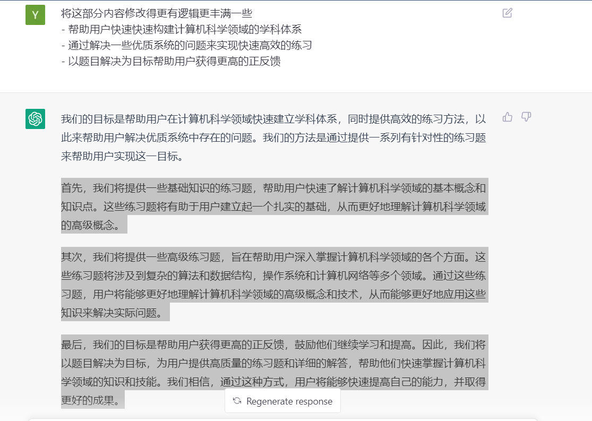
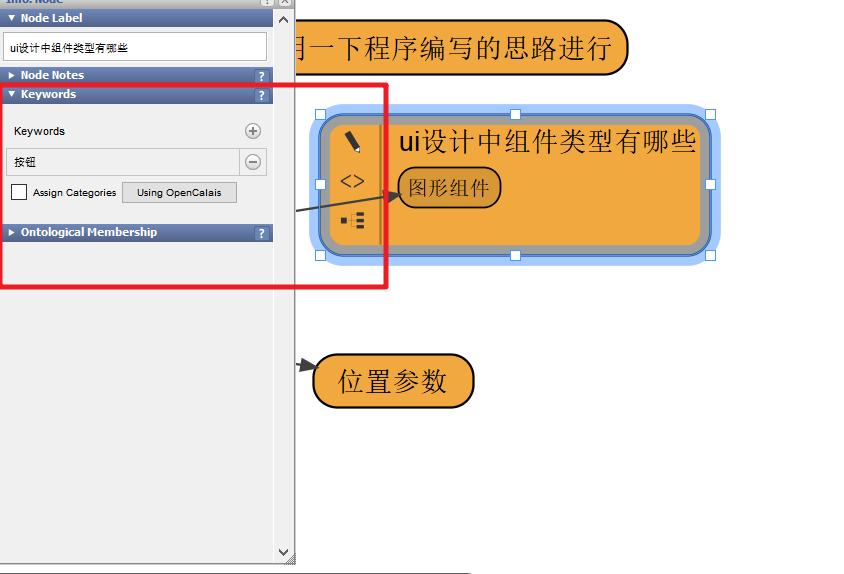
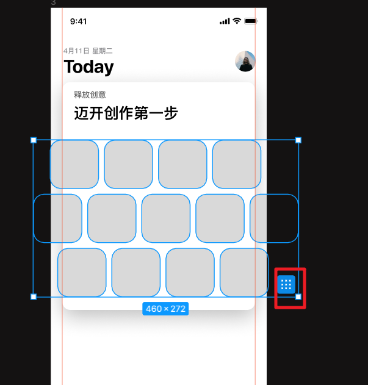
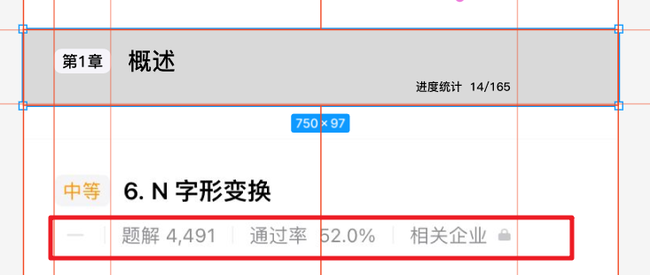
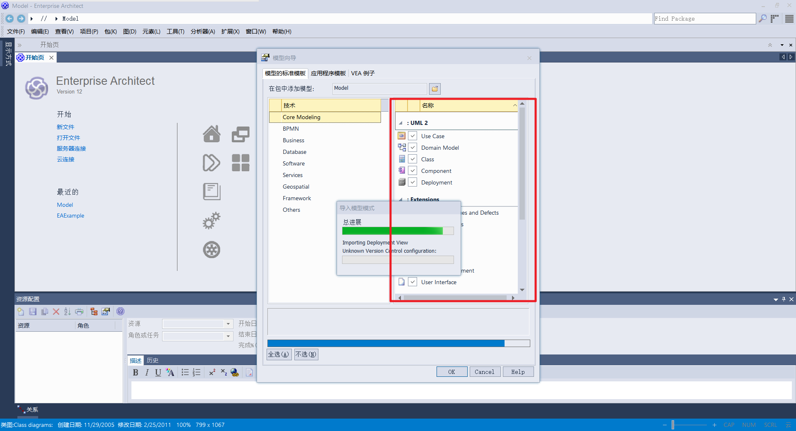

项目开发过程记录


一般一些题库软件被开发出来的功能性目的是什么呢


题库软件通常被开发出来的功能性目的是帮助用户快速、高效地练习和测试特定主题或领域的知识。以下是一些常见的功能：

1. 题目收集和分类：软件会收集和整理各种类型的问题和答案，以便用户可以更轻松地找到和选择他们想要的题目。
2. 自适应测试：软件可以根据用户的表现调整测试难度，以便用户可以在其能力范围内保持挑战性。
3. 统计和报告：软件可以跟踪用户的测试结果，包括正确率、用时等等，并提供详细的报告，以便用户可以更好地了解他们的学习进度。
4. 用户个性化设置：软件可以根据用户的喜好和需求进行个性化设置，例如显示答案、随机化问题、调整测试时间等。
5. 多种题型：软件通常支持不同的题型，例如选择题、填空题、简答题等，以便用户可以在多种情况下进行练习。

总之，题库软件的目的是帮助用户更好地学习和掌握知识，通过练习和测试来提高他们的技能和能力。


题库软件被开发出来的功能性预期是什么


题库软件的功能性预期包括但不限于以下几点：

1. 题目管理：可以方便地添加、修改、删除、分类、搜索、导入和导出题目，以及对题目进行批量操作等。
2. 题目类型：支持不同类型的题目，如选择题、填空题、判断题、问答题、编程题等。
3. 题目难度：可以设置不同难度级别的题目，以满足不同用户的需求。
4. 题目来源：可以记录题目来源，包括出题人、出题时间、出题渠道等信息。
5. 组卷功能：可以根据用户需求，自动生成试卷，并支持手动选择题目的功能。
6. 统计分析：可以对题目的使用情况、用户的答题情况等进行统计和分析，以便于更好地了解题目的情况和优化系统功能。
7. 考试模式：可以模拟真实的考试环境，包括限时考试、随机出题等功能，以提高用户的实战能力。
8. 数据备份与恢复：可以进行数据备份和恢复，以保证数据的安全性和完整性。
9. 用户管理：可以管理用户账户和权限，包括注册、登录、修改密码、权限设置等。
10. 系统设置：可以对系统进行一些基本设置，包括主题风格、语言选择、邮件提醒等。


类似力扣这样的题库软件的组成结构是怎样的呢


类似力扣这样的题库软件通常由以下组成部分构成：

1. 题目库：包含各种类型的编程题目，例如算法、数据结构、面向对象编程等。每个题目都包含题目描述、输入输出样例、评分标准、代码模板等信息。
2. 用户系统：允许用户注册、登录、保存题目进度和历史记录等。
3. 测评系统：用于自动评判用户提交的代码，并提供实时反馈和测试用例的输出。
4. 讨论社区：提供用户交流的平台，用户可以在这里互相帮助、分享解题思路、讨论代码优化等。
5. 排行榜和奖励系统：激励用户积极参与，提供排行榜、成就勋章等奖励机制，以此鼓励用户完成更多的编程题目。

以上是一个典型的题库软件的组成结构，当然不同的平台可能会有不同的特点和功能。


> 专业软件开发需求文档模板

1. 项目概述

项目概述应该包括以下内容：

- 项目名称和简要描述
- 项目目标和预期结果
- 项目的背景和动机
- 项目的范围和限制
- 项目所需的技术和资源

1. 用户需求

用户需求应该包括以下内容：

- 用户类型和数量
- 用户的主要需求和期望
- 用户使用场景和流程
- 用户的操作和功能要求
- 用户所需的数据和内容

1. 功能需求

功能需求应该包括以下内容：

- 系统所需的功能和模块
- 每个模块的详细说明和功能描述
- 模块间的依赖关系和数据流
- 模块的输入和输出
- 模块的输入数据格式和内容
- 模块的输出数据格式和内容

1. 非功能需求

非功能需求应该包括以下内容：

- 性能要求，如响应时间、处理速度和容量
- 可靠性要求，如可用性、错误处理和备份
- 安全要求，如身份验证、访问控制和数据保护
- 可扩展性和可维护性要求，如模块化设计和可配置性
- 兼容性和可移植性要求，如跨平台和多语言支持

1. 技术需求

技术需求应该包括以下内容：

- 开发平台和开发工具
- 技术架构和设计模式
- 数据库和数据结构
- 通信和网络要求
- 应用程序编程接口（API）和集成要求

1. 项目进度和交付要求

项目进度和交付要求应该包括以下内容：

- 项目的时间表和阶段
- 开发周期和里程碑
- 开发人员和测试人员的工作分配
- 交付时间和目标
- 项目成本和预算


将这部分内容修改得更有逻辑更丰满一些 - 计算机的学习和使用本身是非常有趣的事情 - 但是传统教学方式严重影响了计算机学生学习的兴趣 - 甚至为学生学习设置了非常高的门槛 - 也导致计算机环境鱼龙混杂  - 没有一个平台将各种专业类的题目汇集起来 - 很多题库服务的对象都是老师  - 很多老师布置的作业环境非常粗糙 - 导致很多题目本身的价值对于学生来说被严重削弱 - 具体表现就是做完即抛  


计算机学习和使用本身是一个非常有趣的领域，但是传统教学方式却对计算机学生的兴趣产生了严重的负面影响。传统教学方式往往给学生设置了非常高的门槛，使得他们难以入门。此外，由于计算机领域的环境鱼龙混杂，学生很难找到一个统一的平台来汇集各种专业类的题目。

尤其值得注意的是，很多题库服务的对象都是老师，而很多老师布置的作业环境非常粗糙，导致很多题目本身的价值对于学生来说被严重削弱。具体表现就是学生完成作业后便很快忘记，这样的效果不利于他们的深入学习。

为了解决这些问题，需要建立一个能够汇集各种专业类的题目的平台。这个平台不仅需要面向老师，还需要面向学生。同时，需要在平台上提供良好的作业环境，以确保学生能够更好地理解题目，更好地学习计算机。最终，这将有助于提高学生的兴趣和学习效果，也有助于提升整个计算机领域的发展水平。


> 感觉这样搞的话 
>
> 可以直接边搞边做ppt了
>
> 




开发像leetcode这样的题库软件需要哪些技术和资源呢


开发像LeetCode这样的题库软件需要涉及到多种技术和资源，以下是一些主要的方面：

1. 前端开发技术：开发一个类似LeetCode这样的网站需要熟悉HTML、CSS和JavaScript等前端开发技术，以及各种前端框架如React、Angular等。
2. 后端开发技术：网站需要一个后端服务器来存储用户数据、题目数据等。常见的后端开发技术有Python、Java、Node.js等，常用的后端框架有Django、Spring等。
3. 数据库：为了存储用户数据和题目数据，需要使用数据库。常用的数据库有MySQL、PostgreSQL、MongoDB等。
4. 服务器：需要一个服务器来托管网站，处理用户请求等。一般来说可以使用云服务器如Amazon Web Services (AWS)、Google Cloud等。
5. 版本控制工具：需要使用版本控制工具如Git来管理代码，协同开发。
6. 数据结构和算法：作为一款算法题库软件，需要熟悉各种数据结构和算法。
7. 设计和用户体验：需要对产品设计和用户体验有一定的了解，以确保用户能够顺利使用网站。
8. 测试和调试：需要进行充分的测试和调试，确保网站的功能和性能符合预期。
9. 运维和监控：需要确保网站的稳定性和可用性，并监控服务器的性能和资源利用情况。

以上是开发像LeetCode这样的题库软件需要的一些主要技术和资源，具体的开发过程可能会涉及到更多的细节和工具。


如果在手机上开发像leetcode这样的题库软件需要哪些技术和资源呢


开发类似于 LeetCode 这样的题库软件需要以下技术和资源：

1. 编程语言：你需要选择一种适合移动应用开发的编程语言。目前，最流行的移动应用开发语言是Java和Kotlin（Android）和Swift（iOS）。
2. 开发环境：为了开发和测试应用程序，你需要在计算机上安装一个集成开发环境（IDE）。Android Studio和Xcode是针对Android和iOS的最常用的IDE。
3. 数据库：你需要使用一个数据库来存储用户数据和题目信息。MySQL和PostgreSQL是最流行的开源数据库，而Firebase是Google提供的云数据库。
4. 服务器：为了让用户可以使用应用程序，你需要将应用程序部署在一台服务器上。Amazon Web Services（AWS）和Microsoft Azure是流行的云服务提供商，可以为你提供强大的计算和存储资源。
5. API：你需要使用API来从服务器上获取题目信息和用户数据。REST API是最流行的API类型之一，它使用HTTP协议来传输数据。
6. 设计：一个好的应用程序需要一个漂亮而易于使用的用户界面。为了实现这一点，你需要拥有一些设计资源，如图标和UI组件。
7. 测试：在发布应用程序之前，你需要对应用程序进行测试。你可以使用自动化测试框架和手动测试工具来测试应用程序。
8. 发布：发布应用程序需要一些额外的资源，例如开发者帐户、签名证书和应用程序商店列表。

总的来说，开发一个像 LeetCode 这样的题库软件需要一个团队，包括开发人员、设计人员和测试人员。


能否对上述技术的应用目的进行分类


可以将上述技术按照应用目的进行如下分类：

1. 应用程序开发：编程语言、开发环境和设计资源都是用于开发应用程序的。编程语言用于编写应用程序的逻辑代码，开发环境用于编译、调试和测试应用程序，设计资源用于创建漂亮而易于使用的用户界面。
2. 数据存储和管理：数据库和服务器用于存储和管理用户数据和题目信息。数据库用于存储数据，而服务器用于处理请求并提供数据。
3. 数据传输和交互：API用于从服务器获取题目信息和用户数据，并将它们传递给应用程序。API使用HTTP协议进行通信，可以在应用程序和服务器之间进行数据交互。
4. 应用程序测试：测试是为了确保应用程序质量和稳定性的关键步骤。自动化测试框架和手动测试工具可以帮助开发团队发现和解决潜在的问题。
5. 应用程序发布：发布应用程序需要一些额外的资源，例如开发者帐户、签名证书和应用程序商店列表。这些资源用于将应用程序提交到应用程序商店，并确保应用程序在各种设备和操作系统上都能正常运行。


独立软件设计者应该如何从零开始


独立软件设计者从零开始需要掌握以下步骤：

1. 确定你的目标用户和需求：在开始设计软件之前，你需要确定你的目标用户和他们的需求。这样可以帮助你了解市场上的机会，并设计出一款满足用户需求的软件。
2. 进行市场研究：在开始设计软件之前，你需要进行市场研究，了解竞争对手的情况以及市场上已经存在的软件。这样可以帮助你确定自己的软件在市场上的定位和差异化竞争点。
3. 制定软件设计方案：在了解目标用户和市场需求后，你需要制定软件设计方案。这包括确定软件的功能、架构、用户界面设计等方面。
4. 进行软件开发：一旦软件设计方案确定，你可以开始进行软件开发。这可能需要学习编程语言和开发工具，或者与其他开发者合作进行开发。
5. 进行测试和优化：在软件开发完成后，你需要对软件进行测试和优化，以确保软件能够满足用户需求，并且没有漏洞和错误。
6. 推广和营销：一旦软件开发和测试完成，你需要进行推广和营销，让更多的用户了解你的软件并下载使用。这可以通过社交媒体、广告、SEO等方式来实现。

总之，作为独立软件设计者，你需要有良好的计划、开发技能和市场推广能力，同时保持持续学习和改进的心态，才能从零开始成功设计出一款优秀的软件。


进行原型设计的过程中，需要注意以下几个方面：

1. 确定设计目标：在进行原型设计前，需要明确设计目标和需求，确定软件的基本功能和用户体验要求，以便在设计过程中有一个清晰的方向和目标。
2. 精心设计界面和交互：在进行原型设计时，需要精心设计界面和交互，考虑到用户的体验和行为，以确保软件的功能和用户体验得到最佳的体现。
3. 保持简洁和清晰：在进行原型设计时，需要保持简洁和清晰，避免过多的细节和无用的信息，以便让用户更加关注软件的核心功能和特点。
4. 反复测试和修改：在进行原型设计时，需要反复测试和修改，听取用户的反馈和建议，并根据用户的反馈和建议进行修改和完善，以确保软件的功能和用户体验得到最佳的表现。
5. 熟练掌握设计工具和技术：在进行原型设计时，需要熟练掌握设计工具和技术，如Axure、Sketch、Adobe XD等，以确保设计能够得到有效的实现和展示。

总之，在进行原型设计的过程中，需要注重用户体验和行为，保持简洁和清晰，反复测试和修改，并熟练掌握设计工具和技术，以确保软件的功能和用户体验得到最佳的展现。


如何将原型用在之后的软件开发中呢

原型是软件开发中一个非常重要的工具，它可以帮助开发团队更好地理解用户需求、设计用户界面以及验证功能实现的可行性。以下是将原型用在之后的软件开发中的一些步骤：

1. 确认原型的可行性：在开始软件开发之前，需要仔细检查原型的所有功能和界面，以确保其可行性。如果发现原型中存在任何问题，需要及时进行修复。
2. 定义开发计划：在确定原型可行性之后，需要与开发团队一起制定详细的开发计划，包括开发阶段、时间表和里程碑。
3. 搭建开发环境：为了能够顺利地进行软件开发，需要搭建好相应的开发环境，包括软件开发工具、版本控制系统、测试环境等。
4. 进行编码和测试：根据原型中定义的功能和界面，在开发环境中进行编码和测试。开发过程中需要不断与原型进行对比，确保开发的软件能够实现原型中的所有功能和界面。
5. 定期评估进展：定期评估开发进展，确保开发团队按照计划进行开发，并及时解决遇到的问题。
6. 完成软件开发：完成软件开发后，需要对软件进行全面的测试，确保软件能够满足用户需求，并在生产环境中稳定运行。

总之，将原型用在软件开发中可以帮助开发团队更好地理解用户需求、设计用户界面以及验证功能实现的可行性。在使用原型时，需要与开发团队密切协作，及时进行修复，并确保开发团队按照计划进行开发，最终交付一个能够满足用户需求的高质量软件产品。


手机力扣软件题库界面设计使用的组件有哪些


作为一个AI模型，我无法确认手机力扣软件具体使用了哪些组件来设计题库界面，但一般来说，常见的用于移动应用程序界面设计的组件包括：

1. 文本框：用于输入和显示文本信息；
2. 按钮：用于触发交互操作；
3. 列表视图：用于展示一组数据列表；
4. 卡片视图：用于展示单个数据项；
5. 导航栏：用于导航和切换不同的界面；
6. 标签栏：用于切换应用程序不同功能的标签；
7. 搜索框：用于输入搜索关键字，搜索数据；
8. 弹出框：用于显示提示信息、警告信息或请求用户确认的操作；
9. 进度条：用于显示操作进度或加载状态；
10. 图片视图：用于展示图片。

当然，这只是一些常见的组件，具体使用哪些组件取决于应用程序的需求和设计。

有哪些网站能交互显示前端各种组件的功能的呢


以下是一些交互式前端组件展示网站的推荐：

1. CodePen（https://codepen.io/）：一个社交编码平台，提供在线编辑器和展示你的代码。你可以在这里找到各种各样的前端组件，例如响应式布局、导航菜单、动画效果等等。
2. JSFiddle（https://jsfiddle.net/）：一个在线代码编辑器和调试器，支持 HTML、CSS、JavaScript、jQuery 和其他前端框架。你可以在这里创建自己的代码片段，或浏览其他用户的代码片段。
3. CodeSandbox（https://codesandbox.io/）：一个在线的前端开发环境，可以创建和共享 React、Vue、Angular 等前端项目。你可以在这里浏览其他用户的项目，或创建自己的项目。
4. CSS-Tricks（https://css-tricks.com/）：一个前端开发社区，提供有关 HTML、CSS 和 JavaScript 的教程、技巧和文章。它还包括一个代码播放器，可以交互地显示代码的效果。
5. Bootstrap（https://getbootstrap.com/docs/5.1/getting-started/introduction/）：一个流行的前端框架，提供响应式布局、导航菜单、表格、表单等常用组件。在 Bootstrap 的官方文档中，你可以找到各种演示和示例。

这些网站提供了丰富的前端组件和示例，可以帮助你更好地学习和理解前端开发。


> 如何从零开始设计一个软件原型

设计一个软件原型需要经过以下步骤：

1. 确定项目目标和需求：了解客户的需求和目标，确定软件的功能和用途，以及需要实现哪些特性。
2. 确定用户界面：根据项目目标和需求，设计用户界面，包括页面布局、交互和视觉设计。
3. 制定原型设计方案：根据用户界面设计，确定原型的功能和流程，并绘制出原型的草图和示意图。
4. 创建原型：利用原型设计方案，使用相关的软件工具和技术创建原型，可以使用一些开源的软件如Sketch，Adobe XD和Figma等。
5. 测试和修改原型：进行测试和修改原型，了解用户的反馈和需求，进行必要的修改和调整。
6. 完善原型：根据测试和修改的结果，完善原型，以确保原型的完整性和准确性。
7. 最终验证：最终验证原型是否满足项目目标和需求。

总之，要设计一个成功的软件原型，需要考虑用户体验、功能性和可靠性，并根据用户需求进行必要的测试和调整。


> 第二步中用户界面在设计的时候 界面组织的逻辑有哪些


在设计用户界面时，界面组织的逻辑可以从以下几个方面考虑：

1. 页面结构：确定页面的布局和组成部分，包括页面标题、导航栏、页脚等，以及各个组件之间的排列和关系。
2. 交互设计：确定用户与界面的交互方式，包括按钮、表单、链接等控件的样式和位置，以及鼠标悬停、点击等交互行为的响应。
3. 内容设计：确定页面的内容和信息结构，包括文本、图像、视频等内容的排列和组织方式，以及各种信息之间的关联和展示方式。
4. 视觉设计：确定页面的视觉风格和外观，包括颜色、字体、图标等元素的选择和设计，以及整个界面的视觉协调性和美感。
5. 反馈设计：确定界面与用户之间的反馈机制，包括提示、错误信息、状态栏等，以及各种反馈方式的样式和位置。

综上所述，用户界面设计需要考虑页面的结构、交互、内容、视觉和反馈等方面，以提供更好的用户体验和功能性。


> 这种内容有哪些参考资料呢


设计用户界面需要综合考虑多个方面，可以参考以下资料：

1. UX设计原则和指南：了解用户体验设计的基本原则和最佳实践，例如设计人性化、易用性、可访问性、一致性等方面的指南。
2. 界面设计规范和样式库：查看各种操作系统和应用程序的界面设计规范和样式库，了解流行的设计风格和趋势，例如Google Material Design、Apple Human Interface Guidelines等。
3. 用户研究和反馈：通过用户研究和用户反馈了解用户的需求和行为，例如用户测试、问卷调查、用户访谈等。
4. 设计工具和资源：使用各种设计工具和资源，例如Sketch、Adobe XD、Figma等界面设计工具，以及各种设计素材、图标库、颜色库等资源。
5. 设计博客和社区：参考设计博客和社区，例如Medium、Behance、Dribbble等，查看其他设计师的作品和经验分享，了解最新的设计趋势和技术。

总之，设计用户界面需要广泛的学习和研究，不断更新自己的知识和技能，以提供更好的设计方案和用户体验。


手机软件设计的页面设计中不同页面之间应该如何组织


在手机软件设计中，不同页面之间的组织需要考虑以下几个方面：

1. 导航结构：手机软件的导航结构应该清晰、简单易懂，让用户快速找到自己需要的功能或信息。一般而言，可以采用标签栏、抽屉式导航、底部标签栏等方式进行导航。
2. 页面布局：不同页面之间的布局应该相互协调，统一风格。每个页面应该明确表达自己的主题和用途，并保持一致的设计语言和风格。
3. 连贯性：不同页面之间应该保持连贯性，让用户感觉到他们在同一个应用程序中。可以通过颜色、字体、图标等方式进行统一设计，保持品牌风格的一致性。
4. 上下文关系：不同页面之间的上下文关系也需要考虑。例如，在用户从一个页面跳转到另一个页面时，应该让用户明确他们是如何到达新页面的，并提供返回上一个页面的方法。

总之，手机软件的页面设计需要综合考虑多个方面，以确保用户能够轻松、愉快地使用应用程序，并提高用户的满意度。


通用软件的页面模板都涉及到哪些页面

> 大概按照这些页面基本上能把一个软件差不读多的信息给涵盖到了

通用软件的页面模板一般包含以下几个页面：

1. 首页：通常是用户进入应用程序后第一个看到的页面，可以展示应用程序的主要功能或信息。
2. 搜索页面：提供搜索功能，让用户能够快速找到需要的内容或信息。
3. 列表页面：显示一系列相关的内容或信息，例如商品列表、新闻列表等。
4. 详情页面：展示特定内容或信息的详细信息，例如商品详情、新闻详情等。
5. 表单页面：用于收集用户输入的信息，例如注册页面、登录页面等。
6. 设置页面：提供应用程序的设置选项，例如账号设置、通知设置等。
7. 消息页面：展示用户收到的消息，例如系统通知、私信等。
8. 用户个人页面：展示用户的个人信息和活动记录，例如个人资料、购买记录等。
9. 搜索结果页面：展示搜索结果的页面，用户可以在这里找到他们需要的内容。

通用手机软件的页面模板通常涉及以下页面：

1. 登录页：用于用户登录账户。
2. 注册页：用于新用户注册账户。
3. 首页：通常是用户进入应用后看到的第一个页面，包含应用的核心功能和导航。
4. 个人中心：用于显示用户的个人信息、设置和偏好等。
5. 列表页：用于展示列表信息，比如商品列表、消息列表等。
6. 详情页：用于展示某一项具体内容的详细信息，比如商品详情、文章详情等。
7. 搜索页：用于帮助用户快速搜索应用中的内容。

这些页面通常是通用软件设计的核心页面，但不同的应用程序可能需要不同的页面，具体的页面设计需要根据具体应用的需求和目的进行调整和定制。


> 找到了一个能进一步辅助自己描述问题的帖子

https://v2ex.com/t/864114


> VUE里的关键词有什么作用




> 这里自己group之后直接自动对齐了




> 感觉一些比较好的习惯在自己后退的时候影响的范围不是很大


> 感觉自己目前搭配视频进行实操学习效率很低


> 感觉这部分内容先设计数据库更方便一些




> 解决之前使用django开发的项目先在本地部署一个使用gitbook写文档的工具


> 需求分析编写规范

需求分析编写规范可以根据具体的项目和团队的情况而异，但以下是一些通用的规范建议：

1. 确定需求分析的目标和范围。需求分析的目标应该明确，可以包括确定用户需求、制定功能需求、规划开发计划等。同时，需求分析的范围也应该清晰，可以包括功能、性能、安全、可用性等方面。
2. 确定需求分析的流程。需求分析应该是一个迭代过程，包括需求搜集、需求分析、需求确认等步骤。在每个步骤中，应该明确任务和责任，避免遗漏和重复。
3. 使用标准化的模板和格式。需求分析应该使用标准的模板和格式，包括需求编号、需求描述、优先级、状态等信息，方便管理和跟踪。
4. 采用可测量的需求描述方式。需求描述应该具有可测量性，例如使用具体的数字、时间、条件等描述需求，避免模糊和歧义。
5. 确定需求的优先级和关联性。在编写需求时，应该确定其优先级和与其他需求的关联性，帮助团队了解需求的重要性和影响。
6. 考虑不同用户的需求。在编写需求时，应该考虑不同用户的需求，包括各种角色和使用场景，确保需求的全面性和有效性。
7. 与利益相关者协商和确认。在编写需求时，应该与利益相关者协商和确认，包括用户、开发人员、测试人员等，确保需求的一致性和可行性。
8. 定期审核和更新需求文档。需求文档应该定期进行审核和更新，以反映项目的最新状态和需求变化，避免过时和混乱。

以上是一些通用的需求分析编写规范建议，可以根据具体情况进行调整和补充。


> 编写需求分析文档过程中如何实现需求分析编写规范的内容呢


> 辅助进行软件系统设计的工具

软件系统设计是软件开发过程中非常重要的一环，需要考虑诸多因素，包括系统架构、数据结构、算法、性能优化等等。为了辅助进行软件系统设计，有很多工具可供选择，下面列举一些常见的工具：

1. 绘图工具：如Visio、OmniGraffle等，可以用来绘制系统架构图、数据流程图、流程图等，方便进行系统设计。
2. UML建模工具：如Enterprise Architect、Rational Rose等，支持UML建模，可以用来建立类图、时序图、用例图等，有助于设计出清晰的系统结构。
3. 原型设计工具：如Axure RP、Sketch等，可用来进行原型设计，帮助用户更好地理解系统的功能和交互方式。
4. 性能测试工具：如LoadRunner、JMeter等，可以模拟并发请求、测试系统负载能力等，帮助进行系统性能设计。
5. 代码生成工具：如CodeSmith、MyGeneration等，可以根据模板自动生成代码，提高开发效率。
6. IDE：如Eclipse、IntelliJ IDEA等，提供丰富的开发功能，支持代码编辑、调试、版本控制等，有助于进行系统设计和开发。

总之，选择合适的工具可以大大提高系统设计的效率和质量。


```mermaid
graph A 
	A[测试] --> B[题目搜索]
	

```

介绍一下用例图这个图形工具


用例图是一种用于描述系统需求和功能的UML图形工具。它描述了一个系统的所有用例，以及与这些用例相关的参与者（Actor）和系统边界。在用例图中，每个用例都是一个系统功能的描述，而每个参与者则是系统中与用例交互的实体。用例图通常是系统设计和开发的起点，因为它们提供了对系统功能和行为的清晰概述。

用例图的主要元素包括：

1. 参与者：表示与系统交互的外部实体。参与者可以是人，组织或另一个系统。
2. 用例：表示系统执行的一个功能或一个用户目标。用例通常使用动词短语描述。
3. 系统边界：表示系统与其环境之间的分界线。边界将系统中的所有用例和参与者限制在系统内部。
4. 关系：用于描述参与者与用例之间的关系。这些关系可以是包含关系，关联关系或泛化关系。

用例图的好处是它们提供了一个易于理解的视图，可以帮助团队了解系统的需求和功能。此外，用例图可以帮助团队识别与系统交互的参与者和潜在用例，并更好地理解系统的范围和边界。


能否给出一个用例图的简单应用场景


当一个系统需要进行功能设计时，用例图是一个常用的工具。以下是一个简单的应用场景：

假设一个在线商店需要开发一个新的下单系统，系统需要满足以下需求：

1. 用户可以浏览商品目录，选择商品并将其添加到购物车中。
2. 用户可以查看购物车中的商品，修改购物车中商品的数量或从购物车中删除商品。
3. 用户可以选择送货方式并输入送货地址。
4. 系统需要将用户订单信息传输给订单处理系统。

在这个场景中，用例图可以很好地描述系统的功能和参与者。例如，用例图可以包括以下元素：

1. 一个 "浏览商品" 的用例，它的参与者是 "用户" 。
2. 一个 "管理购物车" 的用例，它的参与者也是 "用户" 。
3. 一个 "选择送货方式和地址" 的用例，它的参与者同样是 "用户" 。
4. 一个 "传输订单信息" 的用例，它的参与者是 "系统" 。

在用例图中，可以用关联线将每个用例与参与者连接起来，表示参与者与用例之间的交互。此外，用例图还可以显示系统边界，以限定系统的范围。

这个用例图可以帮助团队更好地理解系统的功能和参与者，并确保开发的系统满足需求。


给出上述应用场景的用例图的plantuml代码


以下是一个使用PlantUML创建的简单用例图示例，来表示上述在线商店的下单系统：

```
sqlCopy code@startuml
left to right direction
actor User
rectangle "Online Shop" {
  User --|> (Browse Products)
  User --|> (Manage Cart)
  User --|> (Select Delivery)
  (Select Delivery) --> (Transmit Order)
}
@enduml
```

这个用例图使用了PlantUML的简单语法，其中 "@startuml" 和 "@enduml" 之间的代码定义了用例图的内容和布局。在这个用例图中，"User" 被定义为参与者，"Online Shop" 被定义为系统。用例 "Browse Products"、"Manage Cart"、"Select Delivery" 和 "Transmit Order" 分别表示系统的不同功能。

用箭头表示参与者与用例之间的关系。例如， "User" 参与者与 "Browse Products" 用例之间的关系是 "--|>" 。这意味着参与者可以执行用例中描述的功能。

这个用例图还使用了矩形来表示系统边界，即 "Online Shop" 。这个矩形限定了系统的范围，并将所有用例和参与者限制在系统内部。

请注意，这个用例图只是一个简单的示例，实际应用中可能需要更复杂的用例图来表示更多的用例和参与者。


继续完善一下这个应用场景下的用例图


> 全选创建之后没办法打开了




> 这个工具的打开速度很仿真实际项目的打开速度
>
> 电脑直接卡成ppt了

