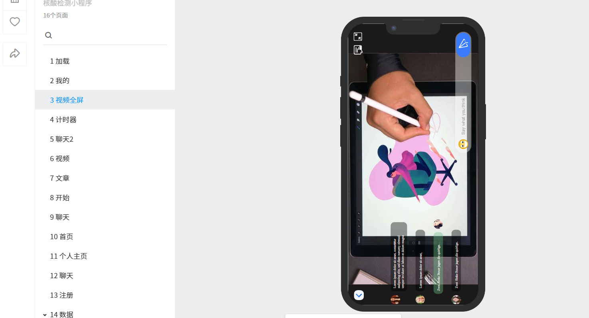
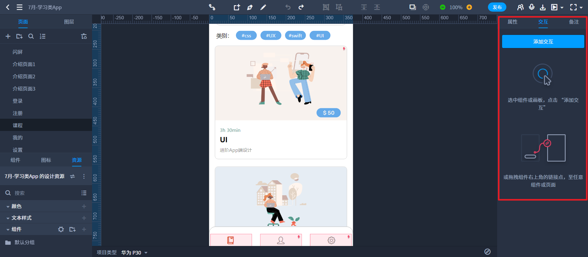

> 安卓模拟器选择

自己目前的需求是什么

- 开发手机软件做测试用
- 要比as开发平台自带模拟器方便下载
- 模拟器能和as(搭成工具链)

夜神

https://mp.weixin.qq.com/s/FIbjRzs-KsZlRSIivKUVow

> 自己有一个刷题软件的想法

> 之前看了很多东西 感觉现在还是不太能下手开始搞
>
> 如何从零开始设计一个手机软件
>
> 找到清楚的每个步骤

> 如何从零开始设计一个手机软件 每个步骤需要实现的目标是什么

设计一个手机软件是一个复杂的过程，需要经过多个阶段的规划、设计、开发和测试。下面是一个大致的步骤：

1. 确定软件的目的和目标：你需要明确你想要开发的软件类型，它的目标用户是谁，它的主要功能是什么，它需要解决哪些问题或需求。
2. 做市场调研：调查市场上已经有哪些类似的软件，并了解它们的特点和缺点。这可以帮助你确定你的软件需要哪些功能和特点，以及你的软件应该与现有软件有何不同之处。
3. 制定软件设计规范：在开发软件之前，你需要制定一些设计规范，如用户界面设计、交互流程设计、数据管理和存储设计等。这些规范应该基于你的软件目标和用户需求。
4. 制定软件原型：制定软件原型是为了让你能够更好地理解你的软件将如何运行，以及它将包括哪些功能。你可以使用在线工具如Sketch、Adobe XD等制作你的原型。
5. 开始开发：一旦你有了原型和设计规范，你就可以开始进行开发。这需要确定哪些技术将用于开发，如Android、iOS等，你需要学习如何使用这些技术并开始编写代码。
6. 测试和修复：一旦你完成了软件开发，你需要进行测试，以确保软件没有任何漏洞和错误。如果发现问题，你需要修复它们并重新测试。
7. 发布和推广：一旦你确认软件没有问题，你可以发布它。发布后，你需要制定一个营销计划，将你的软件推广到你的目标用户，并持续推广和改进你的软件。

总体来说，设计一个手机软件需要经过许多阶段和计划，从制定目标和市场调研到设计、开发、测试和发布。每个步骤都有其目的和目标，都是让你更好地理解你的软件，更好地满足你的用户需求。

设计手机软件的每个阶段自己要产出哪些内容

设计手机软件的每个阶段需要产出不同的内容，具体如下：

1. 研究阶段：
   - 用户调研报告：包括用户需求、行为和偏好分析。
   - 竞品分析报告：包括竞品的功能、界面、用户体验等分析。
   - 产品需求文档：包括产品功能、用例、流程、数据结构等详细说明。
2. 原型设计阶段：
   - 交互原型：包括主要功能和流程的交互原型，用于模拟用户界面和交互方式。
   - UI设计：包括界面设计、色彩搭配、字体排版、图标等，用于传达产品风格和品牌形象。
   - 信息架构图：包括产品的信息结构、分类、层次关系等，用于优化产品的导航和搜索。
3. 开发阶段：
   - 开发文档：包括接口文档、技术架构文档、代码规范文档等，用于开发人员的参考。
   - 前端代码：包括HTML、CSS、JavaScript等前端代码，用于实现用户界面和交互。
   - 后端代码：包括数据库设计、服务器端代码等，用于实现产品功能和数据管理。
4. 测试阶段：
   - 测试计划：包括测试目标、测试用例、测试流程等，用于规划测试工作。
   - 测试报告：包括测试结果、缺陷报告、性能分析等，用于反馈开发人员和优化产品。
5. 发布阶段：
   - 发布版本：包括安装包、升级包等，用于发布到应用商店或线上。
   - 用户文档：包括产品介绍、使用说明、常见问题等，用于帮助用户使用产品。
   - 宣传资料：包括产品宣传页、广告、视频介绍等，用于推广产品。

设计手机软件的每个阶段自己要产出哪些内容

设计手机软件的每个阶段需要产出不同的内容，具体如下：

1. 研究阶段：
   - 用户调研报告：包括用户需求、行为和偏好分析。
   - 竞品分析报告：包括竞品的功能、界面、用户体验等分析。
   - 产品需求文档：包括产品功能、用例、流程、数据结构等详细说明。
2. 原型设计阶段：
   - 交互原型：包括主要功能和流程的交互原型，用于模拟用户界面和交互方式。
   - UI设计：包括界面设计、色彩搭配、字体排版、图标等，用于传达产品风格和品牌形象。
   - 信息架构图：包括产品的信息结构、分类、层次关系等，用于优化产品的导航和搜索。
3. 开发阶段：
   - 开发文档：包括接口文档、技术架构文档、代码规范文档等，用于开发人员的参考。
   - 前端代码：包括HTML、CSS、JavaScript等前端代码，用于实现用户界面和交互。
   - 后端代码：包括数据库设计、服务器端代码等，用于实现产品功能和数据管理。
4. 测试阶段：
   - 测试计划：包括测试目标、测试用例、测试流程等，用于规划测试工作。
   - 测试报告：包括测试结果、缺陷报告、性能分析等，用于反馈开发人员和优化产品。
5. 发布阶段：
   - 发布版本：包括安装包、升级包等，用于发布到应用商店或线上。
   - 用户文档：包括产品介绍、使用说明、常见问题等，用于帮助用户使用产品。
   - 宣传资料：包括产品宣传页、广告、视频介绍等，用于推广产品。

如果只是个人手机软件开发 能否简化上述任务

如果是个人手机软件开发，可以根据个人实际情况和项目规模来简化任务，但是也需要确保产品质量和用户体验。以下是一些简化任务的方法：

1. 研究阶段：
   - 可以通过网络调查、市场分析和问卷调查等方式获取用户需求和竞品信息。
   - 可以将产品需求文档简化为主要功能和流程的说明。
2. 原型设计阶段：
   - 可以通过手绘草图或在线原型设计工具来快速制作原型，避免大量时间和资源的投入。
   - 可以使用开源UI组件库来简化UI设计的工作量。
3. 开发阶段：
   - 可以使用现成的开源框架和组件来加快开发速度，避免重复造轮子。
   - 可以采用敏捷开发方式，每次开发一个小功能，逐步完善产品。
4. 测试阶段：
   - 可以使用在线测试工具进行自动化测试和功能测试，节省测试时间和成本。
   - 可以自行进行用户体验测试和兼容性测试，以确保产品质量。
5. 发布阶段：
   - 可以将应用发布到简单的应用市场或网站上，以节省发布成本。
   - 可以自行编写简单的用户文档和宣传资料。

总之，在个人手机软件开发中，需要根据自身实际情况和项目规模，灵活应对各个阶段的任务，确保产品的质量和用户体验。

有没有相关辅助生成需求文档的工具呢

是的，有一些工具可以辅助生成需求文档，下面列举几个常用的工具：

1. 需求管理工具：例如Jira、Trello等，这些工具提供了项目管理和协作功能，可以辅助记录和管理需求，同时也支持多人协作和讨论。
2. 原型设计工具：例如Axure、Sketch等，这些工具可以帮助用户快速制作交互原型，通过拖拽和连接的方式，实现用户界面和交互方式的模拟。
3. 需求分析工具：例如ReqView、Lucidchart等，这些工具提供了完整的需求分析和建模功能，可以帮助用户制定产品需求文档，并支持导出Word、PDF等格式的文档。
4. 产品设计工具：例如Figma、Adobe XD等，这些工具提供了全套的产品设计和制作功能，可以帮助用户进行界面设计、交互设计和动画设计等，还可以实现多人协作和实时预览。

这些工具可以有效地辅助用户生成需求文档，并提高工作效率和质量。用户可以根据自己的实际需求和工作习惯，选择合适的工具来使用。

辅助书写需求分析文档的工具有哪些呢

以下是几种辅助书写需求分析文档的工具：

1. Google Docs或Microsoft Word：这些工具是常见的文档编辑工具，可以用于书写需求文档。它们提供了基本的文本编辑、格式设置、表格、图片和链接等功能，可以较为方便地编写需求文档。
2. Confluence：Confluence是一款基于Web的企业Wiki和协作软件，它可以帮助团队共享知识和合作开发。Confluence提供了丰富的文本编辑和协作功能，可以轻松书写需求文档，同时也支持在线评论、讨论和修改。
3. Markdown编辑器：Markdown是一种轻量级的标记语言，可以用于快速书写格式化文档。有许多Markdown编辑器可以使用，例如Typora、Visual Studio Code等，它们提供了丰富的文本编辑和格式化功能，可以方便地编写需求文档。
4. 专业需求分析工具：例如ReqView、Caliber等，这些工具提供了完整的需求分析和建模功能，可以帮助用户制定产品需求文档，并支持导出Word、PDF等格式的文档。它们通常包含需求分类、需求追踪、版本控制和变更管理等功能。

以上工具可以根据个人需求和习惯选择使用，需要根据实际需求来选择合适的工具。同时，书写需求文档并不是唯一重要的事情，更重要的是能够理解、记录和满足用户需求。

辅助书写需求分析文档的工具有哪些 并给出官方地址

以下是几个辅助书写需求分析文档的工具，它们可以提高文档质量和效率：

1. Microsoft Visio: Microsoft Visio是一个流程图和矢量图形制作工具。它可以帮助用户创建复杂的流程图、组织结构图、流程图等。Visio具有直观的用户界面和丰富的模板和样式，可提高文档的可读性和美观性。官方地址：https://www.microsoft.com/zh-cn/microsoft-365/visio/flowchart-software
2. Lucidchart: Lucidchart是一个基于Web的流程图和图表绘制工具。它可以帮助用户创建复杂的流程图、组织结构图、流程图等。Lucidchart具有丰富的模板和样式，可提高文档的可读性和美观性。官方地址：https://www.lucidchart.com/pages/zh/home
3. Axure RP: Axure RP是一个交互式原型设计工具，可用于创建高保真度的原型和用户界面设计。Axure RP具有强大的交互和动画效果，可帮助用户更好地展示设计思路。它还提供了丰富的注释和文档生成工具，可帮助用户生成详细的需求分析文档。官方地址：https://www.axure.com/
4. UMLet: UMLet是一个基于Java的UML绘图工具。它可以帮助用户创建UML类图、序列图、用例图等。UMLet具有简单易用的用户界面和丰富的模板和样式，可提高文档的可读性和美观性。官方地址：https://www.umlet.com/
5. Balsamiq Mockups: Balsamiq Mockups是一个简单易用的界面设计工具，可用于快速创建UI界面的草图。它具有简单的绘图工具和丰富的UI元素库，可帮助用户快速创建草图。Balsamiq Mockups还支持多人协作和注释，可提高文档的可读性和协作效率。官方地址：https://balsamiq.com/
6. Confluence: Confluence是一个企业级的知识管理和协作平台，可以用于文档管理、项目管理、团队协作等。它具有丰富的插件和模板，可用于创建各种类型的文档和报告。Confluence还提供了丰富的注释和讨论功能，可提高文档的可读性和协作效率。官方地址：https://www.atlassian.com/software/confluence

注意：以上工具的官方地址可能随时间而有所变化，请自行搜索确认。

> 个人小型项目创建原型的工具推荐并给出相关网站地址

https://hk.v2ex.com/t/863510

> 摹客前端

> HackAll自己像设计的刷题类app想成了接单app 用接单app来操作应该更好玩一些

https://www.mockplus.cn/example/rp/100253

> 把软件设计想象成ppt设计
>
> 但是软件界面设计比ppt设计难的地方在哪里呢

> 为啥这些原型模板不能像摹客里面那样拿来直接用直接编辑

> 模板太多太花了
>
> 自己要先想办法把自己软件的大致逻辑想清楚

提供的功能

- 本专业科目有对应的题目 (我自己维护更新题库)
  - 题目类型多方便多个角度来提升能力
    - 选择
    - 应用
  - 题目粒度比较大方便将解决一个问题看成是一个小项目进行处理
  - 题目的考点和难度编号答案都需要进行维护
- 论坛交流功能
  - 方便论坛交流
- 

> 个人设计题库软件感觉让自己把所有题库软件测试一遍很不显示
>
> 需要有一个像论文综述的形式总结一下
>
> 去哪里能找到一堆软件测评类的文章

https://w2solo.com/topics/2790

软件不维护了

本专业题库软件及相关题目资源非常不好找

