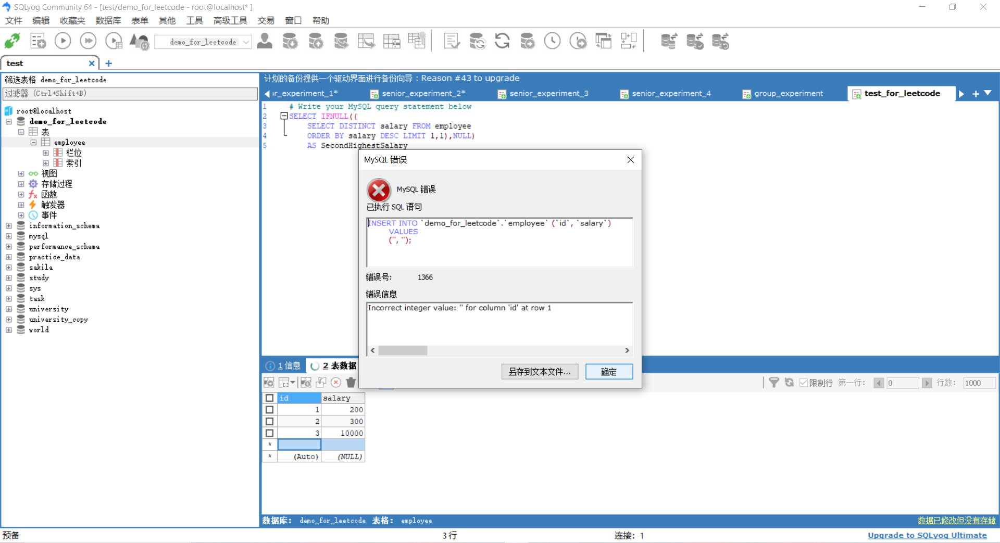

https://leetcode.cn/problems/second-highest-salary/

```mysql
# Write your MySQL query statement below
select ifnull((
    select distinct salary from employee
    order by salary DESC limit 1,1),null)
    as SecondHighestSalary
```

错误记录

`ifnull()` Control Flow Functions

If expr1 is not NULL, IFNULL() returns expr1; otherwise it returns expr2.

The default return type of IFNULL(expr1,expr2) is the more “general” of the two expressions, in the order STRING, REAL, or INTEGER. ==**Consider the case of a table based on expressions or where MySQL must internally store a value returned by IFNULL() in a temporary table**==

> **Consider the case of a table based on expressions or where MySQL must internally store a value returned by IFNULL() in a temporary table** 不理解这部分是什么意思

> 需要了解一下sql语法背后的具体执行逻辑
>
> 想知道一条sql语句应用层面上的执行逻辑 不是背后硬件的执行逻辑
>
> https://cn.v2ex.com/t/701387
>
> ==自己写两个 sql 看看执行计划不就完了==
>
> https://zhuanlan.zhihu.com/p/512320539 

> 如何理解==执行计划==显示的结果信息
>
> https://zhuanlan.zhihu.com/p/512320539 文章内容不值得细看 需要自己找到官方文档来源

> 执行计划给出的结果解释内容非常简陋

```mysql
# Write your MySQL query statement below
explain select ifnull((
    select distinct salary from employee
    order by salary DESC limit 1,1),null)
    as SecondHighestSalary
```


`distinct`


`DESC`

`as SecondHighestSalary`


> 自己在操作auto字段数据的时候经常回出现这种问题




