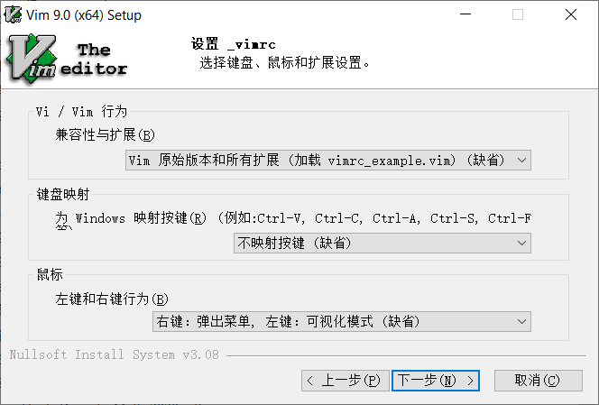

如何对下面的目录中的页码前批量添加一个空格和tab 第1章 新手上路 1 1.1 自然语言与编程语言 2 1.1.1 词汇量 2 1.1.2 结构化 2 1.1.3 歧义性 3 1.1.4 容错性 3 1.1.5 易变性 4 1.1.6 简略性 4 1.2 自然语言处理的层次 4 1.2.1 语音、图像和文本 5 1.2.2 中文分词、词性标注和命名实体识别 5


你可以使用文本编辑器中的查找和替换功能来完成这个任务。以下是一个基本的步骤指南：

1. 打开文本编辑器，并打开包含目录的文本文件。
2. 使用查找和替换功能。在查找框中输入数字，如“1”，并在替换框中输入“\t 1”，其中“\t”代表一个制表符。
3. 点击替换全部按钮，以将所有匹配的数字前添加制表符和空格。
4. 可以按照类似的步骤添加制表符和空格到其它数字前。

请注意，上述步骤仅是一个基本指南，不同的文本编辑器的界面和操作细节可能略有不同。


能否使用vim来进行批量处理


是的，你可以使用 Vim 编辑器进行批量处理。以下是一个可能的步骤：

1. 打开目录所在的文本文件，使用 vim 打开它。

```
Copy code
vim 文件名
```

1. 进入 Vim 命令模式（按 ESC 键），然后输入以下命令：

```
rubyCopy code
:%s/\([0-9]\)/\t\1/g
```

这个命令会在每个数字前添加一个制表符和一个空格。其中，[0−9][0−9] 是正则表达式，匹配一个数字，并将其保存到一个捕获组中；\t 代表一个制表符，\1 表示捕获组中的内容（即数字本身）。

1. 按下回车键，命令将在整个文件中执行，将所有匹配的数字前都添加制表符和空格。

如果你想要在进行替换时进行确认，请使用命令：

```
rubyCopy code
:%s/\([0-9]\)/\t\1/gc
```

其中，“c” 表示“确认”，Vim 会在替换之前提示你是否要替换。

请注意，Vim 中的命令细节和操作方式可能需要一些学习和练习，但一旦熟练掌握，Vim 是一款非常高效的文本编辑器。


能否解释一下上述命令是什么码


当你执行 Vim 命令 `:%s/\([0-9]\)/\t\1/g` 时，Vim 会执行全局替换操作，将目录中所有数字前面添加一个制表符和一个空格。

具体来说，这个命令可以分解为以下部分：

- `%` 表示操作范围为整个文件。
- `s` 表示进行替换操作。
- `/\([0-9]\)/` 是正则表达式，用于匹配所有的数字，并将其保存到一个捕获组中。
- `/\t\1/` 表示要将匹配到的内容替换成一个制表符和一个空格，以及捕获组中的数字。
- `g` 表示进行全局替换，即不止替换每行中的第一个匹配项，而是替换所有匹配项。

因此，这个命令可以在目录中的每个数字前添加一个制表符和一个空格，以便在浏览文本时更容易识别和分隔目录项。


使用vim对下面目录中的所有页码数字前添加两个制表符 注意不要处理到章节序号 类似 第1章 1.1 这种规律的数字 第1章 新手上路 1 1.1 自然语言与编程语言 2 1.1.1 词汇量 2 1.1.2 结构化 2 1.1.3 歧义性 3 1.1.4 容错性 3 1.1.5 易变性 4 1.1.6 简略性 4 1.2 自然语言处理的层次 4 1.2.1 语音、图像和文本 5 1.2.2 中文分词、词性标注和命名实体识别 5


以下是一种可能的解决方案：

1. 打开文件：在终端中输入 vim 文件名，按回车键。
2. 进入正则表达式模式：按下冒号键，然后输入 %s/[\d]˙[\d]˙\d+\d+/\1\t\t\2/g，按回车键。
3. 保存并退出：按下冒号键，然后输入 wq，按回车键。

这个正则表达式将匹配所有数字，并在数字前添加两个制表符，但是不会处理到章节序号，例如 “第1章” 和 “1.1” 等数字将不会被处理。

解释：

- % 表示对整个文本进行操作。
- s 表示替换操作。
- \d+ 表示匹配一个或多个数字。
- [^\d.] 表示匹配任何非数字和非小数点的字符。这个表达式将确保只有页码数字被匹配，而不是章节序号。
- \1 和 \2 表示对匹配到的第一个和第二个组进行替换。
- \t 表示制表符。

注意，这个正则表达式可能不适用于所有文本格式。如果您的文本格式略有不同，您可能需要修改正则表达式来适应您的需要。


以下是一种可能的解决方案：

1. 打开文件：在终端中输入 vim 文件名，按回车键。
2. 进入正则表达式模式：按下冒号键，然后输入 %s/[\d]˙[\d]˙\d+\d+/\1\t\t\2/g，按回车键。
3. 保存并退出：按下冒号键，然后输入 wq，按回车键。

这个正则表达式将匹配所有数字，并在数字前添加两个制表符，但是不会处理到章节序号，例如 “第1章” 和 “1.1” 等数字将不会被处理。

解释：

- % 表示对整个文本进行操作。
- s 表示替换操作。
- \d+ 表示匹配一个或多个数字。
- [^\d.] 表示匹配任何非数字和非小数点的字符。这个表达式将确保只有页码数字被匹配，而不是章节序号。
- \1 和 \2 表示对匹配到的第一个和第二个组进行替换。
- \t 表示制表符。

注意，这个正则表达式可能不适用于所有文本格式。如果您的文本格式略有不同，您可能需要修改正则表达式来适应您的需要。





> 做好一个文本处理还挺麻烦的


 


文字处理好像chatgpt也不太可以
给的很多vim命令都不能用
而且自己粘贴内容的时候vim好像粘贴的不太全 感觉很奇怪


不知道为啥这个目录页码识别不了

放弃一本书了 目录整理不下来 费了好大劲感觉还是不行 直接变得识别不了了 裂开