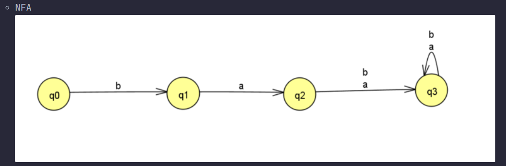
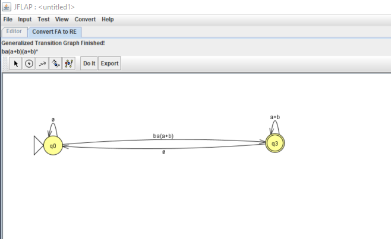
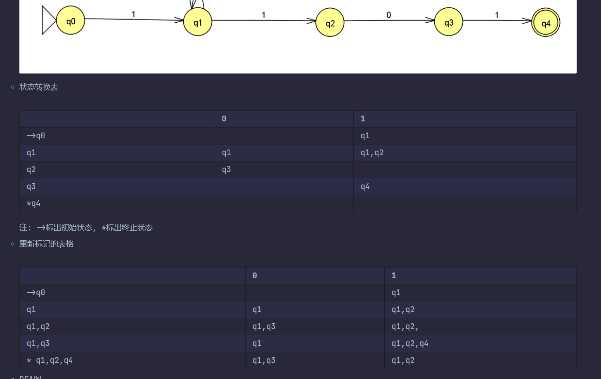

面向对象相关

根据这段代码解释一下面向对象的具体思想 #include <iostream> class MyStream : public std::ostream { public:  MyStream(std::streambuf* buf) : std::ostream(buf) {}    template<typename T>  MyStream& operator<<(const T& value) {    std::cout << "[MyStream] " << value;    return *this;  } }; int main() {  MyStream myStream(std::cout.rdbuf());  myStream << "Hello, world!" << std::endl;  return 0; }


这段代码展示了面向对象编程的思想。面向对象编程是一种将现实世界的问题抽象为对象的编程范式。在这段代码中，我们定义了一个称为 `MyStream` 的新类，它是 `std::ostream` 类的子类，继承了 `std::ostream` 中的一些成员函数和特性。

这个新类 `MyStream` 中定义了一个模板成员函数 `operator<<`，该函数接受任意类型的参数，并以一定的格式输出它们。这个函数被重载为该类的成员函数，因此它可以在类的实例上调用，这个函数返回一个 `MyStream` 对象的引用，以便在链式编程中使用。

在 `main()` 函数中，我们创建了一个名为 `myStream` 的 `MyStream` 对象，它将输出绑定到标准输出流 `std::cout`。我们使用 `<<` 运算符将 `"Hello, world!"` 和 `std::endl` 一起发送到 `myStream` 对象。在 `MyStream` 类的 `operator<<` 函数中，我们添加了一个自定义前缀 `[MyStream]`，以将其与其他输出区分开来。这种方式可以方便地定制输出的格式和样式，使代码更加模块化和可维护。

因此，该代码的目的是定义一个新的输出流 `MyStream`，它具有比 `std::ostream` 更高的灵活性和可定制性，可以轻松地将自定义前缀添加到输出中。这是面向对象编程的一个典型示例，其中类被用来封装一些相关的数据和行为，并允许用户通过创建实例和调用方法来使用和操作这些数据。


这段代码使用类封装了哪些内容, 如何进行封装的


这段代码使用类封装了一个自定义输出流，封装的内容包括以下部分：

1. 一些私有成员变量：这些变量用于存储与 `MyStream` 类的实现相关的状态信息，例如输出前缀字符串。
2. 一个公有的构造函数：这个函数被用于创建 `MyStream` 类的实例。它接受一个指向 `std::streambuf` 类的指针作为参数，并通过调用基类 `std::ostream` 的构造函数来初始化基类的成员变量。
3. 一个公有的析构函数：这个函数被用于清理类实例的资源，例如关闭输出流或释放内存。
4. 一个公有的成员函数 `operator<<`：这个函数重载了 `<<` 运算符，使得类的实例可以像输出流一样使用 `<<` 运算符。该函数接受一个模板类型的参数，并通过调用 `std::cout` 的 `<<` 运算符来输出该参数的值，同时添加了一个前缀字符串。该函数返回一个 `MyStream` 对象的引用，以便实现链式编程。

这些内容被封装在 `MyStream` 类中，使用类的封装特性来实现。在这个类的实现中，私有成员变量被声明为私有变量，仅能在类的内部访问和修改；构造函数和析构函数被声明为公有函数，以允许外部代码创建和销毁类的实例；成员函数 `operator<<` 被声明为公有函数，以允许外部代码使用该类实例的方法。通过这种方式，类的内部实现被隐藏起来，只有公有接口对外部可见，保证了类的安全性和可维护性。


上述三种函数的区别是什么


在面向对象编程中，构造函数、析构函数和成员函数是类的三种重要函数。它们的作用和区别如下：

1. 构造函数：构造函数是一种特殊的成员函数，它被用于初始化类的对象。当我们创建一个类的实例时，构造函数被自动调用，用于初始化该实例的成员变量。在上述代码中，`MyStream` 类的构造函数用于创建一个新的 `MyStream` 对象，并初始化其基类 `std::ostream` 的成员变量。在一个类中可以定义多个构造函数，以便支持不同的实例化方式。
2. 析构函数：析构函数是一种特殊的成员函数，它被用于清理类的对象。当一个类的对象被销毁时，析构函数被自动调用，用于释放该对象占用的资源。在上述代码中，`MyStream` 类的析构函数用于清理输出流。在一个类中只能定义一个析构函数。
3. 成员函数：成员函数是定义在类中的函数，它们用于实现类的各种操作和功能。成员函数可以访问和修改类的成员变量，也可以调用其他成员函数。在上述代码中，`MyStream` 类的成员函数 `operator<<` 用于重载 `<<` 运算符，实现自定义输出流的功能。在一个类中可以定义多个成员函数，以便支持多种操作和功能。

总之，构造函数、析构函数和成员函数在面向对象编程中都是非常重要的函数，它们各自负责类对象的初始化、清理和操作。了解它们的区别和作用，可以帮助我们更好地理解和设计类。


如何理解面向对象这种抽象思想(初始化, 清理, 操作)


面向对象是一种抽象思想，它的核心概念是将数据和操作封装成一个独立的实体，即对象。对象拥有自己的属性和行为，属性是数据的集合，行为是操作的集合。这种抽象思想使得我们可以将复杂的系统划分成一些相对独立的对象，每个对象只关注自己的属性和行为，从而提高了系统的可维护性和可扩展性。

在面向对象中，初始化、清理和操作是三个基本的操作类型，它们对应了对象的生命周期的不同阶段：

1. 初始化：初始化是对象创建时的操作，它用于给对象的属性赋初始值，确保对象在被使用之前处于一个合法的状态。通常在对象的构造函数中进行初始化。
2. 操作：操作是对象的主要行为，它用于实现对象的各种功能和操作。对象的操作可以修改对象的属性，也可以产生新的对象或者输出一些结果。
3. 清理：清理是对象销毁时的操作，它用于释放对象占用的资源，确保对象在不再使用时不会造成内存泄漏或其他问题。通常在对象的析构函数中进行清理。

这三种操作类型构成了对象的生命周期，它们的顺序是初始化 -> 操作 -> 清理。在面向对象编程中，我们通常通过类来定义对象，类包含了对象的属性和操作，并提供了构造函数和析构函数来实现初始化和清理操作，同时提供了成员函数来实现对象的各种操作。

理解面向对象中的初始化、清理和操作，可以帮助我们更好地理解类和对象的概念，同时也可以帮助我们设计出更加健壮和易于维护的代码。


为什么定义一个类是从对象的生命周期的角度进行定义呢


在面向对象编程中，类是对一类对象的抽象描述，它包含了对象的属性和操作，并定义了对象的行为规范。从对象的生命周期的角度来定义类，是因为对象的生命周期是一个非常重要的概念，它决定了对象在什么时候创建、什么时候销毁，以及在它存在的时间内应该执行哪些操作。因此，理解对象的生命周期对于设计和编写面向对象程序是非常重要的。

对象的生命周期可以分为三个阶段：初始化、操作、清理。在定义一个类时，需要考虑这三个阶段，并设计相应的方法来实现这些操作。例如，需要定义一个构造函数来初始化对象的属性，定义成员函数来实现对象的操作，以及定义析构函数来清理对象占用的资源。通过这种方式，我们可以确保对象在创建、使用和销毁过程中都能够正常运行，并且避免一些潜在的错误。

从对象的生命周期的角度来定义类，还可以帮助我们更好地理解对象的行为和属性之间的关系，以及对象与其他对象之间的交互关系。这样，我们就可以更加清晰地描述系统的结构和功能，以便于开发和维护面向对象程序。


有没有比较好的面向对象的书籍推荐


当然有，以下是一些我认为比较好的面向对象的书籍：

1. 《设计模式: 可复用面向对象软件的基础》（Design Patterns: Elements of Reusable Object-Oriented Software）：这是由四位著名的计算机科学家（Erich Gamma, Richard Helm, Ralph Johnson, John Vlissides）共同编写的一本书，它讨论了面向对象设计中常见的问题，并提供了23种设计模式来解决这些问题。这本书是面向对象设计中的经典之作，深入浅出地讲解了面向对象的思想和技术，是每一个面向对象程序员必读的书籍之一。
2. 《Effective C++》：这是Scott Meyers编写的一本关于C++编程技巧的书籍，它讨论了C++中一些常见的问题和陷阱，并提供了一些有效的解决方法。这本书重点介绍了面向对象编程中的一些关键概念和技巧，如构造函数、析构函数、拷贝构造函数、虚函数等，是C++程序员必读的书籍之一。
3. 《Head First 设计模式》（Head First Design Patterns）：这是一本由Eric Freeman、Elisabeth Robson、Bert Bates、Kathy Sierra共同编写的入门级别的设计模式书籍。这本书使用了大量的图形和生动的例子来讲解23种设计模式，使得读者可以更加轻松地理解和掌握这些模式。这本书非常适合初学者学习面向对象设计和设计模式。
4. 《代码大全》（Code Complete）：这是由Steve McConnell编写的一本关于软件开发的书籍，它涵盖了软件开发的各个方面，包括需求分析、设计、编码、测试、维护等。这本书特别注重面向对象的设计和编程，提供了很多实用的技巧和建议，帮助读者写出高质量的面向对象代码。
5. 《深入浅出设计模式》（Head First Design Patterns）：这是一本由程杰、曾磊共同编写的设计模式书籍，与其他设计模式书籍不同的是，它将设计模式的实现过程和应用场景结合起来，通过生动的故事情节来介绍每一种设计模式的应用和使用场景，非常适合初学者学习。


对象的生命周期在《Head First 设计模式》哪个章节有讲解到


对象的生命周期在《Head First 设计模式》中被涉及到的章节有：

1. 第二章《观察者模式》：这一章介绍了观察者模式，其中一个关键的概念是主题对象（Subject），主题对象是被观察的对象，它的生命周期与观察者对象息息相关。
2. 第四章《工厂模式》：这一章介绍了工厂模式，其中的工厂对象（Factory）负责创建其他对象，它的生命周期与被创建的对象息息相关。
3. 第五章《单例模式》：这一章介绍了单例模式，其中的单例对象（Singleton）在整个应用程序中只有一个实例，它的生命周期是全局的。
4. 第六章《命令模式》：这一章介绍了命令模式，其中的命令对象（Command）将一个请求封装成一个对象，它的生命周期与请求的生命周期相关。
5. 第八章《模板方法模式》：这一章介绍了模板方法模式，其中的模板方法（Template Method）定义了算法的框架，它的生命周期与算法的生命周期相关。

在这些章节中，作者并没有专门讲述对象的生命周期，而是通过具体的设计模式来介绍对象的生命周期是如何被管理和控制的。因此，读者需要在学习这些设计模式的过程中，关注每个对象的生命周期，以便更好地理解和应用这些模式。


不同编程语言面向对象之间的区别是什么


虽然不同编程语言都支持面向对象编程，但它们在语法、特性和使用上可能存在一些差异。以下是一些常见的面向对象编程语言之间的区别：

1. 类和对象的定义方式：不同编程语言对于类和对象的定义方式可能存在差异。例如，Java使用class关键字定义类和对象，而Python使用class关键字定义类，使用实例化操作符（“()”）创建对象。
2. 继承的实现方式：不同编程语言可能对继承的实现方式有所不同。例如，C++支持多重继承，而Java只支持单一继承和接口继承。
3. 多态的实现方式：不同编程语言可能对多态的实现方式有所不同。例如，C++使用虚函数（virtual function）实现运行时多态，而Java使用接口（interface）和抽象类（abstract class）实现编译时多态。
4. 访问控制：不同编程语言可能对访问控制的实现方式有所不同。例如，Java使用public、private和protected关键字控制访问权限，而Python使用单下划线“_”和双下划线“__”表示私有成员。
5. 内存管理：不同编程语言可能对内存管理的实现方式有所不同。例如，Java使用垃圾回收机制（garbage collection）自动管理内存，而C++需要手动管理内存。

总之，不同编程语言的面向对象特性和语法之间可能存在差异，开发人员需要根据不同的需求和应用场景选择合适的编程语言和技术。


那使用哪种语言来体会面向对象思想比较方便呢


在当今的编程语言中，Java 是一种非常适合学习面向对象编程的语言。Java 设计初衷就是要支持面向对象编程，而且其语法和特性非常符合面向对象编程的理念。以下是一些原因：

1. 易于理解：Java 的语法和结构非常清晰，对于初学者来说很容易理解和掌握。例如，Java 中的类和对象的定义、继承和多态的实现都非常直观和易于理解。
2. 良好的面向对象支持：Java 的设计初衷就是要支持面向对象编程，其语法和特性非常符合面向对象编程的理念。Java 支持类、对象、封装、继承、多态等面向对象的特性。
3. 丰富的库和工具：Java 有一个庞大的标准类库，其中包含了大量的面向对象的类和方法，方便开发人员直接使用。此外，Java 还有许多流行的集成开发环境（IDE）和调试工具，使得开发面向对象应用程序非常方便。

总之，Java 是一种非常适合学习和实践面向对象编程的语言，如果你想深入理解面向对象编程的概念和实践，可以选择学习和使用 Java。


java语言和c语言的区别有哪些类型


Java语言和C语言之间有很多区别，包括以下几个方面：

1. 编译方式：C语言是一种编译型语言，需要在编译之后生成可执行代码；而Java是一种解释型语言，代码会在运行时被解释执行。
2. 内存管理：在C语言中，程序员需要手动分配和释放内存空间，而在Java中，内存管理由垃圾回收器自动处理。
3. 数据类型：C语言中的数据类型比Java更加底层，例如需要手动控制内存的指针类型，而Java中则提供了更加高级的对象和类。
4. 平台依赖性：C语言的代码在不同的平台上可能会有不同的行为，因为它直接操作硬件；而Java的代码则是平台无关的，因为它在虚拟机上运行。
5. 异常处理：Java中提供了更加完善的异常处理机制，可以更好地处理程序运行时出现的异常情况。
6. 面向对象编程：Java是一种面向对象编程语言，而C语言则不是，虽然C++可以支持面向对象编程。

总的来说，Java语言比C语言更加高级、安全、方便和易于学习和使用，但在一些需要高性能和底层控制的应用场景中，C语言仍然是一种不可替代的语言。


Java和python语言的区别有哪些类型呢


Java语言和Python语言之间有很多区别，包括以下几个方面：

1. 编译方式：Java是一种编译型语言，需要在编译之后生成可执行代码；而Python是一种解释型语言，代码会在运行时被解释执行。
2. 代码可读性：Python的语法比Java更加简洁，易于阅读和理解。同时，Python还支持函数式编程和面向对象编程，使得代码更加灵活。
3. 内存管理：Java中的内存管理由垃圾回收器自动处理，而Python中的垃圾回收机制也类似。但是Java中的垃圾回收机制更加成熟和高效。
4. 数据类型：Python中的数据类型更加灵活，支持动态类型，而Java则是静态类型语言。这意味着在Python中，变量的类型可以在运行时改变，而Java则需要在编译时确定。
5. 平台依赖性：Java的代码是跨平台的，可以在不同的操作系统上运行；而Python则在不同的操作系统上可能会有不同的行为。
6. 性能：Java的性能通常比Python更好，因为Java是一种编译型语言，而Python是一种解释型语言。同时，Java的虚拟机也被优化得更好。

总的来说，Java语言和Python语言各有优缺点，在不同的应用场景中有不同的用途。Java通常用于大型企业应用和高性能系统中，而Python则常用于科学计算、数据分析、人工智能等领域。


java编译方式是什么


Java是一种编译型语言，它的编译方式如下：

1. 编写Java源代码：Java程序员使用Java语言编写程序，源代码以.java文件的形式保存。
2. 编译Java源代码：使用Java编译器将Java源代码编译成Java字节码文件，以.class文件的形式保存。
3. 运行Java程序：Java虚拟机（JVM）将Java字节码文件解释为机器码，然后运行这些机器码。在这个过程中，JVM会将Java程序的字节码文件加载到内存中，并执行其中的指令，完成程序的执行。

Java的编译过程可以在命令行中进行，也可以使用集成开发环境（IDE）等工具来完成。在编译Java源代码时，可以指定编译参数来控制编译过程中的行为，例如生成调试信息、优化编译等。


如何理解java虚拟机


Java虚拟机（Java Virtual Machine，JVM）是Java程序运行的环境，它是一个能够解释执行Java字节码文件的虚拟计算机。

Java程序在编译时会被编译成字节码文件，这些字节码文件可以在任何支持Java虚拟机的平台上运行。JVM会将字节码文件加载到内存中，并执行其中的指令，完成程序的执行。JVM负责管理Java程序的内存，包括分配和释放内存空间，并提供垃圾回收功能，确保Java程序不会因为内存泄漏而导致崩溃。JVM还提供了一些与操作系统和硬件无关的接口，使得Java程序可以在不同的平台上运行。

Java虚拟机是Java平台的核心组件，它的设计使得Java程序具有跨平台性、安全性、可移植性、高效性等优点。同时，Java虚拟机也是Java语言成功的关键之一，它为Java程序员提供了一种方便、快捷、高效的开发方式。


java虚拟机和c语言中的哪种工具比较类似


在C语言中，与Java虚拟机类似的工具是操作系统的动态链接库（Dynamic Link Library，DLL）或共享库（Shared Library）。DLL或共享库也是一种将代码打包成二进制文件并在程序运行时加载的方式。

与Java虚拟机类似，DLL或共享库也提供了对代码的封装和抽象，使得代码的开发者可以更加专注于实现业务逻辑，而不必关注底层实现细节。同时，它们也提供了一些基础的服务，例如内存管理、线程管理等，使得代码更加容易编写和维护。

然而，与Java虚拟机不同的是，DLL或共享库是直接由操作系统加载和执行的，而Java虚拟机是一个独立的运行环境，它与操作系统是分离的。此外，Java虚拟机还提供了一些高级的服务，例如垃圾回收、动态类加载等，这些特性在C语言中是不具备的。


jdk在上述的描述中又属于哪方面的功能呢


JDK（Java Development Kit）是Java开发工具包，它提供了Java程序开发所需要的工具和环境。

JDK包括Java编译器（javac）和Java虚拟机（JVM），以及用于开发和调试Java程序的各种工具、类库和文档等。JDK还提供了一些其他的开发工具，例如JavaFX、Java EE等，以及用于开发Android应用程序的工具。

因此，JDK提供的功能主要包括：

1. Java编译器：用于将Java源代码编译成Java字节码文件。
2. Java虚拟机：用于将Java字节码文件解释为机器码并运行Java程序。
3. Java类库：提供了丰富的类和方法，可用于实现各种Java应用程序。
4. 开发工具：包括集成开发环境（IDE）、调试器、性能分析工具等，用于开发、测试和优化Java程序。
5. 文档：提供了Java API文档和开发指南等，方便Java开发者进行学习和参考。

综上所述，JDK是Java开发的基础，它为Java开发者提供了一整套完整的工具和环境，使得Java开发更加高效和便捷。


jdk和cpp语言的哪些工具比较类似


与JDK相比，C++语言提供的工具和环境相对简单。但是，在C++语言中也有一些与JDK相似的工具和库，例如：

1. 编译器：C++语言也有自己的编译器，例如GNU Compiler Collection（GCC）等。
2. 标准库：C++标准库提供了一系列的容器、算法、迭代器等等，可用于开发各种C++应用程序。
3. 第三方库：与Java类似，C++语言也有大量的第三方库可供使用，例如Boost、STLport等等。
4. IDE：C++语言也有自己的集成开发环境，例如Eclipse、Visual Studio等等。
5. 文档：C++语言的开发文档也非常丰富，包括C++标准库文档、编译器手册等等。

尽管C++语言提供的工具和环境不如JDK那么全面，但是C++语言在计算机系统底层的开发和控制方面具有一定的优势。同时，C++语言也是许多高性能应用程序和操作系统的开发语言，因此它在某些场景下具有很高的使用价值。


idea和eclipse两种工具又是java的什么呢


IDEA和Eclipse都是Java的集成开发环境（IDE），它们提供了一整套的Java开发工具和环境，包括代码编辑器、编译器、调试器、自动化构建工具、图形界面设计器等等。开发者可以使用这些工具来编写、调试和测试Java程序，以及进行版本控制和构建管理等操作。

不同的开发者可能会有不同的喜好，IDEA和Eclipse在某些方面具有不同的特点和优势。例如，IDEA在代码提示、代码重构、版本控制等方面表现优秀，而Eclipse在代码编辑、调试和性能分析等方面表现较好。同时，IDEA和Eclipse都有丰富的插件生态系统，开发者可以根据自己的需求安装不同的插件来扩展IDE的功能。

综上所述，IDEA和Eclipse都是Java开发的重要工具，它们为Java开发者提供了一整套完整的开发环境和工具，使得Java开发更加高效和便捷。


这两个工具和java的jdk又什么关系呢


IDEA和Eclipse都是基于Java开发的应用程序，它们依赖于Java Development Kit（JDK）来运行和编译Java代码。JDK是Java平台的软件开发工具包，包括Java编译器、Java虚拟机、Java类库等等。它是开发和运行Java程序的基础工具。

因此，在使用IDEA或Eclipse进行Java开发之前，需要先安装JDK，并将其配置为IDE的运行时环境。在IDEA或Eclipse中，开发者可以通过设置JDK路径来指定所使用的JDK版本。这样，IDEA或Eclipse就可以利用JDK中提供的Java编译器和Java虚拟机来编译、运行和调试Java程序。

总之，IDEA、Eclipse和JDK都是Java开发中不可或缺的重要工具，它们共同构成了Java开发的基础设施和生态系统。开发者需要熟悉它们的使用和配置，才能更好地进行Java开发。


从不同方面比较一下idea和eclipse


IDEA和Eclipse都是流行的Java集成开发环境，它们在某些方面有所不同。下面从不同的方面进行比较：

1. 性能：IDEA在性能方面表现优秀，它在启动速度、编译速度和响应速度方面都比Eclipse更快。
2. 用户界面：Eclipse具有更为丰富的用户界面，并且拥有更多的定制化选项，使得用户可以根据自己的喜好进行配置。而IDEA则更注重界面的简洁和易用性。
3. 代码提示和自动完成：IDEA在代码提示和自动完成方面表现更出色，它能够提供更准确和更智能的代码提示，帮助开发者更快地编写代码。
4. 代码重构：IDEA在代码重构方面比Eclipse更强大，它提供了更多的重构工具，并能够自动识别和处理代码中的重构操作。
5. 插件生态系统：Eclipse拥有更为丰富的插件生态系统，有大量的第三方插件可供选择，可以帮助开发者更好地完成各种任务。而IDEA则注重自带的功能和智能化扩展。
6. 支持的语言：Eclipse支持多种编程语言，包括Java、C/C++、Python、PHP等等，而IDEA则主要专注于Java开发，但也提供了一些对其他语言的支持。

总之，IDEA和Eclipse都是优秀的Java集成开发环境，它们在不同的方面表现出色，可以根据自己的需求和喜好选择使用。


两种工具所属公司分别是什么


IntelliJ IDEA由JetBrains公司开发，是一款功能强大的Java集成开发环境。JetBrains是一家成立于1997年的软件公司，总部位于捷克共和国的布拉格市，该公司开发的其他知名软件还包括PyCharm、WebStorm等。

Eclipse由Eclipse Foundation开发，是一款基于Java开发的开源集成开发环境。Eclipse Foundation是一个非营利组织，旨在促进开源软件的发展和使用。Eclipse Foundation的成员包括IBM、Oracle、Red Hat、SAP等知名公司，它们共同支持Eclipse开发，并致力于推动Java技术的发展。


java配置开发环境的步骤


配置Java开发环境需要以下步骤：

1. 下载和安装Java开发工具包（JDK）：从官方网站（https://www.oracle.com/java/technologies/javase-downloads.html）下载适合自己操作系统的JDK，并按照安装向导进行安装。
2. 配置环境变量：将Java安装目录下的bin目录添加到系统的Path环境变量中，以便在命令行中可以直接运行Java相关命令。
3. 安装并配置开发环境：选择一款适合自己的Java集成开发环境（如Eclipse、IntelliJ IDEA等），并按照安装向导进行安装。在开发环境中，需要设置Java SDK的路径，并配置其他相关参数。
4. 创建项目：在开发环境中创建Java项目，设置项目的基本信息，如名称、路径、包名等。
5. 编写和调试代码：在项目中创建Java类，并编写相应的代码。在开发环境中进行调试和测试，检查代码是否能够正常运行。
6. 打包和部署应用：完成代码编写和测试后，可以使用开发环境提供的打包工具将应用程序打包成可执行文件或者jar包。然后将打包好的文件部署到目标机器上，即可运行应用程序。

以上是Java开发环境的基本配置步骤，具体的操作可能会因为不同的操作系统、开发工具或者项目需求而有所不同。


解释一下上述步骤之间的逻辑


以上步骤的逻辑是基于Java开发的流程和依赖关系而设计的。

首先，Java开发需要依赖Java开发工具包（JDK），因此在配置Java开发环境之前需要先下载和安装JDK。

然后，为了使操作系统能够识别Java相关的命令，需要将Java安装目录下的bin目录添加到系统的Path环境变量中。

接下来，为了方便Java开发，需要选择一款适合自己的Java集成开发环境，如Eclipse、IntelliJ IDEA等，并按照安装向导进行安装。在开发环境中，需要设置Java SDK的路径，并配置其他相关参数，以便在开发过程中能够正常编写和调试Java代码。

创建项目是Java开发的基本步骤之一，通过创建项目可以将代码组织成一个完整的单元，方便开发和管理。

在项目中编写和调试代码，是Java开发的主要内容。通过开发环境提供的功能，可以方便地进行代码编写、调试和测试，以确保代码的正确性和可靠性。

最后，将应用程序打包成可执行文件或者jar包，并部署到目标机器上，即可完成Java开发的全过程。

以上步骤之间是有逻辑顺序的，需要按照顺序逐一完成，才能确保Java开发环境的正常运行和应用程序的正常部署。


为什么Java的程序打包需要自己手动进行而不是像c一样自动生成exe文件呢


Java程序打包不同于C语言程序生成exe文件的方式，主要原因是因为Java程序的运行依赖于Java虚拟机（JVM），而JVM并不是所有平台上都能够预装，因此需要将程序和JVM一同打包并部署到目标机器上。另外，Java程序一般采用jar包来打包，而jar包可以包含多个类文件和资源文件，可以方便地在不同环境下进行部署和运行。因此，需要手动进行Java程序的打包和部署，以确保程序能够在不同平台上正常运行。

此外，Java的跨平台性也是Java程序打包需要手动进行的重要原因之一。Java程序可以在不同的操作系统和硬件平台上运行，因此需要根据不同的平台打包不同的程序。如果采用类似于C语言生成exe文件的方式，会使Java程序的跨平台性受到限制，从而无法充分发挥Java语言的优势。

因此，Java程序打包需要手动进行，并采用jar包的方式进行打包，以确保Java程序的跨平台性和运行的可靠性。


如何理解这个打包行为


在Java中，打包是指将所有需要的类文件和资源文件打包成一个可执行的文件或者可部署的jar包的过程。这个打包行为可以理解为将多个文件和资源整合到一起，以便于部署、发布和运行Java程序。

在Java程序开发过程中，通常需要用到多个类文件、资源文件和配置文件等，这些文件分散在不同的目录中，为了方便管理和部署，需要将它们整合到一起，形成一个可执行的文件或者可部署的jar包。打包后的文件可以直接运行或者在其他机器上部署和运行，无需再次进行配置和安装。

Java程序打包的过程一般分为以下几个步骤：

1. 编写Java程序并进行调试和测试。
2. 将所有需要的类文件、资源文件和配置文件等整合到一起。
3. 配置打包文件的属性，如版本号、压缩方式等。
4. 使用打包工具进行打包，如jar命令、maven插件、Gradle等。
5. 部署和运行打包后的程序。

通过打包，可以将Java程序部署到不同的环境中，使程序更加灵活和可移植。同时，打包也可以保证程序的可靠性和安全性，减少了因环境差异而引起的问题，为Java程序的开发和部署提供了更加便捷的方式。


给出分别使用java和c开发的两个小工具例子 我想下载下来体验一下jar包和exe的区别


以下是使用Java和C语言分别开发的两个小工具示例，你可以下载并体验它们的jar包和exe文件的区别：

Java开发的示例工具：计算器

- 功能：实现基本的加、减、乘、除等算术运算
- 开发语言：Java
- 开发环境：Eclipse/IntelliJ IDEA + JDK
- 打包工具：jar命令
- 下载链接：https://github.com/lovely-codes/java-calculator/releases

C语言开发的示例工具：文件加密解密器

- 功能：实现对文件进行AES加密解密操作
- 开发语言：C语言
- 开发环境：Visual Studio/Code::Blocks + MinGW
- 打包工具：NSIS（Nullsoft Scriptable Install System）
- 下载链接：https://github.com/lovely-codes/c-file-encrypter/releases

这两个小工具示例都提供了可执行文件和源代码，你可以下载并查看它们的源代码，也可以直接运行可执行文件来体验jar包和exe文件的区别。在运行Java程序时，需要保证本机已经安装了Java Runtime Environment（JRE），而在运行C语言程序时则无需安装任何额外的软件，只需直接运行exe文件即可。


如何将这段程序文件整理成cpp的头文件然后引入到另一个文件中呢 

```
/*
 * @Date: 2023-03-01 14:04:03
 * @LastEditors: Bigorrila
 * @LastEditTime: 2023-03-01 14:04:12
 * @FilePath: \Projects\lexer_example_debug.cpp
 */
#include <fstream>
#include <iostream>
using namespace std;

void pretreatment(char filename[], char Buf[]) {
    ifstream cinf(filename, ios::in);

    if (!cinf.is_open()) {
        cout << "Error opening file" << endl;
        return;
    }

    int i = 0;
    char c;
    bool in_comment = false;

    cout << "<源程序>" << endl;
    
    while (cinf.read(&c, sizeof(char))) {
        cout << c;
        switch (in_comment) {
            case false:
                if (c == '{') in_comment = true;
                else {
                    if (c == 0x9 || c == 0xa) c = 0x20;
                    if (i < 4048) Buf[i++] = c;
                }
                break;
            case true:
                if (c == '}') in_comment = false;
                break;
            default:
                break;
        }
    }
    Buf[i] = '#';
}

int main() {
    char Buf[4048] = {'\0'};
    pretreatment("source.txt", Buf);
    cout << "<预处理结果>" << endl;
    cout << Buf << endl;
}

```


要将这段程序文件整理为 C++ 头文件并在另一个文件中引用，可以按照以下步骤进行操作：

1. 创建一个新的文本文件，将其保存为“pretreatment.h”。文件扩展名“.h”通常用于 C++ 头文件。
2. 将程序文件中的所有内容复制到“pretreatment.h”文件中。
3. 在“pretreatment.h”文件的开头添加以下内容，以避免头文件被重复包含：

```
cppCopy code#ifndef PRETREATMENT_H
#define PRETREATMENT_H

// 此处添加程序文件中的所有代码

#endif // PRETREATMENT_H
```

1. 在其他 C++ 文件中，可以使用以下方式包含“pretreatment.h”头文件：

```
cppCopy code
#include "pretreatment.h"
```

1. 在需要调用 `pretreatment` 函数的地方，可以直接调用该函数即可。
2. 如果您的代码在编译时出现了错误，请确保将所有必要的头文件包含到程序中，例如`<iostream>`和`<fstream>`。

完整的“pretreatment.h”头文件代码如下：

```
cppCopy code#ifndef PRETREATMENT_H
#define PRETREATMENT_H

#include <fstream>
#include <iostream>
using namespace std;

void pretreatment(char filename[], char Buf[]) {
    ifstream cinf(filename, ios::in);

    if (!cinf.is_open()) {
        cout << "Error opening file" << endl;
        return;
    }

    int i = 0;
    char c;
    bool in_comment = false;

    cout << "<源程序>" << endl;
    
    while (cinf.read(&c, sizeof(char))) {
        cout << c;
        switch (in_comment) {
            case false:
                if (c == '{') in_comment = true;
                else {
                    if (c == 0x9 || c == 0xa) c = 0x20;
                    if (i < 4048) Buf[i++] = c;
                }
                break;
            case true:
                if (c == '}') in_comment = false;
                break;
            default:
                break;
        }
    }
    Buf[i] = '#';
}

#endif // PRETREATMENT_H
```


> 头文件定义问题解决

能否给出自己构造的cpp头文件并提示如何将头文件引入到当前代码文件中

当然可以！

下面是一个简单的头文件示例：

```
arduinoCopy code#ifndef MYHEADER_H
#define MYHEADER_H

#include <iostream>

void myFunction();

#endif
```

该头文件定义了一个函数 `myFunction()`，并引入了标准 C++ 库中的 `<iostream>` 头文件。头文件的名称是 `myheader.h`，并使用了 include guards（`#ifndef` 和 `#define`）来确保该头文件只被编译一次。

在将头文件引入到代码文件中时，可以使用 `#include` 预处理指令。假设你的头文件名为 `myheader.h`，你可以在你的代码文件中这样使用：

```
arduinoCopy code
#include "myheader.h"
```

请注意，使用引号而不是尖括号来引用自定义头文件。

这会将 `myheader.h` 文件中的所有声明引入到代码文件中，允许你在代码文件中使用 `myFunction()` 函数。


如何安装配置antlr cpp的开发环境上


要安装和配置ANTLR C++开发环境，您需要遵循以下步骤：

1. 下载ANTLR：首先，您需要下载ANTLR C++运行时。您可以从ANTLR官方网站（https://www.antlr.org/download.html）下载最新版本的ANTLR。请确保您下载的是ANTLR C++运行时。

2. 安装ANTLR：解压缩您下载的ANTLR文件，并将其安装到您喜欢的位置。例如，您可以将其安装到/usr/local目录下。安装完毕后，您应该能够在终端上执行antlr命令。

3. 编写ANTLR语法：在您的开发环境中，编写一个ANTLR语法文件，定义您要解析的语言的语法。ANTLR语法是使用ANTLR语言编写的，它是一种特殊的语言，用于描述您的语言的语法。您可以使用任何文本编辑器编写ANTLR语法文件。请确保您保存该文件，并使用.g4扩展名。

4. 生成C++代码：在终端上执行antlr命令，使用您编写的ANTLR语法文件作为输入文件。ANTLR将生成C++代码，用于解析您的语言。

   ```
   shellCopy code
   $ antlr4 -Dlanguage=Cpp YourGrammar.g4
   ```

5. 配置C++工程：您需要将ANTLR生成的代码添加到您的C++工程中。您可以使用任何C++ IDE或文本编辑器进行此操作。将ANTLR生成的代码添加到您的工程中，并将ANTLR头文件和库文件路径添加到您的C++编译器选项中。

6. 构建和运行：构建您的C++工程，并运行它。您应该能够解析您的语言并执行相应的操作。

这些步骤应该能够帮助您安装和配置ANTLR C++开发环境。请注意，ANTLR C++运行时还提供了许多其他功能，例如错误处理和语法高亮显示。您可以查看ANTLR官方文档以获取更多信息。


解释一下上述配置过程的逻辑


ANTLR是一种用于解析语言的工具，可帮助您根据您定义的语法规则来解析输入的文本。ANTLR可以生成C++代码，该代码可以集成到您的C++应用程序中，以解析您的语言并执行相应的操作。

在安装和配置ANTLR C++开发环境时，您需要首先下载并安装ANTLR C++运行时。然后，您需要编写ANTLR语法文件，以定义您要解析的语言的语法规则。ANTLR语法是使用ANTLR语言编写的，它是一种特殊的语言，用于描述您的语言的语法。您可以使用任何文本编辑器编写ANTLR语法文件，并将其保存为.g4扩展名。

接下来，您需要使用antlr命令将ANTLR语法文件作为输入文件，生成C++代码。您可以通过指定-Dlanguage选项来选择C++作为目标语言。生成的C++代码包括语法分析器、词法分析器和许多其他帮助函数。这些函数可以帮助您解析您的语言并执行相应的操作。

然后，您需要将生成的C++代码添加到您的C++工程中，并将ANTLR头文件和库文件路径添加到您的C++编译器选项中。这些步骤将ANTLR生成的代码与您的应用程序集成起来，以便您可以在您的应用程序中使用它。

最后，您可以构建和运行您的C++应用程序。您应该能够解析您的语言并执行相应的操作。如果您的语法文件存在错误，ANTLR将生成相应的错误消息以帮助您进行调试。


antlr基础语言


ANTLR基础语言是一种用于描述语法规则的语言，用于生成词法分析器和语法分析器。ANTLR语法基于上下文无关文法（Context-Free Grammar，CFG）的规则，可以描述各种语言的语法规则。ANTLR基础语言使用扩展的巴科斯-瑙尔范式（Extended Backus-Naur Form，EBNF）表示法来定义语法规则。

以下是一些ANTLR基础语言的关键概念：

1. 终结符（Terminal）：终结符是语法中的最小单元。终结符是文本或标记，表示输入文本中的特定字符或字符序列。例如，对于C语言，终结符可以是“+”或“if”等符号或关键字。
2. 非终结符（Non-terminal）：非终结符是一个语法规则，它表示一个或多个终结符的组合。非终结符可以包含其他非终结符或终结符。例如，在C语言中，非终结符可以是一个表达式、语句或函数声明。
3. 语法规则（Grammar rule）：语法规则定义了如何使用非终结符和终结符来构建语法结构。语法规则可以定义一个句子、一个表达式或一个整个程序的语法结构。
4. 语法分析器（Parser）：语法分析器使用语法规则来解析输入文本，并创建相应的语法树或语法分析树。ANTLR生成的语法分析器包括了所有语法规则，并且可以将输入文本转化成相应的语法树。
5. 词法分析器（Lexer）：词法分析器根据语法规则将输入文本分割为标记，标记可以是终结符。ANTLR生成的词法分析器使用语法规则将输入文本分割成终结符。

ANTLR基础语言非常强大，可以用于描述各种语言的语法规则。ANTLR不仅仅是一个工具，它是一种描述语言。它可以帮助您生成词法分析器和语法分析器，从而解析和处理各种类型的文本。


给出一个anltr语法案例帮助我快速上手antlr基础语法的使用


以下是一个简单的ANTLR语法案例，用于解析简单的数学表达式，包括加、减、乘、除和括号。该语法案例包括了ANTLR语法规则的基本概念，包括终结符、非终结符和语法规则。

```
cssCopy codegrammar MathExpression;

expression : addSub;

addSub: multDiv (('+' | '-') multDiv)*;

multDiv: atom (('*' | '/') atom)*;

atom: INT | '(' expression ')';

INT: [0-9]+;

WS: [ \t\r\n]+ -> skip;
```

这个语法文件定义了MathExpression语言的语法规则，包括expression、addSub、multDiv和atom等非终结符。

expression规则是最高级别的规则，它定义了一个算术表达式。它将表达式解析为addSub规则的一个实例。

addSub规则定义了加法和减法表达式。它将表达式解析为多个multDiv规则和一个可选的加号或减号，这些multDiv规则和加号或减号交替出现。

multDiv规则定义了乘法和除法表达式。它将表达式解析为多个atom规则和一个可选的乘号或除号，这些atom规则和乘号或除号交替出现。

atom规则定义了最小的表达式单元。它可以是一个整数，或是由括号包含的一个表达式。

最后，INT规则定义了一个整数。WS规则定义了空格、制表符和换行符等空白字符，并将它们跳过，不作为解析输入文本的一部分。

在使用该语法规则时，您可以使用ANTLR工具生成C++代码，然后将该代码添加到您的应用程序中。您可以使用生成的语法分析器解析MathExpression语言的文本，并执行相应的操作。

该案例只是一个简单的示例，您可以在ANTLR的官方文档中找到更多复杂的示例，以了解如何使用ANTLR语法规则来解析各种类型的文本。


写好的语法文件要怎么使用你


使用写好的ANTLR语法文件可以通过以下步骤完成：

1. 安装ANTLR工具和相应的语言运行时库。
2. 使用ANTLR工具将语法文件编译成可执行的代码。
3. 将生成的代码添加到您的项目中，并与您的代码进行集成。
4. 使用ANTLR生成的语法分析器解析输入文本，根据需要执行相应的操作。

下面是一个简单的使用ANTLR生成的语法分析器解析输入文本的示例：

```
cppCopy code#include <iostream>
#include "antlr4-runtime.h"
#include "MathExpressionLexer.h"
#include "MathExpressionParser.h"

using namespace antlr4;

int main(int argc, const char* argv[]) {

    // 创建ANTLR输入流
    ANTLRInputStream input("1 + 2 * (3 - 4)");

    // 创建词法分析器
    MathExpressionLexer lexer(&input);

    // 创建令牌流
    CommonTokenStream tokens(&lexer);

    // 创建语法分析器
    MathExpressionParser parser(&tokens);

    // 调用语法分析器的解析函数
    tree::ParseTree* tree = parser.expression();

    // 遍历解析树并执行操作
    // ...

    return 0;
}
```

在这个示例中，我们创建了一个ANTLR输入流，并使用它来创建词法分析器。然后，我们使用词法分析器生成的令牌流创建语法分析器。我们调用语法分析器的expression函数来解析输入文本，并生成解析树。最后，我们可以遍历解析树并执行相应的操作。

需要注意的是，具体的操作要根据您的具体需求来编写。例如，对于一个数学表达式的解析，您可能需要计算表达式的值并输出结果。在这种情况下，您可以遍历解析树并计算表达式的值，然后将结果输出到控制台或写入文件。


生成的解析树我要怎么使用呢


生成的解析树可以通过以下方式进行使用：

1. 遍历解析树并获取相应节点的信息，例如节点的类型、文本内容、子节点等信息。
2. 根据解析树生成目标代码、执行相应操作等。

以下是一个简单的遍历解析树的示例代码：

```
cppCopy codevoid traverse(tree::ParseTree* node, int depth = 0) {
    if (node == nullptr) {
        return;
    }

    // 输出节点信息
    std::cout << std::string(depth, ' ') << "Type: " << node->toStringTree() << std::endl;

    // 遍历子节点
    for (int i = 0; i < node->children.size(); i++) {
        traverse(node->children[i], depth + 1);
    }
}

int main() {
    // ...

    // 获取解析树
    tree::ParseTree* tree = parser.expression();

    // 遍历解析树
    traverse(tree);

    // ...
}
```

在这个示例中，我们定义了一个遍历解析树的函数traverse，它接受一个解析树节点和一个表示深度的参数depth。函数首先输出节点的类型和文本内容，然后递归地遍历节点的子节点。我们在程序的主函数中获取了解析树并调用了traverse函数来遍历解析树。

需要注意的是，在实际应用中，您需要根据解析树节点的具体类型和内容进行相应的处理。例如，在解析数学表达式时，您需要根据解析树节点的类型和内容计算表达式的值，并将结果输出到控制台或其他目标。


> 自己从最开始的正则表达式生成的时候没有使用算法(可能是目前遇到的正则表达式串比较简单, 能直接一眼看出来非确定有限自动机的表示方式)





> 自己画完成一个图之后互相验证一下就知道对不对了

> DFA的状态转换表有什么用呢
>
> 自己在重新标记的表格的时候也没有用到这个东西
>
> 是说nfa的状态转换矩阵是和状态转换图是等价的吗 都是一种表示形式
>
> 如果机器来实现确定化的过程是不是就要使用状态转换表了




> 这个报错是什么意思

```
D:/MinGW/x86_64-8.1.0-release-posix-seh-rt_v6-rev0/mingw64/bin/../lib/gcc/x86_64-w64-mingw32/8.1.0/../../../../x86_64-w64-mingw32/lib/../lib/libmingw32.a(lib64_libmingw32_a-crt0_c.o):crt0_c.c:(.text.startup+0x2e): undefined reference to `WinMain'
collect2.exe: error: ld returned 1 exit status
```

这个错误是一个链接器错误，可能是因为你的程序中缺少WinMain函数的实现。WinMain是Windows程序入口函数，在Win32环境下用于代替main函数。当链接器尝试将所有的目标文件（包括库文件）合并成一个可执行文件时，发现缺少WinMain函数的实现，因此会抛出undefined reference错误。

解决该错误的方法是实现WinMain函数或将程序修改为使用main函数。如果你的程序是Windows GUI应用程序，则需要实现WinMain函数。WinMain函数的定义如下：

```
c++Copy codeint WINAPI WinMain(HINSTANCE hInstance, HINSTANCE hPrevInstance, LPSTR lpCmdLine, int nCmdShow)
{
    // your code here
    return 0;
}
```

如果你的程序是控制台应用程序，则应该使用main函数。main函数的定义如下：

```
c++Copy codeint main(int argc, char* argv[])
{
    // your code here
    return 0;
}
```

请注意，如果你想将控制台应用程序转换为Windows GUI应用程序，可以使用WinMain函数并将子系统(subsystem)修改为Windows(/SUBSYSTEM:WINDOWS)。


> 成功运行的代码中又出现了一大坨warning
>
> 需要自己弄清楚warning的分类 不只是要从warning来直接修改问题 还要根据自己的错误类型来判断自己哪里掌握得不够好

```
In file included from lexer_control_chatgpt.cpp:5:
pretreatment.h: In function 'void pretreatment(char*, char*)':
pretreatment.h:24:16: warning: switch condition has boolean value [-Wswitch-bool]
         switch (in_comment) {
                ^
lexer_control_chatgpt.cpp: In function 'char search_table(char*)':
lexer_control_chatgpt.cpp:35:88: warning: ISO C++ forbids converting a string constant to 'char*' [-Wwrite-strings]
         "begin", "end", "integer", "real", "=", "+", "++", "*", ",", ";", "(", ")", "#"};
                                                                                        ^
lexer_control_chatgpt.cpp:35:88: warning: ISO C++ forbids converting a string constant to 'char*' [-Wwrite-strings]
lexer_control_chatgpt.cpp:35:88: warning: ISO C++ forbids converting a string constant to 'char*' [-Wwrite-strings]
lexer_control_chatgpt.cpp:35:88: warning: ISO C++ forbids converting a string constant to 'char*' [-Wwrite-strings]
lexer_control_chatgpt.cpp:35:88: warning: ISO C++ forbids converting a string constant to 'char*' [-Wwrite-strings]
lexer_control_chatgpt.cpp:35:88: warning: ISO C++ forbids converting a string constant to 'char*' [-Wwrite-strings]
lexer_control_chatgpt.cpp:35:88: warning: ISO C++ forbids converting a string constant to 'char*' [-Wwrite-strings]
lexer_control_chatgpt.cpp:35:88: warning: ISO C++ forbids converting a string constant to 'char*' [-Wwrite-strings]
lexer_control_chatgpt.cpp:35:88: warning: ISO C++ forbids converting a string constant to 'char*' [-Wwrite-strings]
lexer_control_chatgpt.cpp:35:88: warning: ISO C++ forbids converting a string constant to 'char*' [-Wwrite-strings]
lexer_control_chatgpt.cpp:35:88: warning: ISO C++ forbids converting a string constant to 'char*' [-Wwrite-strings]
lexer_control_chatgpt.cpp:35:88: warning: ISO C++ forbids converting a string constant to 'char*' [-Wwrite-strings]
lexer_control_chatgpt.cpp:35:88: warning: ISO C++ forbids converting a string constant to 'char*' [-Wwrite-strings]
lexer_control_chatgpt.cpp:42:12: warning: converting to non-pointer type 'char' from NULL [-Wconversion-null]
     return NULL;
            ^~~~
lexer_control_chatgpt.cpp: In function 'code_val scanner(char*, int&)':
lexer_control_chatgpt.cpp:76:19: warning: NULL used in arithmetic [-Wpointer-arith]
     if (t.code == NULL)
                   ^~~~
lexer_control_chatgpt.cpp: In function 'int main(int, char**)':
lexer_control_chatgpt.cpp:90:35: warning: ISO C++ forbids converting a string constant to 'char*' [-Wwrite-strings]
     pretreatment("source.txt", Buf);
```


> - [x] 第三周实现的程序和第二周实现的程序有什么区别


在编译原理中，文法的二义性对应的英文术语是 "grammar ambiguity"。每次中文在翻术语词汇的时候都很sb
自己在看ppt的时候注意把一些术语使用英文找出来 防止自己钻牛角尖


程序员应该如何利用这个语法范式的文档来辅助自己快速应用cpp呢


程序员可以利用C++语法规则的文档来辅助自己快速应用C++，以下是一些建议：

1. 学习基本语法：程序员可以通过学习C++语法规则的文档，了解C++语言的基本语法，例如变量、运算符、流程控制语句等。
2. 查找特定语法结构：当程序员需要实现某个特定的语法结构时，可以通过查找C++语法规则的文档来了解该结构的语法和用法。
3. 理解编译错误：当程序员在编写C++代码时遇到编译错误时，可以通过查找C++语法规则的文档来找到错误的原因，例如语法错误、语义错误等。
4. 了解C++标准库：C++标准库包含了许多有用的数据结构、算法和函数，程序员可以通过查找C++语法规则的文档来学习如何使用标准库中的函数和类。
5. 阅读代码：C++语法规则的文档也可以帮助程序员更好地理解和阅读别人编写的C++代码，特别是当代码涉及到一些复杂的语法结构时。

总之，熟练掌握C++语法规则的文档可以帮助程序员更快速地学习和应用C++，从而提高代码的质量和效率。


python所有语法规则的范式定义


Python是一种解释型编程语言，其语法规则可以分为以下几类：

1. 命名规则：

- 变量名的命名规则：变量名由字母、数字、下划线组成，不能以数字开头，不能使用关键字作为变量名。
- 函数名的命名规则：函数名由字母、数字、下划线组成，不能以数字开头，不能使用关键字作为函数名。
- 类名的命名规则：类名以大写字母开头，多个单词使用驼峰式命名。

1. 数据类型：

- 数字类型：整数(int)、浮点数(float)、复数(complex)。
- 布尔类型：True和False。
- 字符串类型：由一串字符组成的序列。
- 列表类型：有序的序列，可以包含不同类型的元素。
- 元组类型：有序的序列，一旦创建不可修改。
- 字典类型：无序的键值对的集合。

1. 控制流语句：

- 条件语句if-elif-else：根据条件判断执行不同的语句。
- 循环语句while：在条件满足的情况下循环执行代码。
- 循环语句for-in：循环遍历序列中的元素。
- 控制语句break：跳出循环。
- 控制语句continue：跳过本次循环。

1. 函数：

- 定义函数def：定义一个函数。
- 函数调用：调用一个函数。
- 参数传递：函数可以接受传入的参数。

1. 异常处理：

- try-except语句：处理异常。

1. 输入输出：

- 输入函数input()：获取用户输入。
- 输出函数print()：将信息输出到屏幕。

以上是Python的语法规则范式定义。


对应的范式表示是什么呢


!


以下是Python语法规则的对应的范式表示：

1. 命名规则：

- 变量名的命名规则：

```
goCopy code
identifier ::= (letter|"_") (letter | digit | "_")*
```

- 函数名的命名规则：

```
goCopy code
funcname ::= (letter|"_") (letter | digit | "_")*
```

- 类名的命名规则：

```
goCopy code
classname ::= UpperLetter (letter | digit | "_")*
```

1. 数据类型：

- 数字类型：

```
arduinoCopy code
number ::= int | float | complex
```

- 布尔类型：

```
pythonCopy code
bool ::= True | False
```

- 字符串类型：

```
goCopy code
string ::= "'" [^'\n']* "'" | '"' [^"\n"]* '"'
```

- 列表类型：

```
goCopy code
list ::= "[" [expression ("," expression)*] "]"
```

- 元组类型：

```
arduinoCopy code
tuple ::= "(" [expression ("," expression)*] ")"
```

- 字典类型：

```
goCopy codedict ::= "{" [key_value ("," key_value)*] "}"
key_value ::= expression ":" expression
```

1. 控制流语句：

- 条件语句if-elif-else：

```
goCopy codeif_stmt ::= "if" expression ":" suite
             [("elif" expression ":" suite)*]
             ["else" ":" suite]
```

- 循环语句while：

```
goCopy code
while_stmt ::= "while" expression ":" suite
```

- 循环语句for-in：

```
goCopy code
for_stmt ::= "for" target "in" expression ":" suite
```

- 控制语句break：

```
goCopy code
break_stmt ::= "break"
```

- 控制语句continue：

```
goCopy code
continue_stmt ::= "continue"
```

1. 函数：

- 定义函数def：

```
goCopy codefuncdef ::= "def" funcname "(" [parameters] ")" ":" suite
parameters ::= defparameter ("," defparameter)*
defparameter ::= parameter ["=" expression]
parameter ::= identifier [":" expression]
```

- 函数调用：

```
goCopy code
atom ::= identifier "(" [arguments] ")"
```

- 参数传递：

```
goCopy codearguments ::= positional_arguments ["," starred_and_keyword]
             ["," keyword_arguments]
             ["," double_starred]
             | starred_and_keyword ["," keyword_arguments]
             ["," double_starred]
             | keyword_arguments ["," double_starred]
             | double_starred

positional_arguments ::= expression ("," expression)*
starred_and_keyword ::= starred_item ("," keyword_item)*
keyword_arguments ::= keyword_item ("," keyword_item)*
double_starred ::= "**" expression
starred_item ::= "*" expression
keyword_item ::= identifier "=" expression
```