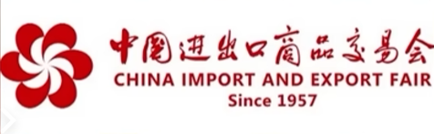

Meet a Chinese Supplier

https://www.youtube.com/watch?v=gmrqfUgaSqU

https://www.youtube.com/watch?v=RwQmgIw_Tok

Factory Tour

https://www.youtube.com/watch?v=2ehSCWoaOqQ

https://www.bilibili.com/video/BV12c411n79h/?spm_id_from=333.999.0.0&vd_source=bd363ff17b54594b4e6ad483160d92e2

1、你们是工厂还是贸易公司?在哪里?规模有多大?能否接受验厂?有无验厂报告?

1: Are you a factory or a trading company?Where is your office? Does your company has a large population? Do you accept factory inspection? Do you have BSO?

2、你们主要市场是哪里?有没有出口到某国家?是否有相应的国际认证和资质证书?

2: Where is your main market? Have you ever sell to XX country? Do you have any international certifications?

3、优势产品是什么?起订量是多少?生产周期多久?能否降低起订量?价格是多少?

3:Waht are your specialties? What is your minimum order/batch size? What are you leadtimes? Can I lower the MOQ? What is the best price you can offer?

4、是否接受OEM，ODM?能否打样?打样要多少天?怎么收费?

4: Do you accept OEM, ODM orders? Can you make samples for me? How long will it take to make the sample? How much will it cost?

5、为什么价格比同行贵?能便宜吗?

5: Why is your price so high? Can I get a better deal?

6、你们如何保证大货的质量、生产周期、价格是否稳定?

6: Do you batch test? Are the quality, lead time and price stable all the time?

7、出现质量问题如何处理?售后有什么保证?

7: How do you solve quality problems and how many years of warranty do you offer?

8、是否接受品牌代理?成为经销商的条件是什么?

8: How to become a reseller distributor of your brand?

9、货物的体积是多少?一个高柜能装多少个?总货值大概是多少?

9: What is the CBM of 1 ctn? How many ctns go into a container? How much is the total value?

10、陆运，空运，海运发到我们国家，大概要多久?费用是多少?

10: How long will it take to ship by cargo, air or sea to my country? How much is the shipping?

11、付款方式是什么?

11: What terms of payment are accepted?

Good morning /afternoon sir/miss, welcome to our booth, how can l help you?

早上好/下午好先生/女士，欢迎来我们的展位，有什么可以帮到您?

Nice to meet you sir /miss, is there anything l can do for you?

很高兴见到您先生/女士，有什么可以帮到您?

These are our new products, which are to the taste of European market.

这是我们的新产品，很受欧洲市场的欢迎。

Please feel free to look around.

请随便看看。

Here is my name card. Can l have yours? How do l address you? How to pronounce your name?

这是我的名片，可以要一张您的名片吗?怎么称呼您?怎么念您的名字?

Would you like something to drink? How about a cup of tea/coffee.

你想喝点什么吗?来杯茶/咖啡怎么样?

Please allow me to give you a short introduction of our company...

请允许我简单介绍一下我们公司。

Excuse me for a moment, l will be right back.

对不起，失陪一下，我马上回来。

Thank you for visiting.

感谢您能来。

Keep in touch.

保持联系。